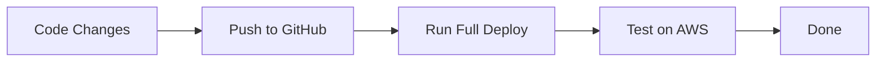
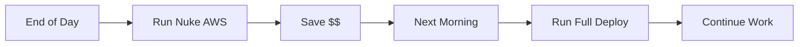
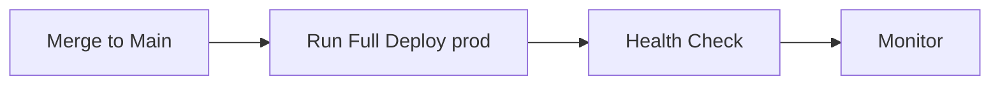

# 🚀 Healink CI/CD Workflows

## Tổng Quan

Healink sử dụng GitHub Actions để tự động hóa build, test và deployment lên AWS ECS.

## 📋 Workflows Có Sẵn

### 1. 🚀 **Full Deploy** (`full-deploy.yml`)

Deploy toàn bộ hệ thống Healink lên AWS.

**Trigger**: Manual (workflow_dispatch)

**Các bước**:
1. Build tất cả Docker images (AuthService, UserService, ContentService, NotificationService, Gateway)
2. Push images lên Amazon ECR
3. Deploy Stateful Infrastructure (RDS, Redis, ECR)
4. Deploy Application Infrastructure (ECS, ALB)
5. Health check tất cả services

**Cách sử dụng**:
```
1. Vào tab Actions trong GitHub
2. Chọn "🚀 Full Deploy - All Services"
3. Click "Run workflow"
4. Chọn environment: dev hoặc prod
5. (Optional) Check "Skip build" nếu muốn dùng images có sẵn
6. Click "Run workflow"
```

**Input Parameters**:
- `environment`: `dev` hoặc `prod` (required)
- `skip_build`: Skip Docker build phase (optional)

**Thời gian**: ~15-20 phút

**Outputs**:
- Service URLs (từ Terraform outputs)
- Health check results

---

### 2. ☢️ **Nuke AWS** (`nuke-aws.yml`)

Xóa tất cả resources AWS **NGOẠI TRỪ** ECR và RDS.

**⚠️ CẢNH BÁO**: 
- Workflow này sẽ xóa tất cả ECS services, ALB, logs
- Data trong RDS và Docker images trong ECR sẽ được GIỮ LẠI
- Chỉ sử dụng khi cần cleanup hoặc tiết kiệm chi phí

**Trigger**: Manual (workflow_dispatch) với confirmation

**Các bước**:
1. Safety check (phải gõ "NUKE" để confirm)
2. Destroy Application Infrastructure (ECS, ALB, Target Groups)
3. Manual cleanup: ECS services, ALBs, Target Groups
4. Delete CloudWatch log groups
5. Verify ECR và RDS còn tồn tại
6. Final report

**Cách sử dụng**:
```
1. Vào tab Actions trong GitHub
2. Chọn "☢️ Nuke AWS (Keep ECR & RDS)"
3. Click "Run workflow"
4. Chọn environment: dev hoặc prod
5. Gõ "NUKE" vào ô confirmation (phải chính xác)
6. Check "Keep ECR images" (recommended)
7. Check "Keep RDS database" (recommended)
8. Click "Run workflow"
```

**Input Parameters**:
- `environment`: `dev` hoặc `prod` (required)
- `confirmation`: Phải gõ "NUKE" chính xác
- `keep_ecr_images`: Giữ Docker images (default: true)
- `keep_rds`: Giữ RDS database (default: true)

**Thời gian**: ~5-10 phút

**Sau khi Nuke**:
- Chi phí AWS giảm xuống ~$15/month (chỉ RDS + ECR storage)
- Có thể redeploy bất cứ lúc nào bằng "Full Deploy"
- Docker images và data vẫn còn nguyên

---

### 3. 🔨 **Build AuthService** (`build-auth-service.yml`)

Build và deploy riêng AuthService (legacy workflow).

**Trigger**: 
- Push to `main` branch với changes trong `src/AuthService/**`
- Manual dispatch

**Note**: Workflow này sẽ được thay thế bởi Full Deploy trong production.

---

## 🏗️ Infrastructure Layers

### Stateful Infrastructure
- RDS PostgreSQL (multi-database)
- Redis Cache
- ECR Repositories
- VPC, Subnets, Security Groups

**Đặc điểm**:
- Long-lived resources
- Không thường xuyên thay đổi
- Data được preserve

### Application Infrastructure
- ECS Fargate Clusters
- ECS Services
- Application Load Balancers
- Target Groups
- CloudWatch Log Groups
- IAM Roles

**Đặc điểm**:
- Ephemeral resources
- Có thể destroy/recreate thường xuyên
- Không chứa data

---

## 💰 Cost Management

### Chi Phí Khi Chạy Full (Dev Environment)

| Resource | Cost/Month |
|----------|------------|
| ECS Fargate (5 services) | ~$30-50 |
| ALB | ~$16 |
| RDS t4g.micro | ~$15 |
| Redis t4g.micro | ~$12 |
| ECR Storage | ~$1 |
| **Total** | **~$74-94/month** |

### Chi Phí Sau Khi Nuke (Keep ECR + RDS)

| Resource | Cost/Month |
|----------|------------|
| RDS t4g.micro | ~$15 |
| ECR Storage | ~$1 |
| **Total** | **~$16/month** |

### Tiết Kiệm Chi Phí

**Chiến lược 1**: Nuke khi không dùng
```bash
# Cuối ngày làm việc
Run "Nuke AWS" workflow
# Chi phí: $16/month

# Sáng hôm sau
Run "Full Deploy" workflow
# Thời gian deploy: 15-20 phút
```

**Chiến lược 2**: Sử dụng Dev environment
- Dev: Nuke mỗi tối, deploy mỗi sáng
- Prod: Chạy 24/7

**Chiến lược 3**: Schedule với GitHub Actions
```yaml
# Có thể thêm schedule vào workflows
on:
  schedule:
    - cron: '0 18 * * 1-5'  # 6PM weekdays - nuke
    - cron: '0 8 * * 1-5'   # 8AM weekdays - deploy
```

---

## 🔐 Security Requirements

### AWS IAM Role

Cần IAM Role cho GitHub Actions:
```
Role Name: GitHubActionRole-Healink
ARN: arn:aws:iam::855160720656:role/GitHubActionRole-Healink
```

**Permissions Required**:
- ECR: Push/Pull images
- ECS: Create/Update/Delete services, tasks
- ALB: Create/Update/Delete load balancers
- RDS: Read access (không cần write cho Nuke)
- CloudWatch: Create/Delete log groups
- IAM: PassRole for ECS execution

### GitHub Secrets

**Required Secrets**:
- `JWT_ISSUER`
- `JWT_AUDIENCE`
- `JWT_SECRET_KEY`
- `REDIS_CONNECTION_STRING`

**Setup**:
```
Repository Settings → Secrets and variables → Actions → New repository secret
```

---

## 🎯 Use Cases

### Case 1: Development Workflow



### Case 2: Cost Optimization



### Case 3: Production Deployment



---

## 📊 Monitoring & Logs

### CloudWatch Logs

Logs được lưu tại:
```
/ecs/healink-{service}-{environment}
```

**Services**:
- `/ecs/healink-authservice-dev`
- `/ecs/healink-userservice-dev`
- `/ecs/healink-contentservice-dev`
- `/ecs/healink-notificationservice-dev`
- `/ecs/healink-gateway-dev`

### Health Checks

Tất cả services có health endpoints:
```
http://{alb-url}/health
```

---

## 🐛 Troubleshooting

### Workflow Failed?

1. **Check GitHub Actions logs**
   - Tab Actions → Click failed workflow → View logs

2. **Common Issues**:
   - AWS credentials expired → Re-run workflow
   - Terraform state locked → Wait or unlock manually
   - ECS service failed to start → Check CloudWatch logs

### Service Not Starting?

1. **Check ECS Console**:
   ```
   AWS Console → ECS → Clusters → healink-{env} → Services
   ```

2. **Check Task Logs**:
   ```
   Click service → Tasks → Click task → Logs tab
   ```

3. **Common Fixes**:
   - Wrong environment variables
   - Image not found in ECR
   - Health check failing

### Cannot Nuke?

1. **ALB stuck deleting**:
   - Wait 5 minutes, retry
   - Manually delete in AWS Console

2. **ECS service cannot delete**:
   - Force delete: `aws ecs delete-service --force`
   - Wait for tasks to stop

---

## 🚀 Quick Start

### First Time Setup

```bash
# 1. Ensure AWS credentials are configured in GitHub Secrets
# 2. Ensure Terraform backend S3 bucket exists
# 3. Run Full Deploy
```

### Daily Development

```bash
# Morning
1. Run "Full Deploy" (dev environment)
2. Wait 15-20 minutes
3. Start coding

# Evening
4. Run "Nuke AWS" (dev environment)
5. Save costs overnight
```

### Production Deployment

```bash
# 1. Test in dev first
Run "Full Deploy" (dev) → Test → Success

# 2. Deploy to prod
Run "Full Deploy" (prod)

# 3. Monitor
Check health endpoints
Check CloudWatch logs
```

---

## 📚 Additional Resources

- [Terraform Scripts](../../terraform_healink/)
- [Local Development](../../LOCAL_DEVELOPMENT.md)
- [Docker Compose Setup](../../docker-compose.yml)

---

## ⚡ Pro Tips

1. **Use skip_build=true** when only updating Terraform configs
2. **Nuke dev env every night** to save ~$50/month
3. **Tag Docker images** with commit SHA for traceability
4. **Monitor CloudWatch logs** after deployment
5. **Set up SNS notifications** for production alerts

---

**Last Updated**: September 30, 2025
**Maintained By**: Healink DevOps Team
