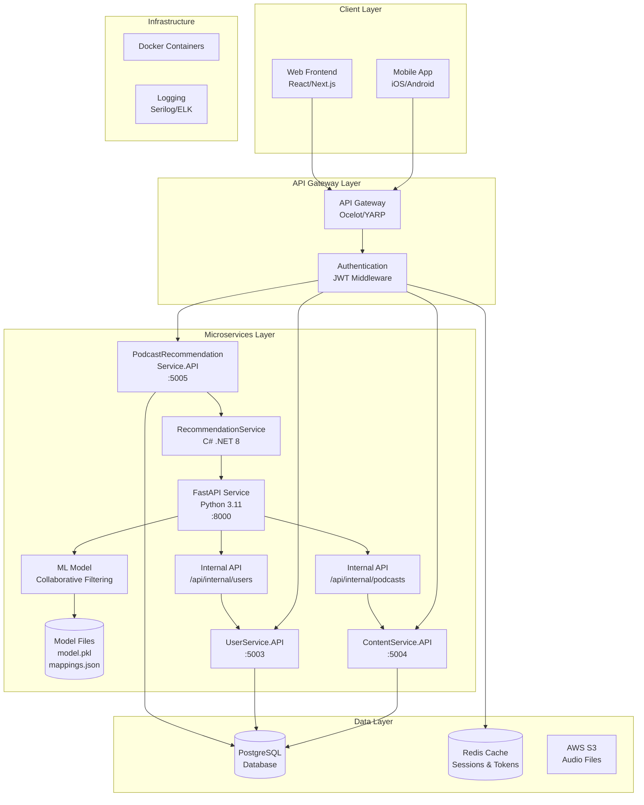

# Healink Platform - Mental Health & Wellness Platform

**Software Design Specification (SDS)**

---

**Ho Chi Minh, Oct 2025**

**Team members:**
| Name                | Student ID |
|---------------------|------------|
| Danh Tuấn Đạt       | SE183946   |
| Nguyễn Hoài Nam     | SE161728   |
| Tô Thái An          | SE183436   |
| Nguyễn Hoàng Minh   | SE183472   |

---

## Table of Contents
- I. Introduction
  - 1. Problem
  - 2. Purpose
  - 3. Scope
  - 4. Objective
- II. System Overview
  - 2.1 Product Perspective
    - 2.1.1 Design Method
    - 2.1.2 User Interfaces
    - 2.1.3 Hardware Interfaces
    - 2.1.4 Software Interfaces
    - 2.1.5 Operation
  - 2.2 Product Functions
  - 2.3 User Characteristics
  - 2.4 Constraints
  - 2.5 Assumptions and Dependencies
  - 2.6 Apportioning of Requirements
  - 2.7 Main Actor
  - 2.8 Main Features
  - 2.9 Screen List + Map and Business Rules
- III. System Architecture
  - 3.1 Code Packages
    - 3.1.1 Front end
    - 3.1.2 Back end
  - 3.2 Business Context Diagram
  - 3.3 System Overview Diagram
  - 3.4 ERD Conceptual
  - 3.5 Physical Database
  - 3.6 Use Case Diagram
- IV. Figures
  - 4.1 Sequence Diagram
  - 4.2 State Diagram
  - 4.3 Deployment Diagram
  - 4.4 Activity Diagram

---

## I. INTRODUCTION
### 1. Problem
Mental health and wellness are critical yet underserved areas in Vietnam. Existing platforms lack personalized support, AI-driven recommendations, and seamless integration between content, community, and professional help.

### 2. Purpose
Healink is an AI-powered mental health & wellness platform connecting users with curated content, expert support, and community features. The platform aims to:
- Provide high-quality mental health resources
- Enable AI-driven recommendations and progress tracking
- Support secure communication with professionals
- Foster a supportive community

### 3. Scope
Healink covers:
- Content management (articles, podcasts, exercises)
- AI recommendation engine (FastAPI ML service)
- Progress tracking and analytics
- Subscription/payment system
- User, staff, admin management
- Community features (Q&A, reviews)

### 4. Objective
Empower Vietnamese users to improve mental health through technology, AI, and community support.

---

## II. SYSTEM OVERVIEW
### 2.1 Product Perspective
Healink is a full-stack microservices platform with:
- Backend: .NET 8 microservices, FastAPI ML service
- Frontend: Next.js webapp
- AWS cloud infrastructure (ECS, ECR, RDS, Redis, RabbitMQ)

#### 2.1.1 Design Method
- Clean Architecture, Domain-Driven Design
- Microservices pattern
- Infrastructure as Code (Terraform)

#### 2.1.2 User Interfaces
- User: Dashboard, content library, progress, subscription, profile
- Staff: Content upload, approval, analytics
- Admin: System dashboard, user/content management, analytics

#### 2.1.3 Hardware Interfaces
- User devices: Mobile, desktop, tablet
- AWS cloud: ECS, RDS, S3, Redis, RabbitMQ

#### 2.1.4 Software Interfaces
- OS: Windows, macOS, Linux, iOS, Android (web)
- External APIs: Google Gemini AI, VNPay, Email
- Database: PostgreSQL, Redis

#### 2.1.5 Operation
- Registration/login, profile management
- Content discovery, reading/listening experience
- AI recommendations, progress tracking
- Subscription/payment
- Content creation/approval

### 2.2 Product Functions
- AI-powered recommendations (FastAPI)
- Progress tracking
- Content management
- Subscription/payment
- User/staff/admin management
- Community features

### 2.3 User Characteristics
- End users: Seek mental health support/resources
- Staff: Content creators, curators
- Admin: System operators

### 2.4 Constraints
- Support 1,000+ concurrent users, <2s response
- Secure payment (VNPay), data privacy
- AI service rate limiting

### 2.5 Assumptions and Dependencies
- Reliable internet
- AWS cloud services
- External APIs available

### 2.6 Apportioning of Requirements
- Phase 1: Core content, user management
- Phase 2: AI features, analytics
- Phase 3: Subscription, community

### 2.7 Main Actors
- User (End user)
- Staff (Content manager)
- Admin (System administrator)

### 2.8 Main Features
- Content discovery & management
- AI-powered recommendations
- Progress tracking
- Subscription/payment
- Profile & role management
- Content approval & quality control
- Community & reviews

### 2.9 Screen List + Map and Business Rules
#### Screen List (Mapping code to UI)
| Screen No | Screen Name                | Description |
|-----------|---------------------------|-------------|
| HL_101    | Authentication            | Login, register, email verify, role-based redirect |
| HL_102    | Home Page (Guest)         | Featured content, subscription plans, sign up/login |
| HL_103    | Content Catalog (Guest)   | Browse limited content, preview, subscription info |
| HL_201    | Home Page (User)          | Personalized recommendations, progress, full library |
| HL_202    | Content List Page         | Browse/filter/search all content |
| HL_203    | Content Detail Page       | Info, play/read, add to favorites, reviews |
| HL_204    | Content Player/Reader     | Full-featured player/reader, notes, bookmarks |
| HL_205    | User Profile Page         | Stats, goals, subscription, settings |
| HL_206    | History & Library         | Activity history, collections, resume |
| HL_207    | Favorites & Collections   | Manage favorites, custom lists, share |
| HL_208    | Subscription Management   | View/change plan, billing, analytics |
| HL_209    | Community & Reviews       | Q&A, write/read reviews, discussions |
| HL_210    | Verify Email Page         | Email verification, resend, activate |
| HL_301    | Staff Dashboard           | Uploads, analytics, approval status |
| HL_302    | Content Upload/Edit       | Add/edit content, metadata, submit for approval |
| HL_303    | Staff Analytics           | Content performance, engagement |
| HL_401    | Admin Dashboard           | System overview, health, usage |
| HL_402    | User Management           | Accounts, roles, permissions |
| HL_403    | Content Management        | Approve/reject, organize, quality control |
| HL_404    | Revenue & Analytics       | Financials, subscription metrics |
| HL_405    | Platform Settings         | Config, notifications, backup |

#### Business Rules (Mapping to code)
- **User Management:** Unique email, password policy, email verification, single session/device, role assignment, deactivation
- **Content Management:** Only staff upload, admin approval, metadata required, max file size, premium access, immutable approval status
- **Payment:** VNPay only, confirmation required, auto-renewal, refund policy, encrypted data
- **AI Features:** Auth required, Google Gemini API, caching, Vietnamese output, error handling, max content length
- **Progress Tracking:** Book/chapter level, CFI position, notes, statistics, premium restriction

---

## III. SYSTEM ARCHITECTURE
### 3.1 Code Packages
#### 3.1.1 Front end (Next.js)
| No | Package      | Description |
|----|-------------|-------------|
| 01 | components  | Reusable React UI components |
| 02 | app/pages   | Main pages/routes |
| 03 | services    | API calls, external service integration |
| 04 | contexts    | React context providers |
| 05 | lib         | Utility functions, helpers |
| 06 | types       | TypeScript types/interfaces |
| 07 | public      | Static files (images, icons) |
| 08 | styles      | Global and modular CSS |

#### 3.1.2 Back end (.NET + FastAPI)
| No | Package/Service                | Description |
|----|-------------------------------|-------------|
| 01 | AuthService                   | User authentication, JWT, registration |
| 02 | UserService                   | User profile, management |
| 03 | ContentService                | Content CRUD, approval |
| 04 | NotificationService           | Email, system notifications |
| 05 | PaymentService                | Subscription, VNPay integration |
| 06 | SubscriptionService           | Subscription plans, status |
| 07 | PodcastRecommendationService  | .NET API for podcast recommendations |
| 08 | Podcast-AI-Service (FastAPI)  | ML-based recommendation engine |
| 09 | Gateway                       | API gateway, routing |
| 10 | SharedLibrary                 | Common code, DTOs, utils |

### 3.2 Business Context Diagram


### 3.3 System Overview Diagram
```
+-------------------+      +-------------------+      +-------------------+
|   Next.js FE      |<---->|   Gateway API     |<---->|   Microservices   |
+-------------------+      +-------------------+      +-------------------+
  |                        |                        |
  v                        v                        v
   [User Devices]           [API Routing]         [Auth, User, Content, ...]
                |
                v
              [FastAPI ML Service]
```

### 3.4 ERD Conceptual
*(Ví dụ:)*
- User (id, email, password, role, profile, subscription)
- Content (id, title, type, metadata, status, author, created_at)
- Progress (id, user_id, content_id, position, completed, notes)
- Subscription (id, user_id, plan, status, start_date, end_date)
- Payment (id, user_id, amount, status, method, receipt)
- Review (id, user_id, content_id, rating, comment)

### 3.5 Physical Database
PostgreSQL: Main business data, identity
Redis: Caching, session
S3: File storage (podcasts, images)

### 3.6 Use Case Diagram
*(Ví dụ:)*
- User: Register, login, browse content, read/listen, request AI, subscribe, review
- Staff: Upload content, submit for approval, view analytics
- Admin: Approve content, manage users, view system health

---

## IV. FIGURES
### 4.1 Sequence Diagram
#### 4.1.1 Registration/Login
User → Next.js → Gateway → AuthService → DB → Response
#### 4.1.2 AI Recommendation Request
User → Next.js → Gateway → PodcastRecommendationService (.NET) → FastAPI ML → Response
#### 4.1.3 Content Approval Workflow
Staff → Next.js → Gateway → ContentService → Admin → Approve/Reject
#### 4.1.4 Payment/Subscription Flow
User → Next.js → Gateway → PaymentService → VNPay → Response
#### 4.1.5 Progress Tracking
User → Next.js → Gateway → UserService → Progress DB

### 4.2 State Diagram
- AI Recommendation: [Idle] → [Request] → [Processing] → [Success/Error]
- Payment: [Initiated] → [Pending] → [Confirmed] → [Active/Failed]

### 4.3 Deployment Diagram
```
[User Devices]
  |
[Next.js FE]
  |
[API Gateway]
  |
[ECS Cluster]
  |-- [AuthService]
  |-- [UserService]
  |-- [ContentService]
  |-- [NotificationService]
  |-- [PaymentService]
  |-- [SubscriptionService]
  |-- [PodcastRecommendationService]
  |-- [FastAPI ML Service]
  |
[RDS, Redis, RabbitMQ, S3]
```

### 4.4 Activity Diagram
- Authentication: Register → Verify Email → Login → Access
- Content: Upload → Submit → Approve → Publish
- Payment: Initiate → VNPay → Confirm → Activate Subscription
- AI: Request → Process → Cache → Return Result

---

## Business Rules (Sample)
### User Management
- BR001: Email/username must be unique
- BR002: Password ≥ 8 ký tự, có chữ hoa, thường, số
- BR003: Email thay đổi phải xác thực lại
- BR004: Tài khoản mới phải xác thực email
- BR005: Một user chỉ có 1 session/device
- BR006: Staff chỉ tạo bởi admin
- BR007: Admin có thể deactivate user
- BR008: Profile gồm tên, họ, liên hệ
- BR009: Token reset password hết hạn sau 24h

### Content Management
- BR101: Chỉ staff được upload content
- BR102: Metadata đầy đủ: title, author, type, category
- BR103: Content staff phải được admin duyệt
- BR104: Content admin tự động duyệt
- BR105: File upload tối đa 50MB
- BR106: Premium content chỉ user có subscription truy cập
- BR107: Approval status không revert về pending
- BR108: Cover image phải hợp lệ

### Payment & Subscription
- BR201: Chỉ dùng VNPay
- BR202: Xác nhận payment cần ResponseCode/TransactionStatus = "00"
- BR203: Subscription chỉ active khi payment thành công
- BR204: 1 user chỉ có 1 subscription active
- BR205: Receipt phải lưu lại
- BR206: Auto-renewal có thể bật/tắt
- BR207: Refund cần admin duyệt
- BR208: Payment data phải mã hóa
- BR209: Subscription hết hạn tự động restrict content
- BR210: Payment URL hết hạn sau 15 phút

### AI Learning Features
- BR301: AI chỉ cho user đã đăng nhập
- BR302: Kết quả AI phải cache DB
- BR303: Dùng Google Gemini API, xử lý lỗi
- BR304: AI trả về tiếng Việt
- BR305: AI lỗi không ảnh hưởng core
- BR306: Kết quả cache theo chapter, dùng chung
- BR307: Content AI tối đa 4000 ký tự/lần

### Progress Tracking
- BR401: Track progress book/chapter
- BR402: Vị trí lưu bằng CFI
- BR403: User có thể tạo/sửa/xóa note
- BR404: Progress tính theo số chapter hoàn thành
- BR405: Chỉ user có quyền mới xem content
- BR406: Session phải lưu vị trí đọc
- BR407: Progress auto-save
- BR408: Chỉ content đã duyệt mới truy cập
- BR409: Thống kê gồm số sách đã đọc, thời gian
- BR410: Note phải gắn với CFI
- BR411: Premium content chỉ user có subscription

---

*This document is a living specification. Update diagrams, rules, and package mapping as the system evolves.*
