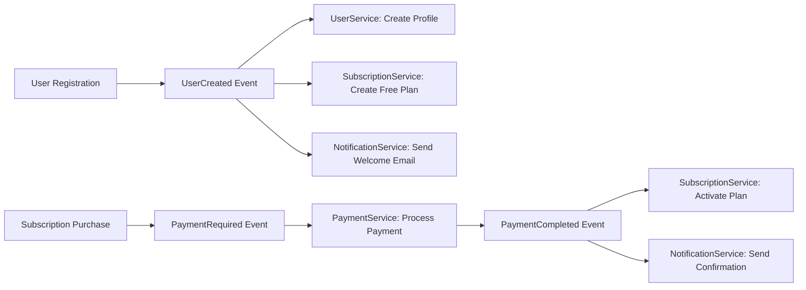

# 🧠 Healink Microservices - Mental Health & Wellness Platform

A comprehensive distributed microservices system for mental health and wellness platform built with .NET 8, featuring AI-powered podcast recommendations, subscription management, and event-driven architecture.

## 📋 Overview

Healink is a modern mental health platform that provides:
- **AI-Powered Podcast Recommendations** using machine learning models
- **User Authentication & Profile Management** with JWT-based security
- **Content Management** for podcasts, community stories, and educational materials
- **Subscription & Payment Processing** with MoMo payment gateway integration
- **Real-time Notifications** via email and push notifications
- **Event-Driven Architecture** with Saga pattern for distributed transactions

## 🏗️ Architecture

### System Overview
```
┌─────────────────────────────────────────────────────────────────┐
│                    Healink Microservices                        │
├─────────────────────────────────────────────────────────────────┤
│                                                                 │
│  ┌─────────────────┐    ┌─────────────────┐    ┌──────────────┐ │
│  │   Mobile App    │    │   Web Frontend  │    │   Admin CMS  │ │
│  │   (iOS/Android) │    │   (React/Vue)   │    │   (React)    │ │
│  └─────────┬───────┘    └─────────┬───────┘    └──────┬───────┘ │
│            │                      │                   │         │
│            └──────────────────────┼───────────────────┘         │
│                                   │                             │
│  ┌─────────────────────────────────▼─────────────────────────────┐ │
│  │                    API Gateway (Ocelot)                      │ │
│  │                    Port: 5000                                │ │
│  │                    JWT Authentication                        │ │
│  └─────────────────────┬───────────────────────────────────────┘ │
│                        │                                         │
│  ┌─────────────────────▼───────────────────────────────────────┐ │
│  │                Microservices Layer                          │ │
│  │                                                             │ │
│  │  ┌─────────────┐ ┌─────────────┐ ┌─────────────────────────┐ │ │
│  │  │ AuthService │ │ UserService │ │   ContentService        │ │ │
│  │  │   :5001     │ │   :5002     │ │      :5004              │ │ │
│  │  │ JWT, OTP    │ │ Profiles    │ │ Podcasts, Stories       │ │ │
│  │  └─────────────┘ └─────────────┘ └─────────────────────────┘ │ │
│  │                                                             │ │
│  │  ┌─────────────┐ ┌─────────────┐ ┌─────────────────────────┐ │ │
│  │  │Notification │ │Subscription │ │   PaymentService        │ │ │
│  │  │   Service   │ │   Service   │ │      :5006              │ │ │
│  │  │   :5003     │ │   :5005     │ │ MoMo, Invoices          │ │ │
│  │  └─────────────┘ └─────────────┘ └─────────────────────────┘ │ │
│  │                                                             │ │
│  │  ┌─────────────────────────────────────────────────────────┐ │ │
│  │  │        PodcastRecommendationService :5007              │ │ │
│  │  │        AI-Powered Recommendations                      │ │ │
│  │  │        FastAPI + TensorFlow Model                      │ │ │
│  │  └─────────────────────────────────────────────────────────┘ │ │
│  └─────────────────────────────────────────────────────────────┘ │
│                                                                 │
│  ┌─────────────────────────────────────────────────────────────┐ │
│  │                    Data & Infrastructure Layer              │ │
│  │                                                             │ │
│  │  ┌─────────────┐ ┌─────────────┐ ┌─────────────────────────┐ │ │
│  │  │ PostgreSQL  │ │    Redis    │ │      RabbitMQ           │ │ │
│  │  │ Multi-DB    │ │   Cache     │ │   Message Broker        │ │ │
│  │  │ Per Service │ │ Sessions    │ │   Event Bus             │ │ │
│  │  └─────────────┘ └─────────────┘ └─────────────────────────┘ │ │
│  │                                                             │ │
│  │  ┌─────────────┐ ┌─────────────┐ ┌─────────────────────────┐ │ │
│  │  │   AWS S3    │ │   SMTP      │ │    Firebase FCM         │ │ │
│  │  │ File Storage│ │   Email     │ │   Push Notifications    │ │ │
│  │  └─────────────┘ └─────────────┘ └─────────────────────────┘ │ │
│  └─────────────────────────────────────────────────────────────┘ │
└─────────────────────────────────────────────────────────────────┘
```

### Microservices Breakdown

| Service | Port | Purpose | Key Features |
|---------|------|---------|--------------|
| **Gateway** | 5000 | API Gateway | Ocelot routing, JWT validation, rate limiting |
| **AuthService** | 5001 | Authentication | JWT tokens, OTP verification, role-based access |
| **UserService** | 5002 | User Management | Profiles, creator applications, preferences |
| **NotificationService** | 5003 | Notifications | Email, push notifications, event processing |
| **ContentService** | 5004 | Content Management | Podcasts, community stories, file uploads |
| **SubscriptionService** | 5005 | Subscriptions | Plans, billing, Saga orchestration |
| **PaymentService** | 5006 | Payments | MoMo integration, invoices, transactions |
| **PodcastRecommendationService** | 5007 | AI Recommendations | ML models, collaborative filtering |

## 🛠️ Tech Stack

### Core Framework
- **.NET 8** - Latest LTS framework with performance improvements
- **C# 12** - Modern language features and syntax
- **ASP.NET Core 8** - Web API framework

### Database & Caching
- **PostgreSQL 16** - Primary relational database with multi-database architecture
- **Redis 7** - Distributed caching, session management, and rate limiting
- **Entity Framework Core 8** - ORM with code-first migrations and change tracking

### Messaging & Events
- **RabbitMQ 3.13** - Message broker for event-driven architecture
- **MassTransit 8.3** - Distributed application framework with Saga support
- **Outbox Pattern** - Reliable event publishing with transactional guarantees

### API & Gateway
- **Ocelot 23** - API Gateway for routing, load balancing, and authentication
- **JWT Bearer** - Stateless authentication with access/refresh token pattern
- **Swagger/OpenAPI 3** - API documentation and interactive testing

### AI & Machine Learning
- **FastAPI (Python)** - AI recommendation service
- **TensorFlow/PyTorch** - Machine learning model inference
- **Collaborative Filtering** - Recommendation algorithms

### Architecture Patterns
- **Clean Architecture** - Domain-centric design with clear separation of concerns
- **CQRS** - Command Query Responsibility Segregation with MediatR
- **Event Sourcing** - Event-driven communication between services
- **Saga Pattern** - Distributed transaction orchestration
- **Repository Pattern** - Data access abstraction
- **Unit of Work** - Transaction management

### External Services
- **AWS S3** - Object storage for audio files and media
- **MoMo Payment Gateway** - Payment processing for Vietnamese market
- **SMTP (Gmail)** - Email notification delivery
- **Firebase Cloud Messaging** - Push notifications for mobile apps

### DevOps & Infrastructure
- **Docker & Docker Compose** - Containerization and local development
- **AWS ECS Fargate** - Serverless container orchestration
- **Terraform** - Infrastructure as Code (IaC)
- **GitHub Actions** - CI/CD pipeline automation
- **AWS RDS** - Managed PostgreSQL database
- **AWS ElastiCache** - Managed Redis cache
- **Amazon MQ** - Managed RabbitMQ message broker
- **ECR** - Container image registry

## 🚀 Quick Start

### Prerequisites
- [.NET 8 SDK](https://dotnet.microsoft.com/download/dotnet/8.0)
- [Docker Desktop](https://www.docker.com/products/docker-desktop)
- [Visual Studio 2022](https://visualstudio.microsoft.com/) or [VS Code](https://code.visualstudio.com/)

### 1. Clone Repository
```bash
git clone https://github.com/oggycat-dev/dot-net-healink-back-end.git
cd dot-net-healink-back-end
```

### 2. Environment Configuration
```bash
# Copy environment template
cp .env.example .env

# Edit configuration
nano .env
```

### 3. Local Development with Docker
```bash
# Start all services
docker-compose up -d

# View logs
docker-compose logs -f

# Check service health
docker-compose ps
```

### 4. Access Services
- **API Gateway**: http://localhost:5000
- **Swagger Documentation**: http://localhost:5000/swagger
- **RabbitMQ Management**: http://localhost:15672 (admin/admin@123)
- **pgAdmin**: http://localhost:5050 (admin@healink.com/admin@123)

## 🌐 API Endpoints

### Authentication Service
```http
POST /api/user/auth/register     # User registration with OTP
POST /api/user/auth/login        # User login
POST /api/user/auth/verify-otp   # OTP verification
POST /api/cms/auth/login         # Admin login
GET  /api/auth/health            # Health check
```

### User Service
```http
GET    /api/user/profile                    # Get user profile
PUT    /api/user/profile                    # Update profile
POST   /api/creatorapplications             # Submit creator application
GET    /api/creatorapplications/pending     # Get pending applications (Admin)
POST   /api/creatorapplications/{id}/approve # Approve application
GET    /api/users/health                    # Health check
```

### Content Service
```http
GET    /api/content/podcasts                # List podcasts with filters
POST   /api/content/podcasts                # Create podcast (Creator)
GET    /api/content/podcasts/{id}           # Get podcast details
PUT    /api/content/podcasts/{id}           # Update podcast (Creator)
GET    /api/content/community               # List community stories
POST   /api/content/community               # Create story
GET    /api/content/health                  # Health check
```

### Subscription Service
```http
GET    /api/subscriptions/plans             # List available plans
GET    /api/subscriptions/my-subscription   # Get current subscription
POST   /api/subscriptions/subscribe         # Subscribe to plan
POST   /api/subscriptions/cancel            # Cancel subscription
GET    /api/subscription/health             # Health check
```

### Payment Service
```http
POST   /api/payments/process                # Process payment
GET    /api/payments/{id}                   # Get payment status
POST   /api/payments/{id}/refund            # Request refund
GET    /api/payments/invoices               # List user invoices
GET    /api/payment/health                  # Health check
```

### AI Recommendation Service
```http
GET    /api/recommendations/me              # Get personalized recommendations
GET    /api/recommendations/trending        # Get trending podcasts
GET    /api/recommendations/health          # Health check
```

## 🏗️ Infrastructure & Deployment

### AWS Architecture (Production)
```
┌─────────────────────────────────────────────────────────────────┐
│                        AWS Cloud                                │
├─────────────────────────────────────────────────────────────────┤
│                                                                 │
│  ┌─────────────────────────────────────────────────────────────┐ │
│  │                 Application Load Balancer                   │ │
│  │              (Single ALB for Cost Optimization)            │ │
│  └─────────────────────┬───────────────────────────────────────┘ │
│                        │                                         │
│  ┌─────────────────────▼───────────────────────────────────────┐ │
│  │                ECS Fargate Cluster                          │ │
│  │                                                             │ │
│  │  ┌─────────────┐ ┌─────────────┐ ┌─────────────────────────┐ │ │
│  │  │   Gateway   │ │ AuthService │ │    UserService          │ │ │
│  │  │   (Public)  │ │ (Internal)  │ │    (Internal)           │ │ │
│  │  └─────────────┘ └─────────────┘ └─────────────────────────┘ │ │
│  │                                                             │ │
│  │  ┌─────────────┐ ┌─────────────┐ ┌─────────────────────────┐ │ │
│  │  │ContentService│ │Notification │ │   SubscriptionService   │ │ │
│  │  │ (Internal)   │ │  Service    │ │      (Internal)         │ │ │
│  │  │              │ │ (Internal)  │ │                         │ │ │
│  │  └─────────────┘ └─────────────┘ └─────────────────────────┘ │ │
│  │                                                             │ │
│  │  ┌─────────────┐ ┌─────────────────────────────────────────┐ │ │
│  │  │PaymentService│ │  PodcastRecommendationService          │ │ │
│  │  │ (Internal)   │ │         (Internal)                     │ │ │
│  │  └─────────────┘ └─────────────────────────────────────────┘ │ │
│  └─────────────────────────────────────────────────────────────┘ │
│                                                                 │
│  ┌─────────────────────────────────────────────────────────────┐ │
│  │                    Data Layer                               │ │
│  │                                                             │ │
│  │  ┌─────────────┐ ┌─────────────┐ ┌─────────────────────────┐ │ │
│  │  │ RDS         │ │ ElastiCache │ │    Amazon MQ            │ │ │
│  │  │ PostgreSQL  │ │    Redis    │ │    RabbitMQ             │ │ │
│  │  │ Multi-DB    │ │   Cache     │ │   Message Broker        │ │ │
│  │  └─────────────┘ └─────────────┘ └─────────────────────────┘ │ │
│  │                                                             │ │
│  │  ┌─────────────┐ ┌─────────────┐ ┌─────────────────────────┐ │ │
│  │  │   ECR       │ │   S3        │ │    CloudWatch           │ │ │
│  │  │ Container   │ │ File Storage│ │    Logging              │ │ │
│  │  │ Registry    │ │             │ │                         │ │ │
│  │  └─────────────┘ └─────────────┘ └─────────────────────────┘ │ │
│  └─────────────────────────────────────────────────────────────┘ │
└─────────────────────────────────────────────────────────────────┘
```

### Cost Optimization
- **Single ALB**: Only Gateway has public access, other services are internal
- **AWS Free Tier**: Optimized for free tier resources where possible
- **Fargate Spot**: Use spot instances for non-critical workloads
- **Estimated Cost**: ~$60/month (Free Tier) → ~$91/month (after 12 months)

### Deployment Options

#### Option 1: GitHub Actions (Recommended)
```bash
# 1. Push code to GitHub
git push origin main

# 2. Go to GitHub Actions
# https://github.com/oggycat-dev/dot-net-healink-back-end/actions

# 3. Run "🚀 Deploy Healink - Free Tier" workflow
# 4. Wait ~20-30 minutes for deployment
```

#### Option 2: Local Terraform
```bash
# Deploy stateful infrastructure
cd terraform_healink/stateful-infra
terraform init -reconfigure
terraform workspace select free || terraform workspace new free
terraform apply -var-file=../free-tier.tfvars

# Deploy application infrastructure
cd ../app-infra
terraform init -reconfigure
terraform workspace select free || terraform workspace new free
terraform apply -var-file=../free-tier.tfvars
```

## 🔐 Security

### Authentication & Authorization
- **JWT Bearer Tokens**: Stateless authentication with 60-minute access tokens
- **Refresh Tokens**: 7-day refresh tokens for seamless user experience
- **Role-Based Access Control**: Admin, User, ContentCreator, Expert roles
- **OTP Verification**: One-time passwords for registration and password reset

### Security Features
- **Password Encryption**: Secure hashing with salt
- **CORS Configuration**: Controlled cross-origin resource sharing
- **Rate Limiting**: Request throttling to prevent abuse
- **Input Validation**: FluentValidation for all API inputs
- **SQL Injection Prevention**: EF Core parameterized queries

### Service Communication
- **Internal Service Auth**: Services communicate via RabbitMQ with internal authentication
- **Redis Security**: Password-protected Redis connections
- **Database Security**: Encrypted connection strings and separate databases per service

## 🔄 Event-Driven Architecture

### Key Events


### Saga Patterns
- **Registration Saga**: Orchestrates user registration across Auth, User, Subscription, and Notification services
- **Subscription Saga**: Manages subscription lifecycle with payment coordination
- **Compensation Logic**: Automatic rollback on failures

### Outbox Pattern
Each service uses the Outbox Pattern for reliable event publishing:
1. Events saved to OutboxEvents table in same transaction
2. Background processor publishes events to RabbitMQ
3. Guarantees at-least-once delivery
4. Prevents data loss during failures

## 🧪 Testing

### Health Checks
```bash
# Test all services
curl http://localhost:5000/api/auth/health
curl http://localhost:5000/api/users/health
curl http://localhost:5000/api/content/health
curl http://localhost:5000/api/subscription/health
curl http://localhost:5000/api/payment/health
curl http://localhost:5000/api/recommendations/health
```

### API Testing
```bash
# Register new user
curl -X POST http://localhost:5000/api/user/auth/register \
  -H "Content-Type: application/json" \
  -d '{"email":"user@example.com","password":"password123","fullName":"Test User"}'

# Login
curl -X POST http://localhost:5000/api/user/auth/login \
  -H "Content-Type: application/json" \
  -d '{"email":"user@example.com","password":"password123"}'

# Get recommendations (with JWT token)
curl -X GET http://localhost:5000/api/recommendations/me \
  -H "Authorization: Bearer YOUR_JWT_TOKEN"
```

## 📊 Monitoring & Observability

### Logging
- **Structured Logging**: Serilog with JSON formatting
- **Distributed Tracing**: Correlation IDs across services
- **Log Levels**: Information, Warning, Error, Debug
- **CloudWatch Integration**: Centralized logging in AWS

### Health Monitoring
- **Health Check Endpoints**: All services provide `/health` endpoints
- **ECS Health Checks**: Container-level health monitoring
- **ALB Health Checks**: Load balancer health monitoring
- **Database Health**: Connection and query health checks

### Performance Monitoring
- **Response Time Tracking**: API response time monitoring
- **Error Rate Monitoring**: Track and alert on error rates
- **Resource Utilization**: CPU, memory, and network monitoring
- **Database Performance**: Query performance and connection pool monitoring

## 🤝 Contributing

### Development Workflow
1. Fork the repository
2. Create a feature branch (`git checkout -b feature/AmazingFeature`)
3. Follow Clean Architecture principles
4. Write unit tests for business logic
5. Update API documentation
6. Commit changes (`git commit -m 'Add AmazingFeature'`)
7. Push to branch (`git push origin feature/AmazingFeature`)
8. Open a Pull Request

### Code Standards
- Follow Clean Architecture principles
- Use CQRS pattern for new features
- Write comprehensive unit tests
- Update documentation for API changes
- Follow C# coding conventions
- Use meaningful commit messages

## 📋 Roadmap

### ✅ Completed Features
- [x] Core microservices architecture (8 services)
- [x] Event-driven communication with RabbitMQ & MassTransit
- [x] Saga pattern for distributed transactions
- [x] JWT authentication & authorization
- [x] AI-powered podcast recommendations
- [x] Subscription & payment processing
- [x] Docker containerization
- [x] AWS deployment with Terraform
- [x] CI/CD pipeline with GitHub Actions
- [x] Health check endpoints
- [x] Structured logging with distributed tracing

### 🚧 In Progress
- [ ] Unit test coverage for all services
- [ ] Integration test suite
- [ ] API rate limiting and throttling
- [ ] Advanced recommendation algorithms
- [ ] Real-time notifications via WebSocket

### 📅 Planned Features
- [ ] Monitoring with Prometheus & Grafana
- [ ] Kubernetes deployment manifests
- [ ] API versioning strategy
- [ ] GraphQL gateway
- [ ] Elasticsearch for content search
- [ ] Mobile app push notifications (FCM)
- [ ] Content CDN integration
- [ ] Advanced analytics and reporting

## 📚 Documentation

### Architecture & Design
- [Registration Saga Implementation](docs/REGISTRATION_SAGA_IMPLEMENTATION.md)
- [AI Recommendation Service Architecture](docs/AI-rcm-service/ai-recommendation-architecture.md)
- [Subscription & Payment System](docs/register-subscription-payment/SUBSCRIPTION_SYSTEM_COMPLETE_DOCUMENTATION.md)

### Deployment & Infrastructure
- [Terraform Deployment Guide](terraform_healink/HOW_TO_RUN_CICD.md)
- [GitHub Actions Workflows](.github/workflows/README.md)
- [Environment Configuration](terraform_healink/ENV_TO_TERRAFORM_MAPPING.md)

### Service-Specific Guides
- [Podcast Recommendation Service](src/PodcastRecommendationService/README.md)
- [Content Service Documentation](src/ContentService/README.md)
- [Health Check Endpoints](HEALTH_CHECK_ENDPOINTS.md)

## 📄 License

This project is licensed under the MIT License - see the [LICENSE](LICENSE) file for details.

## 📞 Contact & Support

- **Project Repository**: [oggycat-dev/dot-net-healink-back-end](https://github.com/oggycat-dev/dot-net-healink-back-end)
- **Issues**: Please use GitHub Issues for bug reports and feature requests
- **Support Email**: healinksupport@gmail.com

---

**Built with ❤️ using .NET 8, Clean Architecture, and AI-powered recommendations**

**Last Updated**: October 15, 2025