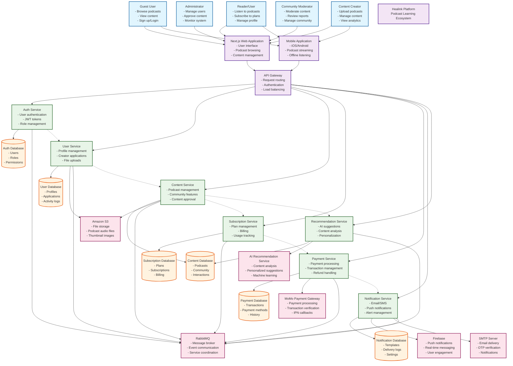

# Healink Business Context Diagram

## Business Context Diagram

## Business Context Description

### **Core Business Domain**
Healink is a **Podcast Learning Ecosystem** that connects content creators with learners through an AI-powered platform for educational podcast content.

### **Primary Actors**
1. **Guest Users**: Browse content, discover podcasts, sign up for accounts
2. **Readers/Users**: Subscribe to podcasts, manage learning progress, interact with community
3. **Content Creators**: Upload and manage podcast content, track analytics, monetize content
4. **Administrators**: Manage platform operations, approve content, monitor system health
5. **Community Moderators**: Moderate user-generated content, handle reports, maintain community standards

### **Key Business Processes**
1. **Content Creation & Management**: Creators upload podcasts, manage metadata, track performance
2. **User Onboarding**: Registration, email verification, profile setup, subscription selection
3. **Content Discovery**: AI-powered recommendations, trending content, personalized suggestions
4. **Subscription Management**: Plan selection, payment processing, access control, billing
5. **Community Engagement**: User interactions, content sharing, social features
6. **Content Moderation**: Review process, approval workflows, quality control

### **External Dependencies**
- **MoMo Payment Gateway**: Vietnamese payment processing
- **Amazon S3**: Scalable file storage for audio content
- **Firebase**: Real-time notifications and messaging
- **AI Service**: Machine learning for content recommendations
- **SMTP Server**: Email delivery for notifications and verification
- **RabbitMQ**: Event-driven communication between services

### **Value Propositions**
- **For Learners**: Access to quality educational content, personalized learning paths, community engagement
- **For Creators**: Easy content upload, analytics insights, monetization opportunities
- **For Platform**: Scalable architecture, reliable payment processing, AI-driven user engagement

### **Business Rules**
- Content creators must be approved before publishing
- Users need active subscriptions for premium content access
- All payments processed through secure MoMo gateway
- AI recommendations based on user behavior and content analysis
- Community content moderated by designated moderators
- Email verification required for account activation

