# Healink System - Detailed/Comprehensive Use Case Diagram

## Comprehensive Use Case Diagram

```mermaid
graph TB
    %% Primary Actors
    Guest[Guest User<br/>- Anonymous visitor<br/>- Potential customer<br/>- Content browser]
    Reader[Reader/User<br/>- Authenticated user<br/>- Content consumer<br/>- Community member]
    Creator[Content Creator<br/>- Approved creator<br/>- Content producer<br/>- Analytics viewer]
    Moderator[Community Moderator<br/>- Content reviewer<br/>- Community manager<br/>- Quality controller]
    Admin[Administrator<br/>- System manager<br/>- User administrator<br/>- Platform owner]
    System[System<br/>- AI Service<br/>- Payment Gateway<br/>- Notification Engine<br/>- Analytics Engine]

    %% Secondary Actors
    PaymentGateway[Payment Gateway<br/>- MoMo<br/>- VNPay<br/>- External payment]
    EmailService[Email Service<br/>- SMTP Server<br/>- Email templates<br/>- Delivery tracking]
    FileStorage[File Storage<br/>- AWS S3<br/>- Audio files<br/>- Thumbnails]
    AIService[AI Service<br/>- Recommendation engine<br/>- Content analysis<br/>- ML models]

    %% Guest User Use Cases - Detailed
    subgraph "Guest User Use Cases"
        UC001[UC001: Browse Featured Content<br/>- View homepage<br/>- See trending podcasts<br/>- Browse categories]
        UC002[UC002: Search Podcasts<br/>- Text search<br/>- Advanced filters<br/>- Category browsing]
        UC003[UC003: View Podcast Details<br/>- Read description<br/>- See ratings & reviews<br/>- Preview audio]
        UC004[UC004: View Creator Profiles<br/>- See creator info<br/>- Browse creator content<br/>- View creator stats]
        UC005[UC005: Register Account<br/>- Fill registration form<br/>- Email verification<br/>- Complete profile]
        UC006[UC006: Social Login<br/>- Google OAuth<br/>- Facebook login<br/>- Apple Sign-In]
        UC007[UC007: Password Recovery<br/>- Request reset link<br/>- Email verification<br/>- Set new password]
        UC008[UC008: View Subscription Plans<br/>- Compare features<br/>- See pricing<br/>- Read terms]
        UC009[UC009: Contact Support<br/>- Submit inquiry<br/>- Live chat<br/>- FAQ browsing]
    end

    %% Reader/User Use Cases - Detailed
    subgraph "Reader/User Use Cases"
        UC101[UC101: Listen to Podcast<br/>- Stream audio<br/>- Control playback<br/>- Track progress]
        UC102[UC102: Download for Offline<br/>- Download episodes<br/>- Manage downloads<br/>- Sync across devices]
        UC103[UC103: Subscribe to Plan<br/>- Choose plan<br/>- Payment processing<br/>- Activation]
        UC104[UC104: Manage Subscription<br/>- Upgrade/downgrade<br/>- Cancel subscription<br/>- View billing]
        UC105[UC105: Update Profile<br/>- Edit personal info<br/>- Change password<br/>- Upload avatar]
        UC106[UC106: Rate & Review<br/>- Rate podcasts<br/>- Write reviews<br/>- Edit reviews]
        UC107[UC107: Comment on Content<br/>- Post comments<br/>- Reply to comments<br/>- Like comments]
        UC108[UC108: Share Content<br/>- Share on social media<br/>- Copy link<br/>- Send to friends]
        UC109[UC109: Get AI Recommendations<br/>- View suggestions<br/>- Provide feedback<br/>- Discover content]
        UC110[UC110: Manage Library<br/>- Save favorites<br/>- Create playlists<br/>- View history]
        UC111[UC111: Apply as Creator<br/>- Submit application<br/>- Upload portfolio<br/>- Track status]
        UC112[UC112: Report Content<br/>- Flag inappropriate<br/>- Report copyright<br/>- Submit complaint]
        UC113[UC113: Manage Notifications<br/>- Configure alerts<br/>- Email preferences<br/>- Push settings]
        UC114[UC114: View Analytics<br/>- Personal stats<br/>- Listening history<br/>- Progress tracking]
    end

    %% Content Creator Use Cases - Detailed
    subgraph "Content Creator Use Cases"
        UC201[UC201: Upload Podcast<br/>- Upload audio file<br/>- Add metadata<br/>- Set categories]
        UC202[UC202: Edit Podcast Info<br/>- Update title/description<br/>- Modify tags<br/>- Change thumbnail]
        UC203[UC203: Manage Episodes<br/>- Create episode series<br/>- Organize content<br/>- Set episode order]
        UC204[UC204: View Creator Analytics<br/>- Listener statistics<br/>- Engagement metrics<br/>- Revenue data]
        UC205[UC205: Moderate Comments<br/>- Review comments<br/>- Delete inappropriate<br/>- Reply to users]
        UC206[UC206: Manage Creator Profile<br/>- Update bio<br/>- Add social links<br/>- Upload banner]
        UC207[UC207: Content Approval Process<br/>- Submit for review<br/>- Track status<br/>- Handle feedback]
        UC208[UC208: Creator Dashboard<br/>- Overview metrics<br/>- Content performance<br/>- User feedback]
        UC209[UC209: Monetization Management<br/>- Set pricing<br/>- View earnings<br/>- Payment settings]
        UC210[UC210: Content Scheduling<br/>- Schedule releases<br/>- Set publication dates<br/>- Manage calendar]
        UC211[UC211: Audience Engagement<br/>- Respond to comments<br/>- Create polls<br/>- Host Q&A]
        UC212[UC212: Content Collaboration<br/>- Invite co-creators<br/>- Manage permissions<br/>- Share revenue]
    end

    %% Community Moderator Use Cases - Detailed
    subgraph "Community Moderator Use Cases"
        UC301[UC301: Review Content Submissions<br/>- Check content quality<br/>- Verify compliance<br/>- Approve/reject]
        UC302[UC302: Moderate User Reports<br/>- Investigate reports<br/>- Take action<br/>- Document resolution]
        UC303[UC303: Manage User Accounts<br/>- Warn users<br/>- Suspend accounts<br/>- Ban users]
        UC304[UC304: Moderate Comments<br/>- Review comments<br/>- Delete inappropriate<br/>- Warn commenters]
        UC305[UC305: Content Quality Control<br/>- Check audio quality<br/>- Verify metadata<br/>- Ensure standards]
        UC306[UC306: Creator Application Review<br/>- Review applications<br/>- Verify credentials<br/>- Approve/reject]
        UC307[UC307: Community Guidelines<br/>- Update policies<br/>- Communicate changes<br/>- Enforce rules]
        UC308[UC308: Moderator Dashboard<br/>- View queue<br/>- Track actions<br/>- Monitor metrics]
        UC309[UC309: Escalate Issues<br/>- Escalate to admin<br/>- Document cases<br/>- Follow up]
        UC310[UC310: Content Categorization<br/>- Assign categories<br/>- Update tags<br/>- Improve discoverability]
    end

    %% Administrator Use Cases - Detailed
    subgraph "Administrator Use Cases"
        UC401[UC401: User Management<br/>- View all users<br/>- Edit profiles<br/>- Deactivate accounts]
        UC402[UC402: Creator Management<br/>- Approve applications<br/>- Assign roles<br/>- Monitor performance]
        UC403[UC403: Content Management<br/>- Review all content<br/>- Bulk operations<br/>- Content policies]
        UC404[UC404: Subscription Management<br/>- View subscriptions<br/>- Handle refunds<br/>- Update plans]
        UC405[UC405: System Monitoring<br/>- Health checks<br/>- Performance metrics<br/>- Error logs]
        UC406[UC406: Role & Permission Management<br/>- Create roles<br/>- Assign permissions<br/>- Update policies]
        UC407[UC407: Financial Management<br/>- Revenue reports<br/>- Payment processing<br/>- Dispute handling]
        UC408[UC408: Platform Configuration<br/>- Feature toggles<br/>- System settings<br/>- Integration config]
        UC409[UC409: Analytics & Reporting<br/>- Generate reports<br/>- Export data<br/>- Business insights]
        UC410[UC410: Backup & Recovery<br/>- Schedule backups<br/>- Test recovery<br/>- Disaster planning]
        UC411[UC411: Security Management<br/>- Monitor threats<br/>- Update security<br/>- Audit logs]
        UC412[UC412: Integration Management<br/>- Manage APIs<br/>- Configure services<br/>- Monitor health]
    end

    %% System Use Cases - Detailed
    subgraph "System Use Cases"
        UC501[UC501: AI Recommendation Engine<br/>- Analyze behavior<br/>- Generate suggestions<br/>- Update models]
        UC502[UC502: Payment Processing<br/>- Process payments<br/>- Handle refunds<br/>- Generate invoices]
        UC503[UC503: Notification Service<br/>- Send emails<br/>- Push notifications<br/>- SMS alerts]
        UC504[UC504: Content Processing<br/>- Transcode audio<br/>- Generate thumbnails<br/>- Extract metadata]
        UC505[UC505: Analytics Processing<br/>- Collect metrics<br/>- Generate reports<br/>- Update dashboards]
        UC506[UC506: Backup & Recovery<br/>- Backup data<br/>- Restore systems<br/>- Disaster recovery]
        UC507[UC507: Security Monitoring<br/>- Detect threats<br/>- Block attacks<br/>- Alert admins]
        UC508[UC508: Performance Optimization<br/>- Cache management<br/>- Load balancing<br/>- Resource scaling]
        UC509[UC509: Data Synchronization<br/>- Sync across services<br/>- Maintain consistency<br/>- Handle conflicts]
        UC510[UC510: Error Handling<br/>- Log errors<br/>- Retry operations<br/>- Alert monitoring]
    end

    %% Error Handling Use Cases
    subgraph "Error Handling Use Cases"
        UC601[UC601: Handle Payment Failures<br/>- Retry payments<br/>- Notify users<br/>- Log errors]
        UC602[UC602: Handle Upload Failures<br/>- Retry uploads<br/>- Provide feedback<br/>- Clean up files]
        UC603[UC603: Handle AI Service Failures<br/>- Use fallback<br/>- Cache results<br/>- Notify admins]
        UC604[UC604: Handle Database Errors<br/>- Retry queries<br/>- Use read replicas<br/>- Alert monitoring]
        UC605[UC605: Handle Network Timeouts<br/>- Retry requests<br/>- Use circuit breaker<br/>- Graceful degradation]
    end

    %% Business Process Use Cases
    subgraph "Business Process Use Cases"
        UC701[UC701: User Registration Saga<br/>- Create auth user<br/>- Create profile<br/>- Send verification]
        UC702[UC702: Creator Application Saga<br/>- Submit application<br/>- Review process<br/>- Approve/reject]
        UC703[UC703: Subscription Payment Saga<br/>- Process payment<br/>- Update subscription<br/>- Send confirmation]
        UC704[UC704: Content Publishing Saga<br/>- Upload content<br/>- Process files<br/>- Publish content]
        UC705[UC705: User Deactivation Saga<br/>- Deactivate account<br/>- Clean up data<br/>- Notify user]
    end

    %% Relationships - Primary Actors
    Guest --> UC001
    Guest --> UC002
    Guest --> UC003
    Guest --> UC004
    Guest --> UC005
    Guest --> UC006
    Guest --> UC007
    Guest --> UC008
    Guest --> UC009

    Reader --> UC101
    Reader --> UC102
    Reader --> UC103
    Reader --> UC104
    Reader --> UC105
    Reader --> UC106
    Reader --> UC107
    Reader --> UC108
    Reader --> UC109
    Reader --> UC110
    Reader --> UC111
    Reader --> UC112
    Reader --> UC113
    Reader --> UC114

    Creator --> UC201
    Creator --> UC202
    Creator --> UC203
    Creator --> UC204
    Creator --> UC205
    Creator --> UC206
    Creator --> UC207
    Creator --> UC208
    Creator --> UC209
    Creator --> UC210
    Creator --> UC211
    Creator --> UC212

    Moderator --> UC301
    Moderator --> UC302
    Moderator --> UC303
    Moderator --> UC304
    Moderator --> UC305
    Moderator --> UC306
    Moderator --> UC307
    Moderator --> UC308
    Moderator --> UC309
    Moderator --> UC310

    Admin --> UC401
    Admin --> UC402
    Admin --> UC403
    Admin --> UC404
    Admin --> UC405
    Admin --> UC406
    Admin --> UC407
    Admin --> UC408
    Admin --> UC409
    Admin --> UC410
    Admin --> UC411
    Admin --> UC412

    System --> UC501
    System --> UC502
    System --> UC503
    System --> UC504
    System --> UC505
    System --> UC506
    System --> UC507
    System --> UC508
    System --> UC509
    System --> UC510

    %% Secondary Actor Relationships
    PaymentGateway --> UC502
    PaymentGateway --> UC103
    PaymentGateway --> UC104
    PaymentGateway --> UC601

    EmailService --> UC503
    EmailService --> UC005
    EmailService --> UC007
    EmailService --> UC113

    FileStorage --> UC504
    FileStorage --> UC201
    FileStorage --> UC202
    FileStorage --> UC602

    AIService --> UC501
    AIService --> UC109
    AIService --> UC603

    %% Include Relationships
    UC101 -.->|includes| UC504
    UC102 -.->|includes| UC504
    UC201 -.->|includes| UC504
    UC202 -.->|includes| UC504
    UC103 -.->|includes| UC502
    UC104 -.->|includes| UC502
    UC005 -.->|includes| UC503
    UC007 -.->|includes| UC503
    UC111 -.->|includes| UC503
    UC301 -.->|includes| UC503
    UC401 -.->|includes| UC505
    UC402 -.->|includes| UC505
    UC403 -.->|includes| UC505

    %% Extend Relationships
    UC001 -.->|extends| UC109
    UC002 -.->|extends| UC109
    UC003 -.->|extends| UC106
    UC201 -.->|extends| UC207
    UC301 -.->|extends| UC401
    UC302 -.->|extends| UC401
    UC303 -.->|extends| UC401

    %% Error Handling Relationships
    UC502 -.->|extends| UC601
    UC201 -.->|extends| UC602
    UC501 -.->|extends| UC603
    UC505 -.->|extends| UC604
    UC503 -.->|extends| UC605

    %% Business Process Relationships
    UC005 -.->|extends| UC701
    UC111 -.->|extends| UC702
    UC103 -.->|extends| UC703
    UC201 -.->|extends| UC704
    UC401 -.->|extends| UC705

    %% Styling
    classDef actorClass fill:#e1f5fe,stroke:#01579b,stroke-width:3px
    classDef guestClass fill:#f3e5f5,stroke:#4a148c,stroke-width:2px
    classDef readerClass fill:#e8f5e8,stroke:#1b5e20,stroke-width:2px
    classDef creatorClass fill:#fff3e0,stroke:#e65100,stroke-width:2px
    classDef moderatorClass fill:#fce4ec,stroke:#880e4f,stroke-width:2px
    classDef adminClass fill:#e0f2f1,stroke:#004d40,stroke-width:2px
    classDef systemClass fill:#f1f8e9,stroke:#33691e,stroke-width:2px
    classDef errorClass fill:#ffebee,stroke:#c62828,stroke-width:2px
    classDef processClass fill:#e8eaf6,stroke:#3f51b5,stroke-width:2px
    classDef secondaryClass fill:#fafafa,stroke:#424242,stroke-width:2px

    class Guest,Reader,Creator,Moderator,Admin,System actorClass
    class UC001,UC002,UC003,UC004,UC005,UC006,UC007,UC008,UC009 guestClass
    class UC101,UC102,UC103,UC104,UC105,UC106,UC107,UC108,UC109,UC110,UC111,UC112,UC113,UC114 readerClass
    class UC201,UC202,UC203,UC204,UC205,UC206,UC207,UC208,UC209,UC210,UC211,UC212 creatorClass
    class UC301,UC302,UC303,UC304,UC305,UC306,UC307,UC308,UC309,UC310 moderatorClass
    class UC401,UC402,UC403,UC404,UC405,UC406,UC407,UC408,UC409,UC410,UC411,UC412 adminClass
    class UC501,UC502,UC503,UC504,UC505,UC506,UC507,UC508,UC509,UC510 systemClass
    class UC601,UC602,UC603,UC604,UC605 errorClass
    class UC701,UC702,UC703,UC704,UC705 processClass
    class PaymentGateway,EmailService,FileStorage,AIService secondaryClass
```

## Comprehensive Use Case Descriptions

### **Guest User Use Cases - Detailed**

#### **UC001: Browse Featured Content**
- **Primary Actor**: Guest User
- **Secondary Actors**: System, FileStorage
- **Goal**: Discover and explore featured podcast content
- **Preconditions**: None
- **Main Flow**:
  1. Guest accesses homepage
  2. System loads featured content from cache
  3. System displays trending podcasts
  4. Guest browses by category
  5. Guest views content previews
- **Alternative Flows**:
  - 2a. Cache miss, system loads from database
  - 4a. Guest uses advanced filters (duration, rating, language)
  - 5a. Guest clicks on content for detailed view
- **Exception Flows**:
  - 2b. Database unavailable, system shows cached content
  - 3b. No content available, system shows empty state
- **Postconditions**: Guest can view featured content and navigate to details

#### **UC002: Search Podcasts**
- **Primary Actor**: Guest User
- **Secondary Actors**: System, AIService
- **Goal**: Find specific podcast content using search functionality
- **Preconditions**: None
- **Main Flow**:
  1. Guest enters search query
  2. System validates search input
  3. System searches content database
  4. System returns search results
  5. Guest views filtered results
- **Alternative Flows**:
  - 2a. Invalid input, system shows error message
  - 3a. Guest uses advanced search with multiple criteria
  - 4a. No results found, system suggests alternatives
- **Exception Flows**:
  - 3b. Search service unavailable, system uses fallback
  - 4b. Search timeout, system shows partial results
- **Postconditions**: Guest can view search results and select content

#### **UC005: Register Account**
- **Primary Actor**: Guest User
- **Secondary Actors**: System, EmailService
- **Goal**: Create a new user account with email verification
- **Preconditions**: Guest is not registered
- **Main Flow**:
  1. Guest clicks "Sign Up"
  2. Guest fills registration form
  3. System validates form data
  4. System checks email uniqueness
  5. System creates user account
  6. System sends verification email
  7. Guest receives email and clicks verification link
  8. System activates account
- **Alternative Flows**:
  - 3a. Validation fails, system shows specific errors
  - 4a. Email already exists, system shows error
  - 6a. Email service unavailable, system queues email
  - 7a. Guest doesn't receive email, system allows resend
- **Exception Flows**:
  - 5b. Database error, system shows error message
  - 6b. Email service fails, system logs error and notifies admin
- **Postconditions**: Guest becomes registered user with verified email

### **Reader/User Use Cases - Detailed**

#### **UC101: Listen to Podcast**
- **Primary Actor**: Reader/User
- **Secondary Actors**: System, FileStorage, AIService
- **Goal**: Stream and listen to podcast content
- **Preconditions**: User is authenticated and has access
- **Main Flow**:
  1. User selects podcast episode
  2. System checks user subscription status
  3. System validates content access
  4. System streams audio content
  5. User controls playback (play, pause, seek)
  6. System tracks listening progress
  7. System updates user analytics
- **Alternative Flows**:
  - 2a. User needs subscription, system redirects to subscription page
  - 3a. Content not available, system shows error
  - 4a. User prefers download, system initiates download
  - 6a. User skips content, system records partial listening
- **Exception Flows**:
  - 4b. Streaming service unavailable, system shows error
  - 6b. Analytics service fails, system logs error
- **Postconditions**: User has listened to content, progress and analytics updated

#### **UC103: Subscribe to Plan**
- **Primary Actor**: Reader/User
- **Secondary Actors**: System, PaymentGateway, EmailService
- **Goal**: Subscribe to a paid subscription plan
- **Preconditions**: User is authenticated
- **Main Flow**:
  1. User views subscription plans
  2. User selects desired plan
  3. User enters payment information
  4. System validates payment data
  5. System processes payment with gateway
  6. Payment gateway processes transaction
  7. System receives payment confirmation
  8. System activates subscription
  9. System sends confirmation email
- **Alternative Flows**:
  - 3a. User uses saved payment method
  - 5a. Payment requires additional verification
  - 6a. Payment fails, system shows error and retry option
- **Exception Flows**:
  - 5b. Payment gateway unavailable, system queues transaction
  - 7b. Payment confirmation delayed, system shows pending status
- **Postconditions**: User has active subscription and access to premium content

#### **UC109: Get AI Recommendations**
- **Primary Actor**: Reader/User
- **Secondary Actors**: System, AIService
- **Goal**: Receive personalized podcast recommendations
- **Preconditions**: User is authenticated
- **Main Flow**:
  1. User requests recommendations
  2. System collects user behavior data
  3. System sends data to AI service
  4. AI service analyzes user preferences
  5. AI service generates recommendations
  6. System receives recommendations
  7. System displays personalized suggestions
  8. User interacts with recommendations
- **Alternative Flows**:
  - 4a. AI service unavailable, system uses fallback algorithm
  - 7a. User provides feedback on recommendations
  - 8a. User clicks on recommendation
- **Exception Flows**:
  - 3b. Data collection fails, system uses cached data
  - 5b. AI service timeout, system shows trending content
- **Postconditions**: User receives personalized recommendations

### **Content Creator Use Cases - Detailed**

#### **UC201: Upload Podcast**
- **Primary Actor**: Content Creator
- **Secondary Actors**: System, FileStorage, EmailService
- **Goal**: Upload new podcast content for publication
- **Preconditions**: Creator is authenticated and approved
- **Main Flow**:
  1. Creator accesses upload page
  2. Creator selects audio file
  3. System validates file format and size
  4. Creator adds metadata (title, description, tags)
  5. Creator sets categories and topics
  6. Creator submits for review
  7. System uploads file to storage
  8. System processes audio file
  9. System creates content record
  10. System notifies moderators
- **Alternative Flows**:
  - 3a. Invalid file format, system shows error
  - 6a. Creator saves as draft
  - 8a. Processing fails, system retries
- **Exception Flows**:
  - 7b. Upload fails, system shows error and retry option
  - 8b. Processing service unavailable, system queues for later
- **Postconditions**: Podcast is uploaded and pending approval

#### **UC204: View Creator Analytics**
- **Primary Actor**: Content Creator
- **Secondary Actors**: System, Analytics Engine
- **Goal**: Monitor content performance and audience engagement
- **Preconditions**: Creator has published content
- **Main Flow**:
  1. Creator accesses analytics dashboard
  2. System loads creator's content data
  3. System calculates performance metrics
  4. System displays analytics dashboard
  5. Creator views listener statistics
  6. Creator analyzes engagement data
  7. Creator views revenue information
- **Alternative Flows**:
  - 3a. Creator filters by date range
  - 6a. Creator exports analytics data
  - 7a. Creator compares content performance
- **Exception Flows**:
  - 2b. Analytics service unavailable, system shows cached data
  - 4b. Data processing fails, system shows error
- **Postconditions**: Creator understands content performance

### **Community Moderator Use Cases - Detailed**

#### **UC301: Review Content Submissions**
- **Primary Actor**: Community Moderator
- **Secondary Actors**: System, EmailService, Creator
- **Goal**: Review and approve/reject content submissions
- **Preconditions**: Moderator is authenticated and authorized
- **Main Flow**:
  1. Moderator accesses moderation queue
  2. System displays pending submissions
  3. Moderator reviews content details
  4. Moderator checks content quality
  5. Moderator verifies compliance
  6. Moderator approves or rejects content
  7. Moderator provides feedback
  8. System updates content status
  9. System notifies creator
- **Alternative Flows**:
  - 6a. Moderator requests content revision
  - 6b. Moderator escalates to admin
  - 7a. Moderator adds detailed feedback
- **Exception Flows**:
  - 2b. Queue service unavailable, system shows error
  - 8b. Notification service fails, system logs error
- **Postconditions**: Content is approved or rejected with feedback

### **Administrator Use Cases - Detailed**

#### **UC401: User Management**
- **Primary Actor**: Administrator
- **Secondary Actors**: System, EmailService
- **Goal**: Oversee and manage user accounts
- **Preconditions**: Admin is authenticated and authorized
- **Main Flow**:
  1. Admin accesses user management
  2. System loads user list with filters
  3. Admin searches or filters users
  4. Admin views user details
  5. Admin performs user actions
  6. System updates user status
  7. System logs admin actions
- **Alternative Flows**:
  - 5a. Admin deactivates user account
  - 5b. Admin resets user password
  - 5c. Admin assigns roles
- **Exception Flows**:
  - 2b. Database unavailable, system shows error
  - 6b. Update fails, system shows error
- **Postconditions**: User account is managed appropriately

### **System Use Cases - Detailed**

#### **UC501: AI Recommendation Engine**
- **Primary Actor**: System
- **Secondary Actors**: AIService, Analytics Engine
- **Goal**: Provide personalized content recommendations
- **Preconditions**: User data is available
- **Main Flow**:
  1. System receives recommendation request
  2. System collects user behavior data
  3. System sends data to AI service
  4. AI service processes user data
  5. AI service generates recommendations
  6. System receives recommendations
  7. System caches recommendations
  8. System returns suggestions
- **Alternative Flows**:
  - 4a. AI service unavailable, system uses fallback
  - 7a. Cache miss, system stores new recommendations
- **Exception Flows**:
  - 3b. Data collection fails, system uses cached data
  - 5b. AI service timeout, system uses trending content
- **Postconditions**: User receives personalized recommendations

#### **UC502: Payment Processing**
- **Primary Actor**: System
- **Secondary Actors**: PaymentGateway, EmailService
- **Goal**: Process subscription payments securely
- **Preconditions**: Payment method is configured
- **Main Flow**:
  1. System receives payment request
  2. System validates payment data
  3. System processes payment with gateway
  4. Payment gateway processes transaction
  5. System receives payment response
  6. System updates subscription status
  7. System sends confirmation email
  8. System logs transaction
- **Alternative Flows**:
  - 4a. Payment requires additional verification
  - 5a. Payment fails, system retries
- **Exception Flows**:
  - 3b. Payment gateway unavailable, system queues transaction
  - 6b. Database update fails, system rolls back transaction
- **Postconditions**: Payment is processed and subscription updated

### **Error Handling Use Cases**

#### **UC601: Handle Payment Failures**
- **Primary Actor**: System
- **Secondary Actors**: PaymentGateway, EmailService
- **Goal**: Handle payment processing failures gracefully
- **Preconditions**: Payment processing fails
- **Main Flow**:
  1. System detects payment failure
  2. System logs error details
  3. System retries payment if appropriate
  4. System notifies user of failure
  5. System provides retry options
- **Alternative Flows**:
  - 3a. Maximum retries reached, system stops retrying
  - 4a. System sends failure notification email
- **Exception Flows**:
  - 2b. Logging service unavailable, system continues processing
- **Postconditions**: Payment failure is handled and user is notified

### **Business Process Use Cases**

#### **UC701: User Registration Saga**
- **Primary Actor**: System
- **Secondary Actors**: AuthService, UserService, EmailService
- **Goal**: Complete user registration process across services
- **Preconditions**: Guest submits registration form
- **Main Flow**:
  1. System creates auth user
  2. System creates user profile
  3. System sends verification email
  4. System waits for email verification
  5. System activates account
- **Alternative Flows**:
  - 1a. Auth user creation fails, system rolls back
  - 3a. Email service unavailable, system queues email
- **Exception Flows**:
  - 2b. Profile creation fails, system compensates
- **Postconditions**: User account is fully created and activated

## Use Case Relationships Summary

### **Include Relationships (Dependencies)**
- Content-related use cases include content processing
- Payment-related use cases include payment processing
- Notification-related use cases include notification service
- Analytics-related use cases include analytics processing

### **Extend Relationships (Optional Extensions)**
- Browsing can extend to recommendations
- Content viewing can extend to rating
- Uploading can extend to approval process
- Moderation can extend to admin management

### **Error Handling Relationships**
- All system use cases can extend to error handling
- Payment failures have specific handling
- Upload failures have specific handling
- AI service failures have specific handling

### **Business Process Relationships**
- Complex business processes are modeled as sagas
- Registration, creator application, payment, and content publishing
- Each saga includes multiple steps and compensation logic

This comprehensive use case diagram provides a complete view of all system functionality, including error handling, business processes, and relationships between different actors and use cases.

