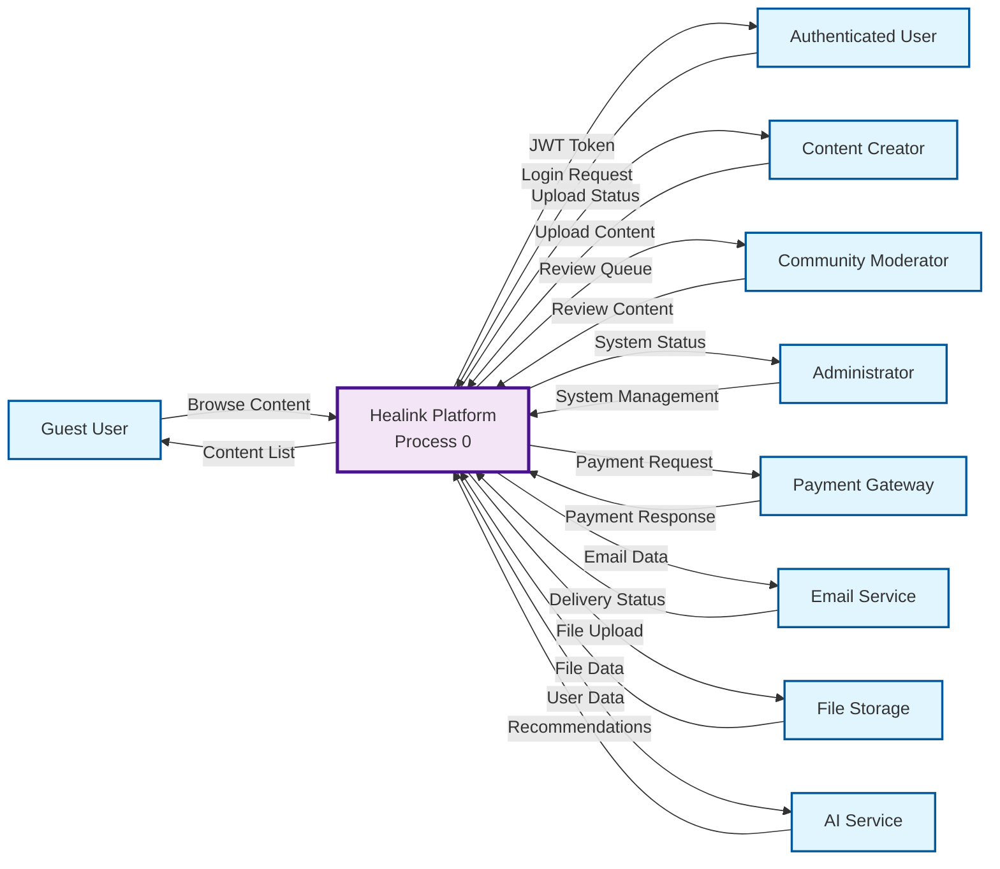

# Healink System - Data Flow Diagram (DFD)

## Data Flow Diagram Overview

```mermaid
graph TB
    %% External Entities
    Guest[Guest User<br/>External Entity]
    User[Authenticated User<br/>External Entity]
    Creator[Content Creator<br/>External Entity]
    Moderator[Community Moderator<br/>External Entity]
    Admin[Administrator<br/>External Entity]
    
    %% External Systems
    PaymentGateway[Payment Gateway<br/>MoMo/VNPay<br/>External Entity]
    EmailService[Email Service<br/>SMTP Server<br/>External Entity]
    FileStorage[File Storage<br/>AWS S3<br/>External Entity]
    AIService[AI Service<br/>FastAPI<br/>External Entity]

    %% Level 0 - Main Process
    HealinkSystem[Healink Platform<br/>Process 0<br/>Podcast Learning Ecosystem]

    %% Level 1 - Major Processes
    subgraph "Level 1 - Major Processes"
        P1[P1: User Management<br/>Authentication & Profile]
        P2[P2: Content Management<br/>Podcast CRUD & Approval]
        P3[P3: Subscription Management<br/>Plans & Billing]
        P4[P4: Payment Processing<br/>Transaction Handling]
        P5[P5: AI Recommendations<br/>Personalized Suggestions]
        P6[P6: Community Management<br/>Comments & Moderation]
        P7[P7: Analytics & Reporting<br/>Metrics & Insights]
        P8[P8: Notification Service<br/>Email & Push Alerts]
    end

    %% Level 2 - Detailed Processes
    subgraph "Level 2 - User Management Processes"
        P1_1[P1.1: User Registration<br/>Account Creation]
        P1_2[P1.2: User Authentication<br/>Login & JWT]
        P1_3[P1.3: Profile Management<br/>Update Information]
        P1_4[P1.4: Creator Application<br/>Apply & Approve]
        P1_5[P1.5: Role Management<br/>Assign Permissions]
    end

    subgraph "Level 2 - Content Management Processes"
        P2_1[P2.1: Content Upload<br/>File & Metadata]
        P2_2[P2.2: Content Processing<br/>Transcode & Extract]
        P2_3[P2.3: Content Approval<br/>Review & Publish]
        P2_4[P2.4: Content Delivery<br/>Stream & Download]
        P2_5[P2.5: Content Analytics<br/>Track Performance]
    end

    subgraph "Level 2 - Subscription Processes"
        P3_1[P3.1: Plan Management<br/>Create & Update Plans]
        P3_2[P3.2: Subscription Lifecycle<br/>Subscribe & Cancel]
        P3_3[P3.3: Billing Management<br/>Generate Invoices]
        P3_4[P3.4: Access Control<br/>Check Permissions]
    end

    subgraph "Level 2 - Payment Processes"
        P4_1[P4.1: Payment Initiation<br/>Create Transaction]
        P4_2[P4.2: Payment Processing<br/>Gateway Integration]
        P4_3[P4.3: Payment Verification<br/>Confirm & Update]
        P4_4[P4.4: Refund Processing<br/>Handle Returns]
    end

    subgraph "Level 2 - AI Recommendation Processes"
        P5_1[P5.1: Data Collection<br/>User Behavior]
        P5_2[P5.2: Model Inference<br/>Generate Suggestions]
        P5_3[P5.3: Recommendation Delivery<br/>Serve Results]
        P5_4[P5.4: Feedback Collection<br/>Improve Model]
    end

    subgraph "Level 2 - Community Processes"
        P6_1[P6.1: Comment Management<br/>Post & Moderate]
        P6_2[P6.2: Content Rating<br/>Rate & Review]
        P6_3[P6.3: Report Handling<br/>Process Complaints]
        P6_4[P6.4: Community Moderation<br/>Review & Action]
    end

    subgraph "Level 2 - Analytics Processes"
        P7_1[P7.1: Data Collection<br/>Gather Metrics]
        P7_2[P7.2: Data Processing<br/>Aggregate & Analyze]
        P7_3[P7.3: Report Generation<br/>Create Dashboards]
        P7_4[P7.4: Insight Delivery<br/>Serve Analytics]
    end

    subgraph "Level 2 - Notification Processes"
        P8_1[P8.1: Notification Trigger<br/>Event Detection]
        P8_2[P8.2: Message Preparation<br/>Template & Content]
        P8_3[P8.3: Delivery Processing<br/>Send Notifications]
        P8_4[P8.4: Delivery Tracking<br/>Monitor Status]
    end

    %% Data Stores
    subgraph "Data Stores"
        D1[(D1: User Database<br/>Auth & Profiles)]
        D2[(D2: Content Database<br/>Podcasts & Metadata)]
        D3[(D3: Subscription Database<br/>Plans & Subscriptions)]
        D4[(D4: Payment Database<br/>Transactions & Methods)]
        D5[(D5: Analytics Database<br/>Metrics & Reports)]
        D6[(D6: Notification Database<br/>Templates & Logs)]
        D7[(D7: Cache Store<br/>Redis - Sessions & Data)]
        D8[(D8: File Store<br/>S3 - Audio & Images)]
    end

    %% Level 0 Data Flows
    Guest -->|Browse Content| HealinkSystem
    HealinkSystem -->|Content List| Guest
    
    User -->|Login Request| HealinkSystem
    HealinkSystem -->|JWT Token| User
    
    Creator -->|Upload Content| HealinkSystem
    HealinkSystem -->|Upload Status| Creator
    
    Moderator -->|Review Content| HealinkSystem
    HealinkSystem -->|Review Queue| Moderator
    
    Admin -->|System Management| HealinkSystem
    HealinkSystem -->|System Status| Admin

    %% Level 1 Data Flows
    HealinkSystem --> P1
    HealinkSystem --> P2
    HealinkSystem --> P3
    HealinkSystem --> P4
    HealinkSystem --> P5
    HealinkSystem --> P6
    HealinkSystem --> P7
    HealinkSystem --> P8

    %% User Management Data Flows
    User -->|Registration Data| P1_1
    P1_1 -->|User Data| D1
    P1_1 -->|Verification Email| EmailService
    
    User -->|Login Credentials| P1_2
    P1_2 -->|User Validation| D1
    P1_2 -->|JWT Token| D7
    P1_2 -->|Login Status| User
    
    User -->|Profile Updates| P1_3
    P1_3 -->|Updated Profile| D1
    P1_3 -->|Profile Data| User
    
    User -->|Application Data| P1_4
    P1_4 -->|Application Record| D1
    P1_4 -->|Review Notification| EmailService
    
    Admin -->|Role Assignment| P1_5
    P1_5 -->|Role Data| D1
    P1_5 -->|Permission Update| D7

    %% Content Management Data Flows
    Creator -->|Audio File| P2_1
    P2_1 -->|File Upload| FileStorage
    P2_1 -->|Metadata| D2
    P2_1 -->|Upload Status| Creator
    
    P2_1 -->|Processing Request| P2_2
    P2_2 -->|Processed File| FileStorage
    P2_2 -->|Extracted Metadata| D2
    
    Moderator -->|Approval Decision| P2_3
    P2_3 -->|Content Status| D2
    P2_3 -->|Approval Notification| EmailService
    
    User -->|Content Request| P2_4
    P2_4 -->|Access Check| D3
    P2_4 -->|File Stream| FileStorage
    P2_4 -->|Content Data| User
    
    P2_4 -->|Usage Metrics| P2_5
    P2_5 -->|Analytics Data| D5

    %% Subscription Management Data Flows
    Admin -->|Plan Configuration| P3_1
    P3_1 -->|Plan Data| D3
    
    User -->|Subscription Request| P3_2
    P3_2 -->|Subscription Data| D3
    P3_2 -->|Payment Request| P4_1
    
    P3_2 -->|Billing Data| P3_3
    P3_3 -->|Invoice Data| D3
    P3_3 -->|Billing Notification| EmailService
    
    P2_4 -->|Access Check| P3_4
    P3_4 -->|Permission Data| D3
    P3_4 -->|Access Decision| P2_4

    %% Payment Processing Data Flows
    P3_2 -->|Payment Data| P4_1
    P4_1 -->|Transaction Record| D4
    P4_1 -->|Payment Request| PaymentGateway
    
    PaymentGateway -->|Payment Response| P4_2
    P4_2 -->|Transaction Update| D4
    P4_2 -->|Payment Status| P3_2
    
    P4_2 -->|Verification Data| P4_3
    P4_3 -->|Confirmed Transaction| D4
    P4_3 -->|Subscription Update| D3
    
    Admin -->|Refund Request| P4_4
    P4_4 -->|Refund Data| PaymentGateway
    P4_4 -->|Refund Record| D4

    %% AI Recommendation Data Flows
    P2_4 -->|User Behavior| P5_1
    P5_1 -->|Behavior Data| D5
    P5_1 -->|User Data| AIService
    
    AIService -->|Recommendations| P5_2
    P5_2 -->|Suggestion Data| D7
    P5_2 -->|Recommendations| User
    
    User -->|Recommendation Request| P5_3
    P5_3 -->|Cached Suggestions| D7
    P5_3 -->|Recommendation List| User
    
    User -->|Feedback Data| P5_4
    P5_4 -->|Feedback| AIService
    P5_4 -->|Improvement Data| D5

    %% Community Management Data Flows
    User -->|Comment Data| P6_1
    P6_1 -->|Comment Record| D2
    P6_1 -->|Comment Notification| EmailService
    
    Moderator -->|Moderation Action| P6_1
    P6_1 -->|Moderated Comment| D2
    
    User -->|Rating Data| P6_2
    P6_2 -->|Rating Record| D2
    P6_2 -->|Updated Rating| D2
    
    User -->|Report Data| P6_3
    P6_3 -->|Report Record| D6
    P6_3 -->|Report Notification| EmailService
    
    Moderator -->|Review Report| P6_4
    P6_4 -->|Action Taken| D6
    P6_4 -->|Resolution Notification| EmailService

    %% Analytics Data Flows
    P2_4 -->|Usage Data| P7_1
    P6_2 -->|Engagement Data| P7_1
    P4_2 -->|Payment Data| P7_1
    P7_1 -->|Raw Metrics| D5
    
    P7_1 -->|Aggregated Data| P7_2
    P7_2 -->|Processed Analytics| D5
    
    Admin -->|Report Request| P7_3
    P7_3 -->|Analytics Data| D5
    P7_3 -->|Generated Report| Admin
    
    Creator -->|Analytics Request| P7_4
    P7_4 -->|Creator Metrics| D5
    P7_4 -->|Analytics Dashboard| Creator

    %% Notification Data Flows
    P1_1 -->|Registration Event| P8_1
    P2_3 -->|Approval Event| P8_1
    P4_3 -->|Payment Event| P8_1
    P8_1 -->|Event Data| D6
    
    P8_1 -->|Notification Data| P8_2
    P8_2 -->|Template Data| D6
    P8_2 -->|Prepared Message| P8_3
    
    P8_3 -->|Email Data| EmailService
    P8_3 -->|Push Data| User
    P8_3 -->|SMS Data| User
    
    P8_3 -->|Delivery Status| P8_4
    P8_4 -->|Delivery Log| D6

    %% Styling
    classDef externalClass fill:#e1f5fe,stroke:#01579b,stroke-width:3px
    classDef processClass fill:#e8f5e8,stroke:#1b5e20,stroke-width:2px
    classDef dataStoreClass fill:#fff3e0,stroke:#e65100,stroke-width:2px
    classDef systemClass fill:#f3e5f5,stroke:#4a148c,stroke-width:3px

    class Guest,User,Creator,Moderator,Admin,PaymentGateway,EmailService,FileStorage,AIService externalClass
    class P1,P2,P3,P4,P5,P6,P7,P8,P1_1,P1_2,P1_3,P1_4,P1_5,P2_1,P2_2,P2_3,P2_4,P2_5,P3_1,P3_2,P3_3,P3_4,P4_1,P4_2,P4_3,P4_4,P5_1,P5_2,P5_3,P5_4,P6_1,P6_2,P6_3,P6_4,P7_1,P7_2,P7_3,P7_4,P8_1,P8_2,P8_3,P8_4 processClass
    class D1,D2,D3,D4,D5,D6,D7,D8 dataStoreClass
    class HealinkSystem systemClass
```

## Data Flow Diagram Levels

### **Level 0 - Context Diagram**

### **Level 1 - Major Processes**

```mermaid
graph TB
    %% External Entities
    User[User]
    Creator[Creator]
    Moderator[Moderator]
    Admin[Admin]
    PaymentGateway[Payment Gateway]
    EmailService[Email Service]
    FileStorage[File Storage]
    AIService[AI Service]

    %% Major Processes
    P1[P1: User Management]
    P2[P2: Content Management]
    P3[P3: Subscription Management]
    P4[P4: Payment Processing]
    P5[P5: AI Recommendations]
    P6[P6: Community Management]
    P7[P7: Analytics & Reporting]
    P8[P8: Notification Service]

    %% Data Stores
    D1[(D1: User Database)]
    D2[(D2: Content Database)]
    D3[(D3: Subscription Database)]
    D4[(D4: Payment Database)]
    D5[(D5: Analytics Database)]
    D6[(D6: Notification Database)]
    D7[(D7: Cache Store)]
    D8[(D8: File Store)]

    %% Data Flows
    User -->|Registration| P1
    User -->|Content Request| P2
    User -->|Subscription| P3
    User -->|Payment| P4
    User -->|Recommendation Request| P5
    User -->|Comment| P6
    
    Creator -->|Upload| P2
    Creator -->|Analytics Request| P7
    
    Moderator -->|Review| P2
    Moderator -->|Moderate| P6
    
    Admin -->|Manage Users| P1
    Admin -->|Manage Content| P2
    Admin -->|Manage Subscriptions| P3
    Admin -->|Reports| P7
    
    P1 -->|User Data| D1
    P2 -->|Content Data| D2
    P3 -->|Subscription Data| D3
    P4 -->|Payment Data| D4
    P5 -->|Analytics Data| D5
    P6 -->|Community Data| D2
    P7 -->|Metrics| D5
    P8 -->|Notifications| D6
    
    P2 -->|File Data| D8
    P1 -->|Session Data| D7
    P5 -->|Cache Data| D7
    
    P4 -->|Payment Request| PaymentGateway
    P8 -->|Email| EmailService
    P2 -->|File Upload| FileStorage
    P5 -->|User Data| AIService

    classDef externalClass fill:#e1f5fe,stroke:#01579b,stroke-width:2px
    classDef processClass fill:#e8f5e8,stroke:#1b5e20,stroke-width:2px
    classDef dataStoreClass fill:#fff3e0,stroke:#e65100,stroke-width:2px
    
    class User,Creator,Moderator,Admin,PaymentGateway,EmailService,FileStorage,AIService externalClass
    class P1,P2,P3,P4,P5,P6,P7,P8 processClass
    class D1,D2,D3,D4,D5,D6,D7,D8 dataStoreClass
```

## Detailed Data Flow Descriptions

### **User Management Data Flows**

#### **Registration Flow**
- **Input**: Registration data (email, password, profile info)
- **Process**: P1.1 - User Registration
- **Data Store**: D1 - User Database
- **Output**: User account, verification email
- **External**: EmailService for verification

#### **Authentication Flow**
- **Input**: Login credentials
- **Process**: P1.2 - User Authentication
- **Data Store**: D1 - User Database, D7 - Cache Store
- **Output**: JWT token, session data
- **External**: None

#### **Profile Management Flow**
- **Input**: Profile updates
- **Process**: P1.3 - Profile Management
- **Data Store**: D1 - User Database
- **Output**: Updated profile data
- **External**: None

### **Content Management Data Flows**

#### **Content Upload Flow**
- **Input**: Audio file, metadata
- **Process**: P2.1 - Content Upload
- **Data Store**: D2 - Content Database, D8 - File Store
- **Output**: Upload status, file URL
- **External**: FileStorage for file upload

#### **Content Processing Flow**
- **Input**: Raw audio file
- **Process**: P2.2 - Content Processing
- **Data Store**: D2 - Content Database, D8 - File Store
- **Output**: Processed file, extracted metadata
- **External**: FileStorage for file processing

#### **Content Delivery Flow**
- **Input**: Content request
- **Process**: P2.4 - Content Delivery
- **Data Store**: D2 - Content Database, D3 - Subscription Database
- **Output**: Content stream, access control
- **External**: FileStorage for file delivery

### **Subscription Management Data Flows**

#### **Subscription Creation Flow**
- **Input**: Plan selection, user data
- **Process**: P3.2 - Subscription Lifecycle
- **Data Store**: D3 - Subscription Database
- **Output**: Subscription record, payment request
- **External**: PaymentGateway for payment processing

#### **Access Control Flow**
- **Input**: Content access request
- **Process**: P3.4 - Access Control
- **Data Store**: D3 - Subscription Database
- **Output**: Access decision
- **External**: None

### **Payment Processing Data Flows**

#### **Payment Initiation Flow**
- **Input**: Payment data, subscription info
- **Process**: P4.1 - Payment Initiation
- **Data Store**: D4 - Payment Database
- **Output**: Transaction record, payment request
- **External**: PaymentGateway for payment processing

#### **Payment Verification Flow**
- **Input**: Payment response
- **Process**: P4.3 - Payment Verification
- **Data Store**: D4 - Payment Database, D3 - Subscription Database
- **Output**: Confirmed transaction, updated subscription
- **External**: PaymentGateway for verification

### **AI Recommendation Data Flows**

#### **Data Collection Flow**
- **Input**: User behavior data
- **Process**: P5.1 - Data Collection
- **Data Store**: D5 - Analytics Database
- **Output**: Behavior data
- **External**: AIService for data processing

#### **Recommendation Generation Flow**
- **Input**: User data, behavior patterns
- **Process**: P5.2 - Model Inference
- **Data Store**: D7 - Cache Store
- **Output**: Personalized recommendations
- **External**: AIService for ML inference

### **Community Management Data Flows**

#### **Comment Management Flow**
- **Input**: Comment data
- **Process**: P6.1 - Comment Management
- **Data Store**: D2 - Content Database
- **Output**: Comment record, notification
- **External**: EmailService for notifications

#### **Content Rating Flow**
- **Input**: Rating data
- **Process**: P6.2 - Content Rating
- **Data Store**: D2 - Content Database
- **Output**: Updated rating, analytics data
- **External**: None

### **Analytics Data Flows**

#### **Data Collection Flow**
- **Input**: Usage metrics, engagement data
- **Process**: P7.1 - Data Collection
- **Data Store**: D5 - Analytics Database
- **Output**: Raw metrics
- **External**: None

#### **Report Generation Flow**
- **Input**: Report request
- **Process**: P7.3 - Report Generation
- **Data Store**: D5 - Analytics Database
- **Output**: Generated report
- **External**: None

### **Notification Service Data Flows**

#### **Notification Trigger Flow**
- **Input**: System events
- **Process**: P8.1 - Notification Trigger
- **Data Store**: D6 - Notification Database
- **Output**: Event data
- **External**: None

#### **Message Delivery Flow**
- **Input**: Notification data
- **Process**: P8.3 - Delivery Processing
- **Data Store**: D6 - Notification Database
- **Output**: Delivery status
- **External**: EmailService, Push services

## Data Store Descriptions

### **D1: User Database**
- **Purpose**: Store user authentication and profile data
- **Data**: User accounts, profiles, roles, permissions
- **Access**: User Management processes
- **Technology**: PostgreSQL

### **D2: Content Database**
- **Purpose**: Store podcast content and metadata
- **Data**: Podcasts, comments, ratings, interactions
- **Access**: Content Management, Community processes
- **Technology**: PostgreSQL

### **D3: Subscription Database**
- **Purpose**: Store subscription plans and user subscriptions
- **Data**: Plans, subscriptions, billing, access control
- **Access**: Subscription Management, Payment processes
- **Technology**: PostgreSQL

### **D4: Payment Database**
- **Purpose**: Store payment transactions and methods
- **Data**: Transactions, payment methods, refunds
- **Access**: Payment Processing processes
- **Technology**: PostgreSQL

### **D5: Analytics Database**
- **Purpose**: Store analytics and metrics data
- **Data**: Usage metrics, performance data, reports
- **Access**: Analytics, AI Recommendation processes
- **Technology**: PostgreSQL

### **D6: Notification Database**
- **Purpose**: Store notification templates and delivery logs
- **Data**: Templates, delivery logs, notification history
- **Access**: Notification Service processes
- **Technology**: PostgreSQL

### **D7: Cache Store**
- **Purpose**: Store frequently accessed data and sessions
- **Data**: Sessions, cached recommendations, temporary data
- **Access**: All processes for performance optimization
- **Technology**: Redis

### **D8: File Store**
- **Purpose**: Store audio files and images
- **Data**: Podcast audio, thumbnails, user avatars
- **Access**: Content Management processes
- **Technology**: AWS S3

## Data Flow Patterns

### **Request-Response Pattern**
- User requests → Process → Data Store → Response
- Used for: Content delivery, user authentication, data retrieval

### **Event-Driven Pattern**
- Event → Process → Data Store → Notification
- Used for: User registration, content approval, payment confirmation

### **Batch Processing Pattern**
- Data Collection → Processing → Data Store → Reporting
- Used for: Analytics processing, report generation

### **Real-time Streaming Pattern**
- Continuous Data → Processing → Data Store → Real-time Updates
- Used for: Content streaming, real-time analytics

Data Flow Diagram này cung cấp cái nhìn chi tiết về luồng dữ liệu trong hệ thống Healink, từ external entities đến internal processes và data stores, giúp hiểu rõ cách dữ liệu được xử lý và lưu trữ trong toàn bộ hệ thống.

