# Healink System - Deployment Diagram

## Deployment Diagram Overview

```mermaid
graph TB
    %% Development Environment
    subgraph "Development Environment"
        Dev[Developer<br/>Local Machine]
        GitHub[GitHub Repository<br/>oggycat-dev/dot-net-healink-back-end]
        GitHubActions[GitHub Actions<br/>CI/CD Pipeline]
    end

    %% AWS Cloud Infrastructure
    subgraph "AWS Cloud - ap-southeast-2"
        subgraph "VPC - healink-vpc"
            subgraph "Public Subnets"
                ALB[Application Load Balancer<br/>healink-gateway-alb<br/>Public Gateway Entry Point]
            end
            
            subgraph "Private Subnets"
                subgraph "ECS Cluster - healink-cluster-free"
                    Gateway[Gateway Service<br/>ECS Fargate<br/>256 CPU / 512 MB]
                    AuthService[Auth Service<br/>ECS Fargate<br/>256 CPU / 512 MB]
                    UserService[User Service<br/>ECS Fargate<br/>256 CPU / 512 MB]
                    ContentService[Content Service<br/>ECS Fargate<br/>256 CPU / 512 MB]
                    NotificationService[Notification Service<br/>ECS Fargate<br/>256 CPU / 512 MB]
                    SubscriptionService[Subscription Service<br/>ECS Fargate<br/>256 CPU / 512 MB]
                    PaymentService[Payment Service<br/>ECS Fargate<br/>256 CPU / 512 MB]
                    RecommendationService[Recommendation Service<br/>ECS Fargate<br/>256 CPU / 512 MB]
                    AIService[AI Service<br/>FastAPI<br/>ECS Fargate<br/>256 CPU / 512 MB]
                end
                
                subgraph "Data Layer"
                    RDS[RDS PostgreSQL<br/>db.t3.micro<br/>Multi-AZ: No<br/>Storage: 20GB]
                    Redis[ElastiCache Redis<br/>cache.t3.micro<br/>Single Node]
                    RabbitMQ[Amazon MQ RabbitMQ<br/>mq.t3.micro<br/>Single Instance]
                end
                
                subgraph "Storage & Registry"
                    ECR[Amazon ECR<br/>8 Repositories<br/>Docker Images]
                    S3[AWS S3<br/>healink-upload-file<br/>Audio Files & Thumbnails]
                end
            end
        end
        
        subgraph "Monitoring & Logging"
            CloudWatch[CloudWatch<br/>Logs & Metrics<br/>Health Monitoring]
        end
        
        subgraph "Security & IAM"
            IAM[IAM Roles & Policies<br/>GitHubActionRole-Healink<br/>ECS Task Roles]
            SecretsManager[AWS Secrets Manager<br/>Database Passwords<br/>API Keys]
        end
    end

    %% External Services
    subgraph "External Services"
        MoMo[MoMo Payment Gateway<br/>Vietnamese Payment<br/>IPN Callbacks]
        SMTP[SMTP Server<br/>Email Delivery<br/>OTP & Notifications]
        Firebase[Firebase<br/>Push Notifications<br/>Real-time Messaging]
    end

    %% Frontend Applications
    subgraph "Client Applications"
        WebApp[Next.js Web App<br/>React Frontend<br/>Port: 3000]
        MobileApp[Mobile App<br/>iOS/Android<br/>Native Apps]
    end

    %% Deployment Flow
    Dev -->|git push| GitHub
    GitHub -->|triggers| GitHubActions
    GitHubActions -->|deploy| ECR
    GitHubActions -->|provision| RDS
    GitHubActions -->|provision| Redis
    GitHubActions -->|provision| RabbitMQ
    GitHubActions -->|deploy| Gateway
    GitHubActions -->|deploy| AuthService
    GitHubActions -->|deploy| UserService
    GitHubActions -->|deploy| ContentService
    GitHubActions -->|deploy| NotificationService
    GitHubActions -->|deploy| SubscriptionService
    GitHubActions -->|deploy| PaymentService
    GitHubActions -->|deploy| RecommendationService
    GitHubActions -->|deploy| AIService

    %% Service Communication
    ALB -->|routing| Gateway
    Gateway -->|internal calls| AuthService
    Gateway -->|internal calls| UserService
    Gateway -->|internal calls| ContentService
    Gateway -->|internal calls| NotificationService
    Gateway -->|internal calls| SubscriptionService
    Gateway -->|internal calls| PaymentService
    Gateway -->|internal calls| RecommendationService
    RecommendationService -->|AI requests| AIService

    %% Data Connections
    AuthService -->|connect| RDS
    UserService -->|connect| RDS
    ContentService -->|connect| RDS
    NotificationService -->|connect| RDS
    SubscriptionService -->|connect| RDS
    PaymentService -->|connect| RDS
    RecommendationService -->|connect| RDS

    AuthService -->|cache| Redis
    UserService -->|cache| Redis
    ContentService -->|cache| Redis
    Gateway -->|session| Redis

    AuthService -->|events| RabbitMQ
    UserService -->|events| RabbitMQ
    ContentService -->|events| RabbitMQ
    SubscriptionService -->|events| RabbitMQ
    PaymentService -->|events| RabbitMQ

    ContentService -->|file upload| S3
    UserService -->|avatar upload| S3

    PaymentService -->|payment processing| MoMo
    NotificationService -->|email delivery| SMTP
    NotificationService -->|push notifications| Firebase

    %% Client Access
    WebApp -->|API calls| ALB
    MobileApp -->|API calls| ALB

    %% Monitoring
    Gateway -->|logs| CloudWatch
    AuthService -->|logs| CloudWatch
    UserService -->|logs| CloudWatch
    ContentService -->|logs| CloudWatch
    NotificationService -->|logs| CloudWatch
    SubscriptionService -->|logs| CloudWatch
    PaymentService -->|logs| CloudWatch
    RecommendationService -->|logs| CloudWatch
    AIService -->|logs| CloudWatch

    %% Security
    GitHubActions -->|assume role| IAM
    Gateway -->|task role| IAM
    AuthService -->|task role| IAM
    UserService -->|task role| IAM
    ContentService -->|task role| IAM
    NotificationService -->|task role| IAM
    SubscriptionService -->|task role| IAM
    PaymentService -->|task role| IAM
    RecommendationService -->|task role| IAM
    AIService -->|task role| IAM

    AuthService -->|secrets| SecretsManager
    UserService -->|secrets| SecretsManager
    ContentService -->|secrets| SecretsManager
    PaymentService -->|secrets| SecretsManager

    %% Styling
    classDef devClass fill:#e1f5fe,stroke:#01579b,stroke-width:2px
    classDef awsClass fill:#fff3e0,stroke:#e65100,stroke-width:2px
    classDef serviceClass fill:#e8f5e8,stroke:#1b5e20,stroke-width:2px
    classDef dataClass fill:#f3e5f5,stroke:#4a148c,stroke-width:2px
    classDef externalClass fill:#fce4ec,stroke:#880e4f,stroke-width:2px
    classDef clientClass fill:#e0f2f1,stroke:#004d40,stroke-width:2px

    class Dev,GitHub,GitHubActions devClass
    class ALB,ECR,S3,CloudWatch,IAM,SecretsManager awsClass
    class Gateway,AuthService,UserService,ContentService,NotificationService,SubscriptionService,PaymentService,RecommendationService,AIService serviceClass
    class RDS,Redis,RabbitMQ dataClass
    class MoMo,SMTP,Firebase externalClass
    class WebApp,MobileApp clientClass
```



## Deployment Architecture Details

### **🏗️ Infrastructure Layers**

#### **1. Development Layer**
- **Developer Machine**: Local development environment
- **GitHub Repository**: Source code management
- **GitHub Actions**: CI/CD pipeline automation

#### **2. AWS Cloud Infrastructure**
- **Region**: ap-southeast-2 (Sydney)
- **VPC**: healink-vpc with public/private subnets
- **Security**: IAM roles, security groups, NACLs

#### **3. Application Layer (ECS Fargate)**
- **Cluster**: healink-cluster-free
- **Services**: 9 microservices (8 .NET + 1 Python)
- **Resources**: 256 CPU / 512 MB per service
- **Scaling**: Auto-scaling based on CPU/memory

#### **4. Data Layer**
- **RDS PostgreSQL**: db.t3.micro (Free Tier)
- **ElastiCache Redis**: cache.t3.micro
- **Amazon MQ RabbitMQ**: mq.t3.micro
- **AWS S3**: File storage for audio/images

#### **5. External Services**
- **MoMo Payment Gateway**: Vietnamese payment processing
- **SMTP Server**: Email delivery
- **Firebase**: Push notifications

### **🚀 Deployment Process**

#### **GitHub Actions Workflow**
```yaml
# 4-Step Deployment Process
1. Deploy Stateful Infrastructure (RDS, Redis, RabbitMQ, ECR)
2. Build & Push Docker Images (9 services)
3. Deploy Application Infrastructure (ECS, ALB)
4. Health Check & Verification
```

#### **Step 1: Stateful Infrastructure**
- **Duration**: 5-10 minutes
- **Resources**: RDS PostgreSQL, ElastiCache Redis, Amazon MQ RabbitMQ
- **ECR Repositories**: 9 repositories for Docker images
- **Security Groups**: Network access control

#### **Step 2: Docker Image Build**
- **Duration**: 15-20 minutes
- **Services**: Gateway, AuthService, UserService, ContentService, NotificationService, SubscriptionService, PaymentService, RecommendationService, AIService
- **Tags**: latest, free, commit-sha
- **Registry**: Amazon ECR

#### **Step 3: Application Deployment**
- **Duration**: 10-15 minutes
- **ECS Cluster**: healink-cluster-free
- **Services**: 9 ECS services with Fargate
- **Load Balancer**: 1 ALB for Gateway (cost optimization)
- **Target Groups**: Health check configuration

#### **Step 4: Health Check**
- **Duration**: 2-3 minutes
- **Wait Time**: 90 seconds for task startup
- **Verification**: ECS task status, service health
- **Output**: Gateway URL for frontend integration

### **💰 Cost Optimization**

#### **Free Tier Configuration**
```hcl
# Database
db_instance_class = "db.t3.micro"        # Free Tier eligible
db_allocated_storage = 20               # Free Tier: 20GB

# ECS Fargate
ecs_task_cpu = "256"                    # 0.25 vCPU
ecs_task_memory = "512"                 # 0.5 GB
ecs_desired_count = 1                   # Single instance

# Message Queue
mq_instance_type = "mq.t3.micro"        # Free Tier eligible
mq_deployment_mode = "SINGLE_INSTANCE"   # No HA for cost saving
```

#### **Cost Breakdown (Free Tier)**
| Resource | Configuration | Free Tier | Monthly Cost |
|----------|---------------|-----------|--------------|
| RDS PostgreSQL | db.t3.micro, 20GB | 750 hrs/month | **$0** |
| ElastiCache Redis | cache.t3.micro | ❌ Not free | **~$12** |
| Amazon MQ | mq.t3.micro | ❌ Not free | **~$18** |
| ECS Fargate | 9 services × 256 CPU/512 MB | Partial | **~$30** |
| ALB | 1 ALB (Gateway only) | 750 hrs/month | **$0** ✅ |
| **TOTAL** | | | **~$60/month** 🎉 |

#### **Cost Savings**
- **Old Architecture**: 9 ALBs = $144/month
- **New Architecture**: 1 ALB = $0 (Free Tier)
- **Savings**: $144/month (100% ALB cost reduction)

### **🔧 Service Configuration**

#### **Gateway Service (Public)**
- **ALB**: Public-facing load balancer
- **Target Group**: Health check on /health
- **Security Group**: Allow HTTP/HTTPS from internet
- **ECS Service**: healink-gateway-free

#### **Internal Services (Private)**
- **No ALB**: Direct ECS service communication
- **Security Groups**: Internal VPC communication only
- **Service Discovery**: ECS service names
- **Health Checks**: Internal health endpoints

#### **Service Communication**
```yaml
# Gateway routes to internal services
Gateway → AuthService: http://healink-auth-service-free:80
Gateway → UserService: http://healink-user-service-free:80
Gateway → ContentService: http://healink-content-service-free:80
Gateway → NotificationService: http://healink-notification-service-free:80
Gateway → SubscriptionService: http://healink-subscription-service-free:80
Gateway → PaymentService: http://healink-payment-service-free:80
Gateway → RecommendationService: http://healink-recommendation-service-free:80
```

### **📊 Monitoring & Logging**

#### **CloudWatch Integration**
- **Log Groups**: /ecs/healink-{service}-free
- **Metrics**: CPU, Memory, Network, Custom metrics
- **Alarms**: Service health monitoring
- **Dashboards**: Service performance visualization

#### **Health Monitoring**
- **ECS Health Checks**: Container-level health
- **ALB Health Checks**: Load balancer health
- **Application Health**: /health endpoints
- **Database Health**: RDS monitoring

### **🔒 Security Configuration**

#### **IAM Roles**
- **GitHubActionRole-Healink**: CI/CD deployment
- **ECS Task Roles**: Service-specific permissions
- **ECR Access**: Docker image push/pull
- **S3 Access**: File upload/download

#### **Network Security**
- **VPC**: Isolated network environment
- **Security Groups**: Port-based access control
- **NACLs**: Subnet-level security
- **Private Subnets**: Internal service isolation

#### **Secrets Management**
- **AWS Secrets Manager**: Database passwords
- **GitHub Secrets**: CI/CD sensitive data
- **Environment Variables**: Service configuration
- **Encryption**: Data at rest and in transit

### **🔄 Deployment Strategies**

#### **Blue-Green Deployment**
- **Current**: Production traffic on active environment
- **New**: Deploy to inactive environment
- **Switch**: ALB target group update
- **Rollback**: Quick revert to previous environment

#### **Rolling Deployment**
- **ECS Service**: Gradual task replacement
- **Health Checks**: Ensure service stability
- **Auto Scaling**: Maintain desired capacity
- **Monitoring**: Real-time health monitoring

#### **Canary Deployment**
- **Traffic Split**: Gradual traffic migration
- **Monitoring**: Performance and error rates
- **Rollback**: Quick revert on issues
- **Validation**: Automated health checks

### **📱 Frontend Integration**

#### **API Endpoints**
```json
{
  "environment": "free",
  "gatewayUrl": "http://healink-gateway-fre-*.elb.amazonaws.com",
  "endpoints": {
    "base": "http://healink-gateway-fre-*.elb.amazonaws.com",
    "health": "http://healink-gateway-fre-*.elb.amazonaws.com/health",
    "auth": "http://healink-gateway-fre-*.elb.amazonaws.com/api/auth",
    "users": "http://healink-gateway-fre-*.elb.amazonaws.com/api/users",
    "content": "http://healink-gateway-fre-*.elb.amazonaws.com/api/content"
  }
}
```

#### **Environment Variables**
```env
# React/Next.js
REACT_APP_API_URL=http://healink-gateway-fre-*.elb.amazonaws.com
REACT_APP_API_GATEWAY=http://healink-gateway-fre-*.elb.amazonaws.com
REACT_APP_AUTH_URL=http://healink-gateway-fre-*.elb.amazonaws.com/api/auth

# Vue.js
VUE_APP_API_URL=http://healink-gateway-fre-*.elb.amazonaws.com
VUE_APP_API_GATEWAY=http://healink-gateway-fre-*.elb.amazonaws.com
```

### **🛠️ Troubleshooting**

#### **Common Issues**
- **ECS Tasks Not Starting**: Check CloudWatch logs
- **Health Check Failures**: Verify /health endpoints
- **Database Connection**: Check security groups
- **ALB Target Health**: Verify service health

#### **Debugging Commands**
```bash
# Check ECS cluster status
aws ecs describe-clusters --cluster healink-cluster-free

# List running tasks
aws ecs list-tasks --cluster healink-cluster-free

# Check service logs
aws logs tail /ecs/healink-gateway-free --follow

# Test health endpoint
curl http://healink-gateway-fre-*.elb.amazonaws.com/health
```

### **📈 Scaling Strategy**

#### **Horizontal Scaling**
- **ECS Service**: Increase desired count
- **Auto Scaling**: CPU/memory-based scaling
- **Load Distribution**: ALB traffic distribution
- **Database**: Read replicas for read scaling

#### **Vertical Scaling**
- **ECS Tasks**: Increase CPU/memory allocation
- **RDS**: Upgrade instance class
- **Redis**: Upgrade node type
- **RabbitMQ**: Upgrade instance type

Deployment Diagram này cung cấp blueprint hoàn chỉnh cho việc triển khai hệ thống Healink trên AWS với tối ưu hóa chi phí Free Tier và kiến trúc microservices scalable.

