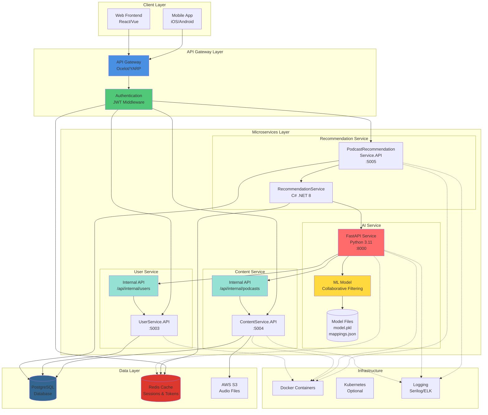

# AI Recommendation Service - Architecture Diagram

## System Architecture Overview



## Component Details

### 1. Client Layer
- **Mobile App**: iOS/Android native apps
- **Web Frontend**: React/Vue SPA
- **Authentication**: JWT Bearer tokens
- **Communication**: HTTPS REST APIs

### 2. API Gateway
- **Technology**: Ocelot / YARP / Custom Gateway
- **Responsibilities**:
  - Route requests to microservices
  - JWT validation
  - Rate limiting
  - CORS handling
  - Request/response logging

### 3. Recommendation Service (C# .NET)
- **Port**: 5005
- **Framework**: ASP.NET Core 8.0
- **Responsibilities**:
  - User recommendation requests
  - HTTP client for AI service
  - Response mapping & validation
  - Error handling & retry logic
  - Caching recommendations

### 4. AI Service (Python FastAPI)
- **Port**: 8000
- **Framework**: FastAPI + Uvicorn
- **Responsibilities**:
  - ML model inference
  - Collaborative filtering predictions
  - Real-time data fetching
  - Duration parsing
  - Fallback to training data

### 5. ML Model
- **Algorithm**: Collaborative Filtering (Matrix Factorization)
- **Framework**: scikit-learn
- **Files**:
  - `model.pkl`: Trained model weights
  - `user_mapping.json`: User ID to index mapping (1000 users)
  - `podcast_mapping.json`: Podcast ID to index mapping (1990 podcasts)
  - `metadata.json`: Additional model metadata

### 6. Content Service
- **Port**: 5004
- **Internal API**: `/api/internal/podcasts`
- **Public API**: `/api/user/podcasts`
- **Responsibilities**:
  - Manage podcast content
  - CRUD operations
  - File uploads (thumbnails, audio)
  - Content status management

### 7. User Service
- **Port**: 5003
- **Internal API**: `/api/internal/users`
- **Public API**: `/api/users`
- **Responsibilities**:
  - User authentication
  - User profile management
  - Role & permission management

### 8. Database (PostgreSQL)
- **Version**: PostgreSQL 15
- **Key Tables**:
  - `Users`: User profiles, roles, status
  - `Contents`: Podcasts, articles (discriminator pattern)
  - `UserInteractions`: Listening history, ratings
  - `Recommendations`: Cached recommendations
- **Indexes**: 
  - `Contents.ContentType`
  - `Contents.ContentStatus`
  - `Contents.CreatedBy`

### 9. Cache (Redis)
- **Version**: Redis 7
- **Use Cases**:
  - JWT token storage & validation
  - User session data
  - Recommendation caching (TTL: 5 min)
  - Podcast data caching (TTL: 5 min)
  - Rate limiting counters

### 10. Storage (AWS S3)
- **Buckets**:
  - `healink-upload-file/podcasts/audio/`
  - `healink-upload-file/podcasts/thumbnails/`
- **Access**: Pre-signed URLs for secure downloads

## Data Flow

### Recommendation Request Flow
1. Client → Gateway (JWT auth)
2. Gateway → Recommendation API
3. Recommendation API → AI Service (HTTP)
4. AI Service → ContentService (Internal API)
5. AI Service → UserService (Internal API)
6. AI Service → ML Model (in-memory prediction)
7. Response back through the chain

### Content Upload Flow
1. Client → Gateway → ContentService
2. ContentService → AWS S3 (file upload)
3. ContentService → PostgreSQL (metadata)
4. ContentService → Redis (cache invalidation)

## Security

### Authentication & Authorization
- JWT Bearer tokens (HS256/RS256)
- Role-based access control (RBAC)
- Token expiration: 24 hours
- Refresh token rotation

### Internal Communication
- Internal APIs: No public exposure
- Service-to-service: Trusted network
- Optional: Mutual TLS (mTLS)

### Data Protection
- Database: Encrypted at rest
- Redis: TLS connection
- S3: Server-side encryption (SSE-S3)
- Logs: PII masking

## Performance

### Response Times
- Recommendation request: 200-500ms
- ML inference: 50-100ms per podcast
- Database query: 20-50ms
- Cache hit: 1-5ms

### Scalability
- Horizontal scaling: All services
- Load balancing: NGINX/Kubernetes
- Database: Read replicas
- Cache: Redis Cluster

### Optimization
- Model preloading on startup
- Connection pooling
- Response caching
- Async/await patterns

## Deployment

### Docker Compose (Development)
```yaml
services:
  - gateway
  - recommendation-api
  - ai-service
  - content-api
  - user-api
  - postgres
  - redis
```

### Kubernetes (Production)
```yaml
Deployments:
  - recommendation-api (replicas: 3)
  - ai-service (replicas: 2)
  - content-api (replicas: 3)
  
Services:
  - LoadBalancer
  - ClusterIP (internal)
  
ConfigMaps:
  - appsettings
  - model-config
  
Secrets:
  - db-credentials
  - jwt-secret
  - aws-credentials
```

## Monitoring & Logging

### Logging
- **Framework**: Serilog (C#), logging (Python)
- **Destination**: Console, File, ELK Stack
- **Structured**: JSON format
- **Correlation IDs**: Request tracing

### Metrics
- **Prometheus**: Custom metrics
- **Grafana**: Dashboards
- **Key Metrics**:
  - Request rate (req/s)
  - Error rate (%)
  - Response time (p50, p95, p99)
  - ML model accuracy
  - Cache hit rate

### Health Checks
- Kubernetes liveness probes
- Readiness probes
- Dependency health checks

## Technology Stack Summary

| Component | Technology | Version |
|-----------|-----------|---------|
| Backend API | C# .NET | 8.0 |
| AI Service | Python FastAPI | 3.11 |
| ML Library | scikit-learn | 1.3+ |
| Database | PostgreSQL | 15 |
| Cache | Redis | 7 |
| Container | Docker | Latest |
| Orchestration | Kubernetes | 1.28+ |
| Gateway | Ocelot/YARP | Latest |
| Storage | AWS S3 | - |
| Logging | Serilog/ELK | Latest |
| Monitoring | Prometheus/Grafana | Latest |

## API Endpoints Summary

### Public Endpoints (JWT Required)
- `GET /api/recommendations/me?limit=10`
- `GET /api/user/podcasts?page=1&pageSize=10`
- `GET /api/users/profile`

### Internal Endpoints (No Auth)
- `GET /api/internal/podcasts?pageSize=100`
- `GET /api/internal/users/{userId}`
- `GET /api/recommendations/{userId}?limit=10` (AI Service)

### Admin Endpoints (Admin Role Required)
- `GET /api/recommendations/user/{userId}`
- `GET /api/admin/users`
- `POST /api/admin/podcasts/approve`
