# AI Recommendation Service - Sequence Diagram

## Full Flow: User Request to AI Recommendation Response

```mermaid
sequenceDiagram
    autonumber
    
    participant Client as Client/Mobile App
    participant Gateway as API Gateway
    participant Auth as Auth Middleware
    participant RcmAPI as PodcastRecommendation<br/>Service.API
    participant RcmService as RecommendationService<br/>(C# .NET)
    participant AIService as AI Service<br/>(FastAPI Python)
    participant ContentAPI as ContentService<br/>Internal API
    participant UserAPI as UserService<br/>Internal API
    participant DB as PostgreSQL<br/>Database
    participant Cache as Redis Cache
    participant MLModel as ML Model<br/>(Trained)
    
    %% ===== USER REQUEST PHASE =====
    rect rgb(240, 248, 255)
        Note over Client,Gateway: 1. Client Request Phase
        Client->>+Gateway: GET /api/recommendations/me?limit=10
        Note right of Client: Headers:<br/>Authorization: Bearer {token}
        
        Gateway->>+Auth: Validate JWT Token
        Auth->>Cache: Check token in Redis
        Cache-->>Auth: Token valid, User: 4a426ae0-34b4...
        Auth-->>Gateway: User authenticated
        
        Gateway->>+RcmAPI: Forward request with UserId
        Note right of Gateway: X-User-Id: 4a426ae0-34b4...
    end
    
    %% ===== .NET SERVICE PROCESSING =====
    rect rgb(255, 250, 240)
        Note over RcmAPI,RcmService: 2. .NET Service Processing
        RcmAPI->>RcmAPI: Extract UserId from token<br/>(CurrentUserService)
        RcmAPI->>+RcmService: GetRecommendationsAsync<br/>(userId, limit=10, includeListened=false)
        
        RcmService->>RcmService: Validate inputs<br/>(userId not empty, limit 1-50)
        RcmService->>RcmService: Build AI Service URL<br/>http://podcast-ai-service:8000/api/recommendations/{userId}
    end
    
    %% ===== AI SERVICE CALL =====
    rect rgb(240, 255, 240)
        Note over RcmService,AIService: 3. AI Service Communication
        RcmService->>+AIService: GET /api/recommendations/{userId}?limit=10
        Note right of RcmService: HTTP Client request<br/>Timeout: 30s
        
        AIService->>AIService: Validate user_id format
        AIService->>AIService: Check if user exists in mappings
    end
    
    %% ===== DATA FETCHING PHASE =====
    rect rgb(255, 240, 245)
        Note over AIService,DB: 4. Real-time Data Fetching
        
        par Fetch User Data
            AIService->>+UserAPI: GET /api/internal/users/{userId}
            UserAPI->>+DB: SELECT * FROM "Users" WHERE "Id" = {userId}
            DB-->>-UserAPI: User data (role, status, etc.)
            UserAPI-->>-AIService: User profile data
        and Fetch All Podcasts
            AIService->>+ContentAPI: GET /api/internal/podcasts?page=1&pageSize=100
            Note right of AIService: Internal API - No auth required
            ContentAPI->>+DB: SELECT * FROM "Contents"<br/>WHERE "ContentType" = 1<br/>AND "ContentStatus" = 5
            Note right of DB: Podcast (Type=1)<br/>Published (Status=5)
            DB-->>-ContentAPI: 6 published podcasts with metadata
            ContentAPI-->>-AIService: JSON response with podcasts array
        end
        
        AIService->>AIService: Parse podcast data<br/>Extract: id, title, duration, tags,<br/>emotionCategories, topicCategories
        AIService->>AIService: Convert duration "HH:MM:SS"<br/>to integer minutes
        Note right of AIService: Example: "00:32:15" → 32 minutes
    end
    
    %% ===== ML PREDICTION PHASE =====
    rect rgb(255, 255, 224)
        Note over AIService,MLModel: 5. Machine Learning Prediction
        
        AIService->>+MLModel: Load model artifacts
        MLModel-->>AIService: model.pkl, user_mapping.json,<br/>podcast_mapping.json, metadata.json
        
        AIService->>AIService: Map user_id to internal index<br/>using user_mapping.json
        
        loop For each podcast (6 podcasts)
            AIService->>AIService: Map podcast_id to internal index<br/>using podcast_mapping.json
            
            AIService->>+MLModel: Predict rating<br/>model.predict(user_idx, podcast_idx)
            Note right of MLModel: Collaborative Filtering<br/>Matrix Factorization
            MLModel-->>-AIService: Predicted rating (0-5 scale)
            
            AIService->>AIService: Store: (podcast_id, predicted_rating)
        end
        
        AIService->>AIService: Sort podcasts by predicted_rating DESC
        AIService->>AIService: Take top N recommendations (limit=10)
        AIService->>AIService: Filter already listened (if includeListened=false)
    end
    
    %% ===== RESPONSE FORMATTING =====
    rect rgb(255, 228, 225)
        Note over AIService,RcmService: 6. Response Assembly
        
        AIService->>AIService: Format response JSON
        Note right of AIService: {<br/>  "user_id": "4a426ae0...",<br/>  "recommendations": [{<br/>    "podcast_id": "6975c94e...",<br/>    "title": "Quản Lý Thời Gian",<br/>    "predicted_rating": 4.05,<br/>    "duration_minutes": 32<br/>  }],<br/>  "total_count": 2,<br/>  "timestamp": "2025-10-10T09:40:39"<br/>}
        
        AIService-->>-RcmService: HTTP 200 OK + JSON
        
        RcmService->>RcmService: Deserialize JSON<br/>AIRecommendationResponse
        RcmService->>RcmService: Map to PodcastRecommendationResponse
        RcmService->>RcmService: Wrap in Result<T> pattern
    end
    
    %% ===== FINAL RESPONSE =====
    rect rgb(230, 230, 250)
        Note over RcmAPI,Client: 7. Final Response Delivery
        
        RcmService-->>-RcmAPI: Result<PodcastRecommendationResponse>
        RcmAPI->>RcmAPI: Check IsSuccess flag
        RcmAPI->>RcmAPI: Log success metrics
        RcmAPI-->>-Gateway: HTTP 200 OK + Result<T>
        
        Gateway-->>-Client: JSON Response
        Note left of Gateway: {<br/>  "isSuccess": true,<br/>  "data": {<br/>    "userId": "4a426ae0...",<br/>    "recommendations": [...],<br/>    "totalFound": 2<br/>  },<br/>  "message": "Success"<br/>}
    end
    
    %% ===== ERROR HANDLING =====
    rect rgb(255, 240, 240)
        Note over Client,MLModel: 8. Error Handling Scenarios
        
        alt AI Service Unavailable
            RcmService->>AIService: GET /api/recommendations/{userId}
            AIService--xRcmService: Connection refused / Timeout
            RcmService->>RcmService: Catch HttpRequestException
            RcmService-->>RcmAPI: Result.Failure("AI service unavailable")
            RcmAPI-->>Client: HTTP 500 + Error message
        else ContentService Returns 500
            AIService->>ContentAPI: GET /api/internal/podcasts
            ContentAPI--xAIService: HTTP 500 Internal Error
            AIService->>AIService: Fallback to training data
            Note right of AIService: Use cached podcasts<br/>from training dataset
            AIService-->>RcmService: HTTP 200 with training data
        else User Not Found
            AIService->>UserAPI: GET /api/internal/users/{userId}
            UserAPI-->>AIService: HTTP 404 Not Found
            AIService->>AIService: Continue with default profile
            AIService-->>RcmService: HTTP 200 with recommendations
        else Invalid JWT Token
            Gateway->>Auth: Validate JWT Token
            Auth--xGateway: Token expired / invalid
            Gateway-->>Client: HTTP 401 Unauthorized
        end
    end
    
    %% ===== CACHING STRATEGY =====
    rect rgb(240, 255, 255)
        Note over AIService,Cache: 9. Caching & Performance Optimization
        
        opt Cache ML Model in Memory
            AIService->>AIService: Load model on startup
            Note right of AIService: Singleton pattern<br/>Model stays in memory
        end
        
        opt Cache Podcast Data
            AIService->>Cache: Check cached podcasts<br/>Key: "podcasts:all"
            alt Cache Hit
                Cache-->>AIService: Cached podcast list
                AIService->>AIService: Use cached data
            else Cache Miss
                AIService->>ContentAPI: Fetch fresh data
                ContentAPI-->>AIService: Latest podcasts
                AIService->>Cache: SET "podcasts:all" TTL=300s
            end
        end
        
        opt Cache User Recommendations
            RcmService->>Cache: Check cached recommendations<br/>Key: "rcm:user:{userId}"
            alt Cache Hit (< 5 minutes old)
                Cache-->>RcmService: Cached recommendations
                RcmService-->>RcmAPI: Return cached result
            else Cache Miss
                Note over RcmService,AIService: Proceed with full flow
                AIService-->>RcmService: Fresh recommendations
                RcmService->>Cache: SET "rcm:user:{userId}" TTL=300s
            end
        end
    end
```

## Key Components

### 1. **Client Layer**
- Mobile App / Web Frontend
- JWT Token authentication

### 2. **API Gateway**
- Routes requests to microservices
- JWT validation
- CORS handling

### 3. **PodcastRecommendationService.API (C# .NET)**
- Controller: `RecommendationsController`
- Endpoints:
  - `GET /api/recommendations/me` (authenticated user)
  - `GET /api/recommendations/user/{userId}` (admin only)
- Authorization: JWT Bearer token

### 4. **RecommendationService (C# .NET)**
- HTTP client wrapper for AI service
- Request/response mapping
- Error handling & retry logic
- Timeout: 30 seconds

### 5. **AI Service (FastAPI Python)**
- Endpoint: `GET /api/recommendations/{user_id}`
- ML model inference
- Real-time data integration
- Fallback to training data on errors

### 6. **ContentService Internal API**
- Endpoint: `GET /api/internal/podcasts`
- No authentication (internal only)
- Returns published podcasts only
- Page size: up to 1000

### 7. **UserService Internal API**
- Endpoint: `GET /api/internal/users/{userId}`
- Returns user profile data
- Used for user context in recommendations

### 8. **ML Model**
- Collaborative Filtering
- Matrix Factorization algorithm
- Trained on historical user interactions
- Model files: `model.pkl`, `user_mapping.json`, `podcast_mapping.json`

### 9. **Database**
- PostgreSQL
- Tables: `Users`, `Contents` (Podcasts)
- Indexes on: `ContentType`, `ContentStatus`

### 10. **Redis Cache**
- JWT token validation
- User session data
- Optional: Cached recommendations (TTL: 5 minutes)
- Optional: Cached podcast data (TTL: 5 minutes)

## Data Flow Summary

1. **Client Request** → API Gateway → Auth Middleware
2. **Authentication** → Redis token validation
3. **Recommendation API** → RecommendationService
4. **HTTP Call** → FastAPI AI Service
5. **Data Fetching** → ContentService + UserService (parallel)
6. **ML Prediction** → Collaborative Filtering Model
7. **Ranking** → Sort by predicted rating
8. **Response** → JSON serialization → Client

## Performance Metrics

- **Average Response Time**: 200-500ms
- **ML Inference Time**: 50-100ms per podcast
- **Database Query Time**: 20-50ms
- **HTTP Round-trip**: 50-100ms
- **Total for 10 recommendations**: ~500ms

## Error Handling

1. **AI Service Down** → Return `ExternalServiceError`
2. **ContentService Error** → AI service falls back to training data
3. **Invalid User** → Continue with default profile
4. **JWT Expired** → Return `401 Unauthorized`
5. **Timeout** → Return `ExternalServiceError` after 30s

## Security

- ✅ JWT authentication required
- ✅ Internal APIs not exposed publicly
- ✅ API Gateway handles CORS
- ✅ Redis secure token storage
- ✅ No sensitive data in logs

## Tech Stack

- **Backend**: C# .NET 8.0, ASP.NET Core
- **AI Service**: Python 3.11, FastAPI, scikit-learn
- **Database**: PostgreSQL 15
- **Cache**: Redis 7
- **Container**: Docker, docker-compose
- **Gateway**: Ocelot / Built-in Gateway
