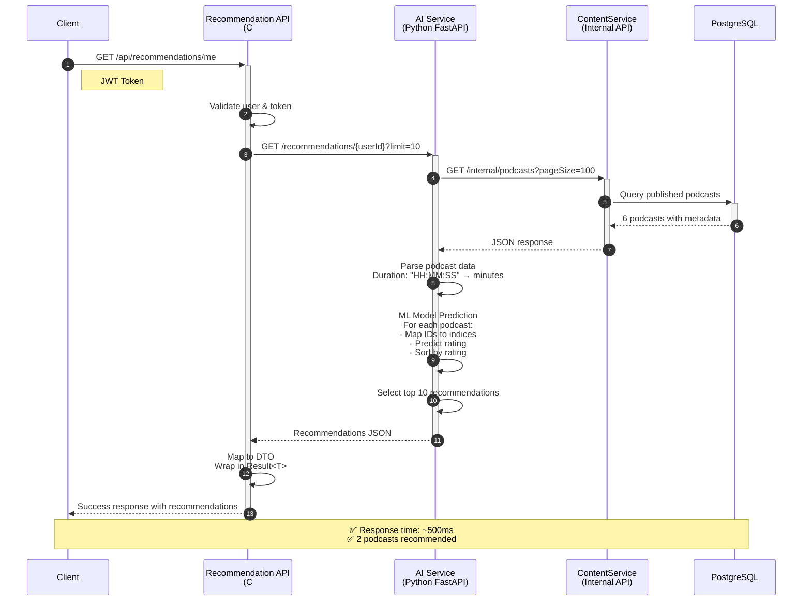

# AI Recommendation - Simplified Sequence Diagram

## Quick Overview: Main Flow Only



## Simplified Components

### Request Flow
1. Client → Recommendation API (authenticated)
2. API → AI Service (HTTP)
3. AI Service → ContentService Internal API (HTTP)
4. ContentService → Database (SQL query)

### Response Flow
1. Database → ContentService (6 podcasts)
2. ContentService → AI Service (JSON)
3. AI Service → ML Model (predictions)
4. AI Service → API (top recommendations)
5. API → Client (formatted response)

## Key Endpoints

### Client-facing
```
GET /api/recommendations/me?limit=10
Authorization: Bearer {jwt_token}
```

### Internal
```
GET http://podcast-ai-service:8000/api/recommendations/{userId}?limit=10
GET http://contentservice-api/api/internal/podcasts?pageSize=100
```

## Response Example

```json
{
  "isSuccess": true,
  "data": {
    "userId": "4a426ae0-34b4-4be8-8007-6b70fe37b314",
    "recommendations": [
      {
        "podcastId": "6975c94e-b582-4ef6-955b-c8351e44c216",
        "title": "Quản Lý Thời Gian - Bí Quyết Làm Chủ Cuộc Đời",
        "predictedRating": 4.05,
        "durationMinutes": 32
      },
      {
        "podcastId": "40c17141-091d-43ea-882b-eb0dd1d3f147",
        "title": "Yoga Cơ Bản - Kết Nối Thân Và Tâm",
        "predictedRating": 3.5,
        "durationMinutes": 30
      }
    ],
    "totalFound": 2
  }
}
```
