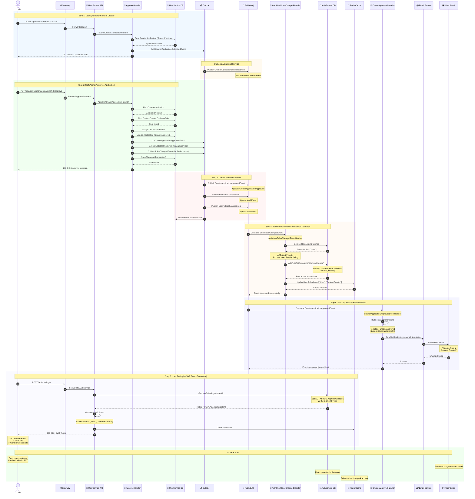
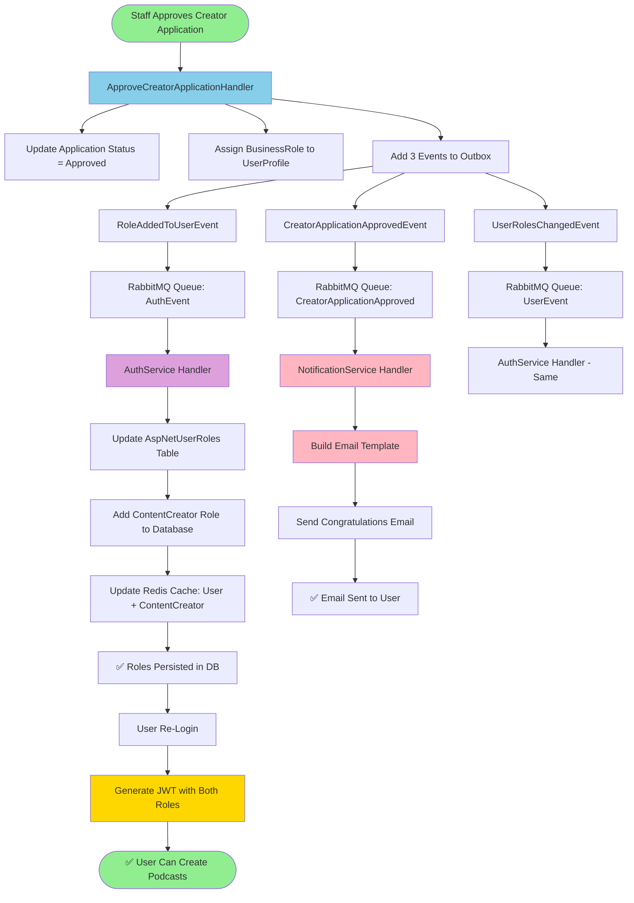
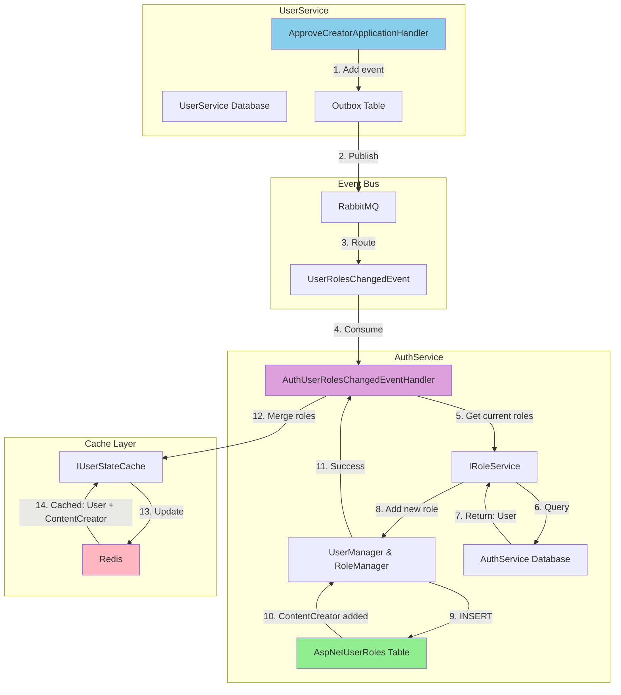
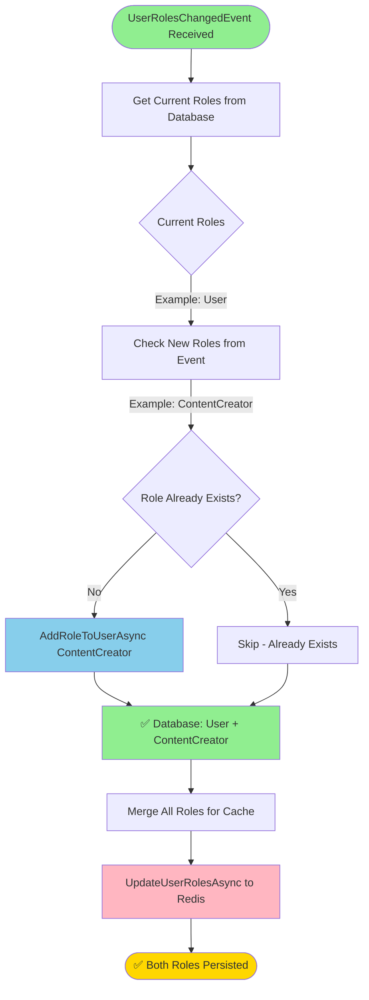
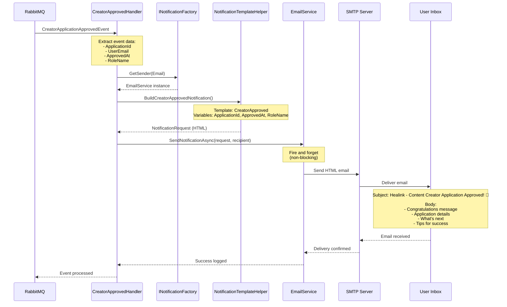
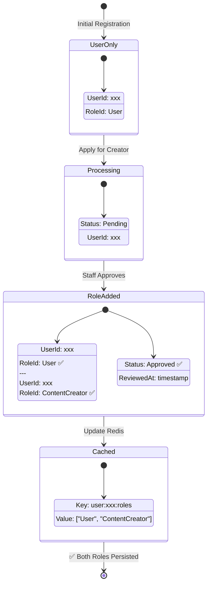
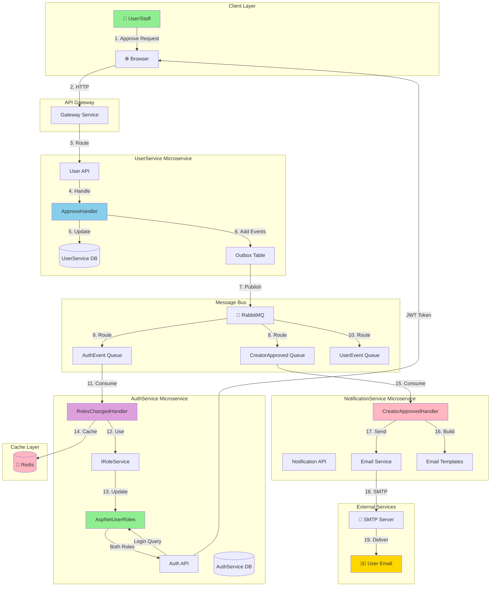

# Creator Application Approval - Complete Flow Diagram

## Full System Flow (Mermaid)

## Key Components Flow

## Role Persistence Architecture

## ADD-ONLY Logic Flow

## Notification System Flow

## Database State Changes

## Complete System Architecture

---

## Summary

**Components:**
- 🔵 **UserService**: Manages creator applications
- 🔐 **AuthService**: Persists roles in database (AspNetUserRoles)
- 📧 **NotificationService**: Sends approval email
- 🐰 **RabbitMQ**: Event bus for async communication
- 🔴 **Redis**: Caches user roles for immediate access

**Key Events:**
1. `CreatorApplicationApprovedEvent` → NotificationService
2. `UserRolesChangedEvent` → AuthService (Database + Redis)

**Critical Fix:**
- **ADD-ONLY logic** in AuthService prevents removing base "User" role
- Both roles persist in database for JWT generation
- Email sent asynchronously (fire-and-forget, non-critical)

**Result:**
✅ User has both "User" and "ContentCreator" roles after re-login  
✅ Roles persist in database permanently  
✅ User receives congratulations email  
✅ User can create podcasts immediately
