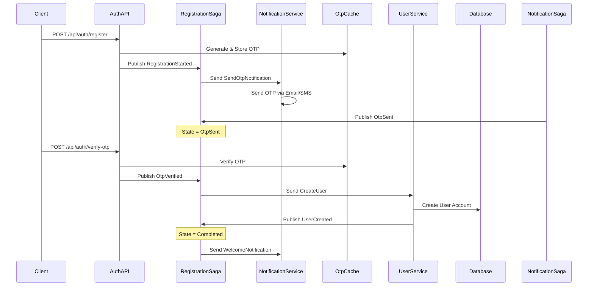

# Registration Saga Implementation Guide

## Overview
Triển khai Registration workflow sử dụng MassTransit Saga Pattern để quản lý distributed transaction qua nhiều services: AuthService → NotificationService → UserService.

## Architecture Design

### Saga States
```
Initial → Started → OtpSent → OtpVerified → UserCreated → Completed
                      ↓           ↓           ↓
                   Failed      Failed      Failed
```

### State Transitions
1. **Started**: Saga bắt đầu khi nhận RegistrationStarted event
2. **OtpSent**: OTP đã được gửi qua NotificationService  
3. **OtpVerified**: User đã verify OTP thành công
4. **UserCreated**: User account đã được tạo trong UserService
5. **Completed**: Workflow hoàn thành thành công
6. **Failed**: Workflow thất bại ở bất kỳ bước nào

## Workflow Flow



## Events Design

### 1. RegistrationStarted
```csharp
public record RegistrationStarted : IntegrationEvent
{
    public Guid CorrelationId { get; init; }
    public string Email { get; init; }
    public string EncryptedPassword { get; init; }
    public string FullName { get; init; }
    public string PhoneNumber { get; init; }
    public string OtpCode { get; init; }
    public NotificationChannelEnum Channel { get; init; }
    public int ExpiresInMinutes { get; init; }
}
```

### 2. SendOtpNotification  
```csharp
public record SendOtpNotification : IntegrationEvent
{
    public string Contact { get; init; }
    public string OtpCode { get; init; }
    public NotificationChannelEnum Channel { get; init; }
    public OtpTypeEnum OtpType { get; init; }
    public string FullName { get; init; }
    public int ExpiresInMinutes { get; init; }
}
```

### 3. OtpSent
```csharp
public record OtpSent : IntegrationEvent
{
    public Guid CorrelationId { get; init; }
    public bool Success { get; init; }
    public string? ErrorMessage { get; init; }
}
```

### 4. OtpVerified  
```csharp
public record OtpVerified : IntegrationEvent
{
    public Guid CorrelationId { get; init; }
    public string Contact { get; init; }
    public OtpTypeEnum Type { get; init; }
}
```

### 5. CreateUser
```csharp
public record CreateUser : IntegrationEvent  
{
    public string Email { get; init; }
    public string EncryptedPassword { get; init; }
    public string FullName { get; init; }
    public string PhoneNumber { get; init; }
}
```

### 6. UserCreated
```csharp
public record UserCreated : IntegrationEvent
{
    public Guid CorrelationId { get; init; }
    public Guid UserId { get; init; }
    public bool Success { get; init; }
    public string? ErrorMessage { get; init; }
}
```

## Implementation Steps

### Phase 1: Core Saga Infrastructure
1. Create RegistrationSagaState
2. Create Integration Events
3. Create RegistrationSaga StateMachine
4. Configure MassTransit with Saga persistence

### Phase 2: Service Integration  
1. Update AuthService controllers
2. Create NotificationService consumer
3. Create UserService consumer
4. Update Service configurations

### Phase 3: Testing & Documentation
1. Unit tests for Saga
2. Integration tests for workflow
3. API documentation
4. Monitoring and logging

## Key Benefits

1. **Distributed Transaction Management**: Saga quản lý consistency qua nhiều services
2. **Fault Tolerance**: Automatic retry và compensation logic
3. **Scalability**: Mỗi service có thể scale độc lập
4. **Maintainability**: Business logic tập trung trong Saga
5. **Monitoring**: Saga state cho phép tracking workflow progress

## Configuration Requirements

### Database
- Saga persistence store (PostgreSQL table)
- Outbox pattern cho reliability

### MassTransit Setup
- RabbitMQ transport
- Saga repository configuration  
- Consumer configuration

### Cache
- Redis cho OTP storage (existing)
- Distributed locking for race conditions
