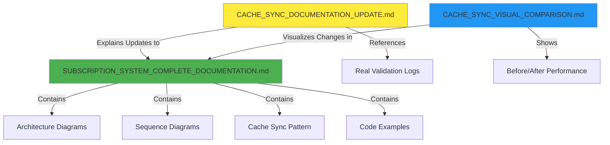

# 📚 Saga Refactor Documentation Index

## 🎯 Quick Links

### For Developers (Start Here)
1. **[QUICK_START_REFACTORED.md](../QUICK_START_REFACTORED.md)** - 🚀 How to run the system after refactor
2. **[SAGA_ARCHITECTURE_DIAGRAMS.md](./SAGA_ARCHITECTURE_DIAGRAMS.md)** - 📊 Visual architecture diagrams

### For Architects & Tech Leads
3. **[SAGA_ARCHITECTURE_GUIDE.md](./SAGA_ARCHITECTURE_GUIDE.md)** - 📐 Comprehensive best practices
4. **[SAGA_REFACTOR_COMPLETE_SUMMARY.md](../SAGA_REFACTOR_COMPLETE_SUMMARY.md)** - 🎉 Complete refactor overview

### For DevOps & QA
5. **[SAGA_MIGRATION_CHECKLIST.md](../SAGA_MIGRATION_CHECKLIST.md)** - ✅ Step-by-step migration guide
6. **[SAGA_REFACTOR_SUMMARY.md](../SAGA_REFACTOR_SUMMARY.md)** - 📝 Technical changes summary

## 📖 Documentation Overview

### 1. QUICK_START_REFACTORED.md
**Purpose**: Get the system running quickly after refactor  
**Audience**: Developers  
**Contains**:
- Migration commands
- Service startup instructions
- Testing steps
- Common issues & solutions
- Health check endpoints

**When to use**: First time running refactored code

---

### 2. SAGA_ARCHITECTURE_DIAGRAMS.md
**Purpose**: Visual understanding of architecture  
**Audience**: Everyone  
**Contains**:
- Before/After comparison diagrams
- Registration flow diagram
- Database schema
- State transition diagram
- Service ownership matrix

**When to use**: Understanding architecture visually

---

### 3. SAGA_ARCHITECTURE_GUIDE.md
**Purpose**: Comprehensive guide to saga patterns  
**Audience**: Architects, Tech Leads, Senior Developers  
**Contains**:
- Core principles
- Anti-patterns vs Best practices
- Implementation guide (step-by-step)
- When to create a saga
- Examples and patterns
- Complete checklist

**When to use**: 
- Creating new sagas
- Architectural reviews
- Training new team members
- Design decisions

---

### 4. SAGA_REFACTOR_COMPLETE_SUMMARY.md
**Purpose**: Executive summary of refactor  
**Audience**: All team members  
**Contains**:
- Problem statement
- Solution overview
- File structure changes
- Code changes
- Database impact
- Benefits
- Success metrics

**When to use**:
- Understanding what changed
- Sharing with stakeholders
- Team meetings

---

### 5. SAGA_MIGRATION_CHECKLIST.md
**Purpose**: Detailed migration procedure  
**Audience**: DevOps, QA, Tech Leads  
**Contains**:
- Pre-migration checklist
- Step-by-step migration
- Testing checklist
- Rollback plan
- Verification steps
- Success criteria

**When to use**:
- Planning migration
- Executing migration
- Verifying deployment

---

### 6. SAGA_REFACTOR_SUMMARY.md
**Purpose**: Quick technical reference  
**Audience**: Developers  
**Contains**:
- Problem & solution
- Files changed
- Next steps
- Benefits

**When to use**: Quick reference

---

## 🗂️ File Structure

```
dot-net-healink-back-end/
├── QUICK_START_REFACTORED.md           # Quick start guide
├── SAGA_REFACTOR_SUMMARY.md            # Quick summary
├── SAGA_REFACTOR_COMPLETE_SUMMARY.md   # Full summary
├── SAGA_MIGRATION_CHECKLIST.md         # Migration guide
├── docs/
│   ├── SAGA_ARCHITECTURE_GUIDE.md      # Best practices guide
│   ├── SAGA_ARCHITECTURE_DIAGRAMS.md   # Visual diagrams
│   └── SAGA_DOCUMENTATION_INDEX.md     # This file
└── src/
    └── AuthService/
        └── AuthService.Infrastructure/
            ├── Saga/
            │   ├── RegistrationSaga.cs
            │   └── RegistrationSagaState.cs
            ├── Configurations/
            │   └── AuthSagaConfiguration.cs
            └── Extensions/
                └── AuthSagaDbContextExtensions.cs
```

## 🎓 Learning Path

### For New Team Members
1. Read: **SAGA_REFACTOR_COMPLETE_SUMMARY.md** (Overview)
2. Read: **SAGA_ARCHITECTURE_DIAGRAMS.md** (Visual understanding)
3. Read: **SAGA_ARCHITECTURE_GUIDE.md** (Deep dive)
4. Do: **QUICK_START_REFACTORED.md** (Hands-on)

### For Creating New Saga
1. Read: **SAGA_ARCHITECTURE_GUIDE.md** → "Implementation Guide" section
2. Reference: **SAGA_ARCHITECTURE_DIAGRAMS.md** → "Registration Saga" example
3. Use: Implementation checklist from guide

### For Migration/Deployment
1. Read: **SAGA_MIGRATION_CHECKLIST.md** (Full procedure)
2. Reference: **QUICK_START_REFACTORED.md** → "Common Issues" section
3. Verify: Follow verification steps in checklist

## 🔍 Quick Search Guide

### I want to...

**...understand what changed**
→ Read: `SAGA_REFACTOR_COMPLETE_SUMMARY.md`

**...run the system**
→ Read: `QUICK_START_REFACTORED.md`

**...create a new saga**
→ Read: `SAGA_ARCHITECTURE_GUIDE.md` → Implementation Guide

**...see diagrams**
→ Read: `SAGA_ARCHITECTURE_DIAGRAMS.md`

**...perform migration**
→ Read: `SAGA_MIGRATION_CHECKLIST.md`

**...understand the pattern**
→ Read: `SAGA_ARCHITECTURE_GUIDE.md` → Core Principles

**...troubleshoot issues**
→ Read: `QUICK_START_REFACTORED.md` → Common Issues

**...review architecture**
→ Read: `SAGA_ARCHITECTURE_GUIDE.md` + `SAGA_ARCHITECTURE_DIAGRAMS.md`

---

## 🔥 Subscription Payment System (Complete Documentation)

### 7. SUBSCRIPTION_SYSTEM_COMPLETE_DOCUMENTATION.md
**Path**: `register-subscription-payment/SUBSCRIPTION_SYSTEM_COMPLETE_DOCUMENTATION.md`  
**Purpose**: Complete guide to subscription registration with payment integration  
**Audience**: Architects, Developers, DevOps  
**Contains**:
- System overview with architecture diagrams
- Complete sequence diagrams (success & failure flows)
- Saga state machine documentation
- Payment gateway integration (MoMo)
- **Cache synchronization pattern** (Redis)
- Security & validation
- Database schema
- API endpoints
- Monitoring & observability

**When to use**:
- Understanding subscription payment flow
- Implementing similar payment features
- Debugging subscription issues
- Performance optimization with cache
- Training new developers on payment integration

**Key Features Documented**:
- ✅ MassTransit Saga orchestration
- ✅ Entity Framework Outbox pattern
- ✅ Payment gateway abstraction (Factory pattern)
- ✅ MoMo IPN callback handling
- ✅ Redis cache synchronization (NEW)
- ✅ Event-driven architecture
- ✅ Compensation logic for failures

---

### 8. CACHE_SYNC_DOCUMENTATION_UPDATE.md
**Path**: `register-subscription-payment/CACHE_SYNC_DOCUMENTATION_UPDATE.md`  
**Purpose**: Summary of cache synchronization feature added to subscription system  
**Audience**: Developers, Tech Leads  
**Contains**:
- What was updated in main documentation
- Implementation details (event publishing, consumer, cache pattern)
- Real-world validation with MoMo payment logs
- Cache data structure and TTL strategy
- Benefits analysis (40-200x performance improvement)
- Next steps for enhancements

**When to use**:
- Understanding what changed in documentation
- Reviewing cache sync implementation
- Validating cache performance
- Planning similar cache patterns in other services

**Real Validation**:
- ✅ Tested with real MoMo payment (TransactionId: 4593081137)
- ✅ Cache logs confirmed (UserId, SubscriptionId, Status, Plan)
- ✅ "siêu mượt và khớp tuyệt đối" (super smooth and perfectly matched)

---

### 9. CACHE_SYNC_VISUAL_COMPARISON.md
**Path**: `register-subscription-payment/CACHE_SYNC_VISUAL_COMPARISON.md`  
**Purpose**: Visual before/after comparison of subscription system architecture  
**Audience**: Everyone (especially visual learners)  
**Contains**:
- 🔴 BEFORE: Direct database queries (50-200ms latency)
- 🟢 AFTER: Cache-first pattern (1-5ms latency)
- Performance comparison table (40-200x improvement)
- Cache data structure examples
- Event-driven cache invalidation flow
- Code changes summary
- Monitoring dashboard recommendations

**When to use**:
- Quick visual understanding of cache sync
- Explaining architecture changes to stakeholders
- Performance optimization presentations
- Training sessions on caching patterns

**Key Metrics**:
- ⚡ **40-200x faster** subscription checks
- 🎯 **99%+ reduction** in database load
- 🔄 **Real-time** cache updates via events
- 📈 **100K+ reads/sec** scalability

---

## 📂 Subscription Payment Documentation Structure

```
docs/register-subscription-payment/
├── SUBSCRIPTION_SYSTEM_COMPLETE_DOCUMENTATION.md  (Main comprehensive guide)
├── CACHE_SYNC_DOCUMENTATION_UPDATE.md             (Update summary)
└── CACHE_SYNC_VISUAL_COMPARISON.md                (Visual before/after)
```

### How These Docs Work Together



### Reading Flow for Subscription System

**For Quick Overview**:
1. Read `CACHE_SYNC_VISUAL_COMPARISON.md` (5 min)
2. Skim `CACHE_SYNC_DOCUMENTATION_UPDATE.md` (10 min)

**For Implementation**:
1. Read `SUBSCRIPTION_SYSTEM_COMPLETE_DOCUMENTATION.md` → Technical Components → Cache Sync (30 min)
2. Review code examples and event definitions
3. Check monitoring recommendations

**For Architecture Review**:
1. Read all three documents in order
2. Focus on sequence diagrams and state machines
3. Review performance metrics and validation logs

---

## 🔍 When to Read Subscription Docs

**I want to...**

**...understand subscription payment flow**
→ Read: `SUBSCRIPTION_SYSTEM_COMPLETE_DOCUMENTATION.md` → Sequence Diagrams

**...implement cache synchronization**
→ Read: `SUBSCRIPTION_SYSTEM_COMPLETE_DOCUMENTATION.md` → Technical Components → Section 5

**...see performance improvements**
→ Read: `CACHE_SYNC_VISUAL_COMPARISON.md` → Performance Comparison

**...debug cache issues**
→ Read: `CACHE_SYNC_DOCUMENTATION_UPDATE.md` → Implementation Details → Real Validation

**...integrate MoMo payment**
→ Read: `SUBSCRIPTION_SYSTEM_COMPLETE_DOCUMENTATION.md` → Payment Gateway Integration Flow

**...understand saga orchestration**
→ Read: `SUBSCRIPTION_SYSTEM_COMPLETE_DOCUMENTATION.md` → Saga Pattern with Compensation

**...optimize subscription queries**
→ Read: `CACHE_SYNC_VISUAL_COMPARISON.md` → Before/After + Code Changes

---

## 📊 Document Relationships

```
┌──────────────────────────────────────────────────────────┐
│         SAGA_REFACTOR_COMPLETE_SUMMARY.md                │
│              (Start here - Overview)                      │
└────────────────────┬─────────────────────────────────────┘
                     │
         ┌───────────┴───────────┐
         │                       │
         ↓                       ↓
┌─────────────────┐    ┌─────────────────┐
│  Quick Start    │    │   Architecture   │
│    Guide        │    │      Guide       │
└────────┬────────┘    └────────┬─────────┘
         │                       │
         │                       │
         ↓                       ↓
┌─────────────────┐    ┌─────────────────┐
│   Migration     │    │    Diagrams     │
│   Checklist     │    │                 │
└─────────────────┘    └─────────────────┘
         │                       │
         └───────────┬───────────┘
                     │
                     ↓
            ┌─────────────────┐
            │  This Index     │
            │  (You are here) │
            └─────────────────┘
```

## 🎯 Documentation Goals

### Completeness ✅
- Covers all aspects of saga refactor
- Includes before/after comparison
- Provides step-by-step guides

### Accessibility ✅
- Clear navigation
- Multiple entry points
- Search-friendly

### Maintainability ✅
- Single source of truth
- Cross-referenced
- Easy to update

### Practicality ✅
- Actionable guides
- Real examples
- Troubleshooting included

## 🔄 Maintenance

### When to Update These Docs

**Add New Saga**:
- Update `SAGA_ARCHITECTURE_GUIDE.md` with new example
- Add diagram to `SAGA_ARCHITECTURE_DIAGRAMS.md`

**Change Saga Pattern**:
- Update `SAGA_ARCHITECTURE_GUIDE.md` → Best Practices
- Update relevant diagrams

**Add New Service**:
- Update `SAGA_ARCHITECTURE_DIAGRAMS.md` → Service Ownership Matrix

**Migration Issues**:
- Add to `QUICK_START_REFACTORED.md` → Common Issues
- Update `SAGA_MIGRATION_CHECKLIST.md`

## 📞 Support

### Questions?
- Check this index for relevant doc
- Search within specific documents
- Ask tech lead with reference to specific doc

### Found an Issue?
- Note which document
- What section
- Suggest improvement

### Want to Contribute?
- Follow existing structure
- Update this index if adding new doc
- Cross-reference related docs

---

**Last Updated**: 2024-11-20  
**Maintained By**: Development Team  
**Version**: 1.1 (Added Subscription Payment & Cache Sync Documentation)

