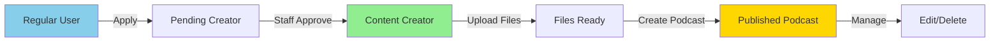

# Content Creator API Documentation - Complete Flow

> **From Creator Application to Podcast Management**  
> Version: 1.0  
> Last Updated: October 8, 2025

---

## 📋 Table of Contents

1. [Overview](#overview)
2. [Authentication](#authentication)
3. [Phase 1: Become a Content Creator](#phase-1-become-a-content-creator)
4. [Phase 2: Upload Media Files](#phase-2-upload-media-files)
5. [Phase 3: Create Podcast](#phase-3-create-podcast)
6. [Phase 4: Manage Podcasts](#phase-4-manage-podcasts)
7. [Error Codes](#error-codes)

---

## Overview

### Complete User Journey



### Base URLs

| Environment | Base URL |
|-------------|----------|
| Development | `http://localhost:5001` |
| Staging | `https://api-staging.healink.com` |
| Production | `https://api.healink.com` |

### Required Headers

```http
Authorization: Bearer {JWT_TOKEN}
Content-Type: application/json
X-Correlation-Id: {UNIQUE_REQUEST_ID} (optional)
```

---

## Authentication

### Login to Get JWT Token

**Endpoint:** `POST /api/user/auth/login`

**Request:**
```json
{
  "email": "user@example.com",
  "password": "Password@123",
  "grantType": 0,
  "userAgent": "Mozilla/5.0...",
  "ipAddress": "127.0.0.1"
}
```

**Response:**
```json
{
  "isSuccess": true,
  "message": "Login successfully!",
  "data": {
    "accessToken": "eyJhbGciOiJIUzI1NiIs...",
    "expiresAt": "2025-10-08T13:42:58.342231Z",
    "roles": ["User"]
  }
}
```

**JWT Token Contains:**
- `sub`: User ID (Guid)
- `email`: User email
- `roles`: Array of role names
- `exp`: Expiration timestamp

---

## Phase 1: Become a Content Creator

### 1.1 Check Current Application Status

**Endpoint:** `GET /api/user/creator-applications/my-status`

**Headers:**
```http
Authorization: Bearer {JWT_TOKEN}
```

**Response - No Application:**
```json
{
  "hasApplication": false,
  "canApply": true,
  "message": "Bạn chưa có đơn đăng ký nào. Hãy tạo đơn đăng ký mới!"
}
```

**Response - Pending Application:**
```json
{
  "hasApplication": true,
  "canApply": false,
  "application": {
    "id": "e6d18ac7-3374-4666-8804-ebac9b68ecdb",
    "status": 1,
    "statusText": "Pending",
    "submittedAt": "2025-10-08T10:30:00Z",
    "stageOrScreenName": "My Creator Name",
    "bio": "I create amazing content"
  },
  "message": "Đơn đăng ký của bạn đang được xem xét. Vui lòng chờ phản hồi."
}
```

**Response - Approved:**
```json
{
  "hasApplication": true,
  "canApply": false,
  "application": {
    "id": "e6d18ac7-3374-4666-8804-ebac9b68ecdb",
    "status": 2,
    "statusText": "Approved",
    "submittedAt": "2025-10-08T10:30:00Z",
    "reviewedAt": "2025-10-08T13:15:52Z",
    "stageOrScreenName": "My Creator Name",
    "bio": "I create amazing content"
  },
  "message": "Chúc mừng! Bạn đã trở thành Content Creator. Bạn có thể bắt đầu tạo nội dung."
}
```

**Status Codes:**
- `0`: Draft
- `1`: Pending
- `2`: Approved
- `3`: Rejected

---

### 1.2 Submit Creator Application

**Endpoint:** `POST /api/user/creator-applications`

**Headers:**
```http
Authorization: Bearer {JWT_TOKEN}
Content-Type: application/json
```

**Request:**
```json
{
  "stageOrScreenName": "Dr. Wellness Coach",
  "bio": "Certified health coach with 10+ years of experience in mental wellness and meditation. Passionate about helping people achieve inner peace.",
  "socialMediaLinks": [
    "https://twitter.com/drwellness",
    "https://instagram.com/drwellness",
    "https://linkedin.com/in/drwellness"
  ],
  "portfolioOrSampleWork": "https://youtube.com/drwellness/samples",
  "whyJoinPlatform": "I want to reach a wider audience and share evidence-based wellness practices.",
  "contentNiche": "Mental Health, Meditation, Stress Management",
  "averageContentFrequency": "2-3 episodes per week",
  "hasExperience": true,
  "experienceDescription": "Hosted 'Mindful Moments' podcast for 3 years with 50k+ listeners"
}
```

**Validation Rules:**
- `stageOrScreenName`: Required, 2-100 characters
- `bio`: Required, 50-1000 characters
- `socialMediaLinks`: Optional, valid URLs
- `whyJoinPlatform`: Required, 50-500 characters

**Response - Success:**
```json
{
  "success": true,
  "message": "Đơn đăng ký Content Creator đã được gửi thành công",
  "applicationId": "e6d18ac7-3374-4666-8804-ebac9b68ecdb",
  "userId": "fdc827e0-0032-4a7f-b53a-8c41081f5411",
  "status": "Pending",
  "submittedAt": "2025-10-08T10:30:00.123Z"
}
```

**Response - Validation Error:**
```json
{
  "success": false,
  "message": "Validation failed",
  "errors": {
    "Bio": ["Bio must be at least 50 characters"],
    "StageOrScreenName": ["Stage name is required"]
  }
}
```

**Response - Already Has Application:**
```json
{
  "success": false,
  "message": "Bạn đã có đơn đăng ký trước đó. Vui lòng chờ xét duyệt."
}
```

---

### 1.3 Wait for Approval

After submission:

1. **Staff/Admin reviews** your application via admin panel
2. **System publishes events** when approved:
   - `CreatorApplicationApprovedEvent` → NotificationService
   - `UserRolesChangedEvent` → AuthService
3. **You receive email** notification (Congratulations! 🎉)
4. **Your JWT token** will include "ContentCreator" role after re-login

**Re-login to get updated JWT:**
```bash
POST /api/user/auth/login
```

**New JWT will contain:**
```json
{
  "roles": ["User", "ContentCreator"]
}
```

---

## Phase 2: Upload Media Files

### 2.1 Generate Pre-Signed Upload URL

**Endpoint:** `POST /api/content/upload/generate-upload-url`

**Headers:**
```http
Authorization: Bearer {JWT_TOKEN}
Content-Type: application/json
```

**Request:**
```json
{
  "fileName": "my-podcast-episode-1.mp3",
  "fileType": "AudioFile",
  "contentType": "audio/mpeg"
}
```

**File Types:**
- `0`: AudioFile (mp3, wav, m4a)
- `1`: CoverImage (jpg, png, webp)
- `2`: Transcript (txt, pdf, docx)
- `3`: Attachment (any file)

**Response:**
```json
{
  "success": true,
  "message": "Pre-signed URL generated successfully",
  "data": {
    "fileId": "a1b2c3d4-e5f6-7890-abcd-ef1234567890",
    "uploadUrl": "https://healink-content.s3.amazonaws.com/uploads/audio/...",
    "s3Key": "uploads/audio/fdc827e0-0032-4a7f-b53a-8c41081f5411/my-podcast-episode-1.mp3",
    "expiresAt": "2025-10-08T11:30:00Z",
    "expiresInMinutes": 60
  }
}
```

**Save this `fileId` - you'll need it when creating the podcast!**

---

### 2.2 Upload File to S3

**Use the `uploadUrl` from previous step**

**Request:**
```bash
curl -X PUT "https://healink-content.s3.amazonaws.com/uploads/audio/..." \
  -H "Content-Type: audio/mpeg" \
  --upload-file my-podcast-episode-1.mp3
```

**PowerShell:**
```powershell
Invoke-RestMethod -Method PUT `
  -Uri $uploadUrl `
  -InFile "my-podcast-episode-1.mp3" `
  -ContentType "audio/mpeg"
```

**JavaScript (Browser):**
```javascript
const file = document.getElementById('fileInput').files[0];

await fetch(uploadUrl, {
  method: 'PUT',
  headers: {
    'Content-Type': 'audio/mpeg'
  },
  body: file
});
```

**Response:** `200 OK` (empty body)

---

### 2.3 Mark Upload as Complete

**Endpoint:** `POST /api/content/upload/{fileId}/complete`

**Headers:**
```http
Authorization: Bearer {JWT_TOKEN}
```

**Path Parameter:**
- `fileId`: The GUID from step 2.1

**Request:** (empty body or optional metadata)
```json
{
  "fileSizeBytes": 15728640,
  "durationSeconds": 1800
}
```

**Response:**
```json
{
  "success": true,
  "message": "File upload completed",
  "fileId": "a1b2c3d4-e5f6-7890-abcd-ef1234567890",
  "status": "Completed"
}
```

---

### 2.4 Upload Cover Image (Optional)

Repeat steps 2.1-2.3 with:
```json
{
  "fileName": "podcast-cover.jpg",
  "fileType": "CoverImage",
  "contentType": "image/jpeg"
}
```

**Save the returned `fileId` for cover image!**

---

## Phase 3: Create Podcast

### 3.1 Create New Podcast

**Endpoint:** `POST /api/content/podcasts`

**Headers:**
```http
Authorization: Bearer {JWT_TOKEN}
Content-Type: application/json
```

**Request:**
```json
{
  "title": "Episode 1: Introduction to Mindfulness",
  "description": "In this episode, we explore the basics of mindfulness meditation and how it can reduce stress and anxiety.",
  "audioFileId": "a1b2c3d4-e5f6-7890-abcd-ef1234567890",
  "coverImageId": "b2c3d4e5-f6a7-8901-bcde-f12345678901",
  "categoryId": "550e8400-e29b-41d4-a716-446655440000",
  "tags": ["mindfulness", "meditation", "mental-health", "stress-relief"],
  "durationInSeconds": 1800,
  "language": "en",
  "isExplicit": false,
  "scheduledPublishAt": null
}
```

**Field Descriptions:**
- `title`: **Required**, 5-200 characters
- `description`: **Required**, 50-5000 characters
- `audioFileId`: **Required**, GUID from upload step
- `coverImageId`: Optional, GUID from cover upload
- `categoryId`: **Required**, valid category GUID
- `tags`: Optional, array of strings (max 10 tags)
- `durationInSeconds`: Optional, auto-detected from file
- `language`: Optional, ISO 639-1 code (default: "en")
- `isExplicit`: Optional, default: false
- `scheduledPublishAt`: Optional, null = publish immediately

**Response - Success:**
```json
{
  "success": true,
  "message": "Podcast created successfully",
  "podcastId": "c3d4e5f6-a7b8-9012-cdef-123456789012",
  "title": "Episode 1: Introduction to Mindfulness",
  "status": "Published",
  "createdAt": "2025-10-08T14:00:00Z",
  "publishedAt": "2025-10-08T14:00:00Z",
  "audioUrl": "https://healink-content.s3.amazonaws.com/podcasts/audio/...",
  "coverImageUrl": "https://healink-content.s3.amazonaws.com/podcasts/covers/..."
}
```

**Response - Validation Error:**
```json
{
  "success": false,
  "message": "Validation failed",
  "errors": {
    "Title": ["Title is required"],
    "AudioFileId": ["Audio file not found or already used"],
    "CategoryId": ["Invalid category"]
  }
}
```

**Response - Not a Creator:**
```json
{
  "success": false,
  "message": "You must be a Content Creator to create podcasts",
  "statusCode": 403
}
```

---

### 3.2 Get Available Categories

**Endpoint:** `GET /api/content/categories`

**Response:**
```json
{
  "success": true,
  "data": [
    {
      "id": "550e8400-e29b-41d4-a716-446655440000",
      "name": "Mental Health",
      "description": "Podcasts about mental wellness, psychology, and emotional health"
    },
    {
      "id": "660e8400-e29b-41d4-a716-446655440001",
      "name": "Meditation",
      "description": "Guided meditations and mindfulness practices"
    },
    {
      "id": "770e8400-e29b-41d4-a716-446655440002",
      "name": "Sleep Stories",
      "description": "Relaxing bedtime stories for better sleep"
    }
  ]
}
```

---

## Phase 4: Manage Podcasts

### 4.1 Get My Podcasts (Creator)

**Endpoint:** `GET /api/content/podcasts/my-podcasts`

**Headers:**
```http
Authorization: Bearer {JWT_TOKEN}
```

**Query Parameters:**
```
?page=1
&pageSize=10
&status=Published
&sortBy=CreatedAt
&sortOrder=Desc
```

**Response:**
```json
{
  "success": true,
  "data": {
    "items": [
      {
        "id": "c3d4e5f6-a7b8-9012-cdef-123456789012",
        "title": "Episode 1: Introduction to Mindfulness",
        "description": "In this episode, we explore...",
        "status": "Published",
        "createdAt": "2025-10-08T14:00:00Z",
        "publishedAt": "2025-10-08T14:00:00Z",
        "durationInSeconds": 1800,
        "audioUrl": "https://...",
        "coverImageUrl": "https://...",
        "category": {
          "id": "550e8400-e29b-41d4-a716-446655440000",
          "name": "Mental Health"
        },
        "tags": ["mindfulness", "meditation"],
        "viewCount": 245,
        "likeCount": 18,
        "commentCount": 7
      }
    ],
    "totalCount": 15,
    "page": 1,
    "pageSize": 10,
    "totalPages": 2
  }
}
```

---

### 4.2 Get Podcast Details

**Endpoint:** `GET /api/content/podcasts/{podcastId}`

**Path Parameter:**
- `podcastId`: GUID of the podcast

**Response:**
```json
{
  "success": true,
  "data": {
    "id": "c3d4e5f6-a7b8-9012-cdef-123456789012",
    "title": "Episode 1: Introduction to Mindfulness",
    "description": "In this episode, we explore the basics...",
    "status": "Published",
    "createdAt": "2025-10-08T14:00:00Z",
    "publishedAt": "2025-10-08T14:00:00Z",
    "updatedAt": "2025-10-08T14:30:00Z",
    "durationInSeconds": 1800,
    "audioUrl": "https://healink-content.s3.amazonaws.com/...",
    "coverImageUrl": "https://healink-content.s3.amazonaws.com/...",
    "creator": {
      "id": "fdc827e0-0032-4a7f-b53a-8c41081f5411",
      "stageOrScreenName": "Dr. Wellness Coach",
      "bio": "Certified health coach..."
    },
    "category": {
      "id": "550e8400-e29b-41d4-a716-446655440000",
      "name": "Mental Health"
    },
    "tags": ["mindfulness", "meditation", "mental-health"],
    "language": "en",
    "isExplicit": false,
    "viewCount": 245,
    "likeCount": 18,
    "commentCount": 7,
    "isLikedByCurrentUser": false
  }
}
```

---

### 4.3 Update Podcast

**Endpoint:** `PUT /api/content/podcasts/{podcastId}`

**Headers:**
```http
Authorization: Bearer {JWT_TOKEN}
Content-Type: application/json
```

**Request:**
```json
{
  "title": "Episode 1: Introduction to Mindfulness (Updated)",
  "description": "Updated description with more details...",
  "coverImageId": "new-cover-image-guid",
  "categoryId": "550e8400-e29b-41d4-a716-446655440000",
  "tags": ["mindfulness", "meditation", "beginner-friendly"],
  "isExplicit": false
}
```

**Fields You CAN Update:**
- ✅ Title
- ✅ Description
- ✅ Cover Image
- ✅ Category
- ✅ Tags
- ✅ isExplicit flag

**Fields You CANNOT Update:**
- ❌ Audio File (must create new podcast)
- ❌ Creator
- ❌ Published Date

**Response:**
```json
{
  "success": true,
  "message": "Podcast updated successfully",
  "podcastId": "c3d4e5f6-a7b8-9012-cdef-123456789012",
  "updatedAt": "2025-10-08T15:00:00Z"
}
```

**Authorization:**
- ✅ Only the **podcast creator** can update
- ❌ Other users get `403 Forbidden`

---

### 4.4 Delete Podcast

**Endpoint:** `DELETE /api/content/podcasts/{podcastId}`

**Headers:**
```http
Authorization: Bearer {JWT_TOKEN}
```

**Response:**
```json
{
  "success": true,
  "message": "Podcast deleted successfully",
  "podcastId": "c3d4e5f6-a7b8-9012-cdef-123456789012",
  "deletedAt": "2025-10-08T16:00:00Z"
}
```

**What Happens:**
1. Podcast marked as `Deleted` (soft delete)
2. Audio and cover files remain in S3 (for backup)
3. Podcast no longer appears in public listings
4. Statistics preserved for analytics

**Authorization:**
- ✅ Only the **podcast creator** can delete
- ❌ Other users get `403 Forbidden`

---

### 4.5 Get Podcast Statistics

**Endpoint:** `GET /api/content/podcasts/{podcastId}/statistics`

**Response:**
```json
{
  "success": true,
  "data": {
    "podcastId": "c3d4e5f6-a7b8-9012-cdef-123456789012",
    "totalViews": 245,
    "totalLikes": 18,
    "totalComments": 7,
    "totalShares": 5,
    "averageListenDuration": 1200,
    "completionRate": 0.67,
    "viewsByDay": [
      { "date": "2025-10-08", "views": 45 },
      { "date": "2025-10-07", "views": 38 },
      { "date": "2025-10-06", "views": 52 }
    ],
    "topCountries": [
      { "country": "Vietnam", "views": 120 },
      { "country": "USA", "views": 85 }
    ]
  }
}
```

---

## Complete Flow Example

### Full Journey with PowerShell

```powershell
# Step 1: Login
$loginBody = @{
    email = "creator@example.com"
    password = "Password@123"
    grantType = 0
    userAgent = "Mozilla/5.0"
    ipAddress = "127.0.0.1"
} | ConvertTo-Json

$login = Invoke-RestMethod -Method POST `
    -Uri "http://localhost:5001/api/user/auth/login" `
    -Body $loginBody `
    -ContentType "application/json"

$token = $login.data.accessToken
$headers = @{ Authorization = "Bearer $token" }

# Step 2: Check if already a creator
$status = Invoke-RestMethod -Method GET `
    -Uri "http://localhost:5001/api/user/creator-applications/my-status" `
    -Headers $headers

if (-not $status.hasApplication) {
    # Step 3: Apply for creator
    $applicationBody = @{
        stageOrScreenName = "Dr. Wellness"
        bio = "Passionate about mental health and wellness. 10+ years experience."
        socialMediaLinks = @("https://twitter.com/drwellness")
        whyJoinPlatform = "Want to reach more people with evidence-based wellness practices."
        contentNiche = "Mental Health, Meditation"
        hasExperience = $true
    } | ConvertTo-Json

    $application = Invoke-RestMethod -Method POST `
        -Uri "http://localhost:5001/api/user/creator-applications" `
        -Body $applicationBody `
        -Headers $headers `
        -ContentType "application/json"

    Write-Host "Application submitted! Wait for approval and email notification."
    exit
}

# Step 4: Generate upload URL for audio
$uploadUrlBody = @{
    fileName = "episode-1.mp3"
    fileType = "AudioFile"
    contentType = "audio/mpeg"
} | ConvertTo-Json

$uploadUrl = Invoke-RestMethod -Method POST `
    -Uri "http://localhost:5001/api/content/upload/generate-upload-url" `
    -Body $uploadUrlBody `
    -Headers $headers `
    -ContentType "application/json"

$audioFileId = $uploadUrl.data.fileId

# Step 5: Upload audio file to S3
Invoke-RestMethod -Method PUT `
    -Uri $uploadUrl.data.uploadUrl `
    -InFile "episode-1.mp3" `
    -ContentType "audio/mpeg"

# Step 6: Mark upload complete
Invoke-RestMethod -Method POST `
    -Uri "http://localhost:5001/api/content/upload/$audioFileId/complete" `
    -Headers $headers

# Step 7: Upload cover image (optional)
$coverUploadBody = @{
    fileName = "cover.jpg"
    fileType = "CoverImage"
    contentType = "image/jpeg"
} | ConvertTo-Json

$coverUrl = Invoke-RestMethod -Method POST `
    -Uri "http://localhost:5001/api/content/upload/generate-upload-url" `
    -Body $coverUploadBody `
    -Headers $headers `
    -ContentType "application/json"

$coverImageId = $coverUrl.data.fileId

Invoke-RestMethod -Method PUT `
    -Uri $coverUrl.data.uploadUrl `
    -InFile "cover.jpg" `
    -ContentType "image/jpeg"

Invoke-RestMethod -Method POST `
    -Uri "http://localhost:5001/api/content/upload/$coverImageId/complete" `
    -Headers $headers

# Step 8: Create podcast
$podcastBody = @{
    title = "Episode 1: Introduction to Mindfulness"
    description = "In this episode, we explore the basics of mindfulness meditation."
    audioFileId = $audioFileId
    coverImageId = $coverImageId
    categoryId = "550e8400-e29b-41d4-a716-446655440000"
    tags = @("mindfulness", "meditation")
    durationInSeconds = 1800
    language = "en"
    isExplicit = $false
} | ConvertTo-Json

$podcast = Invoke-RestMethod -Method POST `
    -Uri "http://localhost:5001/api/content/podcasts" `
    -Body $podcastBody `
    -Headers $headers `
    -ContentType "application/json"

Write-Host "✅ Podcast created successfully!"
Write-Host "Podcast ID: $($podcast.podcastId)"
Write-Host "Audio URL: $($podcast.audioUrl)"

# Step 9: Get my podcasts
$myPodcasts = Invoke-RestMethod -Method GET `
    -Uri "http://localhost:5001/api/content/podcasts/my-podcasts?page=1&pageSize=10" `
    -Headers $headers

Write-Host "`n📊 My Podcasts:"
$myPodcasts.data.items | ForEach-Object {
    Write-Host "  - $($_.title) (Views: $($_.viewCount))"
}
```

---

## Error Codes

| Code | Meaning | Common Causes |
|------|---------|---------------|
| 400 | Bad Request | Invalid JSON, validation errors |
| 401 | Unauthorized | Missing or expired JWT token |
| 403 | Forbidden | Not a Content Creator, or not podcast owner |
| 404 | Not Found | Podcast/File/Category doesn't exist |
| 409 | Conflict | Already has pending application, file already used |
| 413 | Payload Too Large | File size exceeds limit (50MB audio, 5MB image) |
| 415 | Unsupported Media Type | Invalid file format |
| 422 | Unprocessable Entity | Business logic validation failed |
| 429 | Too Many Requests | Rate limit exceeded |
| 500 | Internal Server Error | Server-side error |

---

## Rate Limits

| Endpoint | Limit | Window |
|----------|-------|--------|
| Creator Application | 1 request | Per user lifetime |
| Upload URL Generation | 10 requests | Per minute |
| Create Podcast | 5 requests | Per hour |
| Update Podcast | 20 requests | Per hour |
| Delete Podcast | 10 requests | Per hour |

---

## Best Practices

### ✅ DO:

1. **Always check application status** before showing "Apply" button
2. **Re-login after approval** to get updated JWT with ContentCreator role
3. **Save fileId** from upload URL generation - you'll need it for podcast creation
4. **Mark upload complete** after S3 upload to update file status
5. **Use meaningful titles and descriptions** for better discoverability
6. **Add relevant tags** (3-5 tags) to help users find your content
7. **Test audio playback** before publishing
8. **Handle errors gracefully** - show user-friendly messages

### ❌ DON'T:

1. **Don't hardcode file IDs** - always generate new upload URLs
2. **Don't skip upload completion** step - file won't be usable
3. **Don't reuse audio files** - each file can only be used once
4. **Don't expose pre-signed URLs** - they expire after 1 hour
5. **Don't create podcasts without ContentCreator role** - will fail with 403
6. **Don't update other creators' podcasts** - authorization will fail
7. **Don't forget to handle async** - uploads and processing take time

---

## Support

For API support, contact:
- Email: api-support@healink.com
- Slack: #api-help
- Documentation: https://docs.healink.com

---

**Last Updated:** October 8, 2025  
**API Version:** 1.0  
**Document Version:** 1.0
