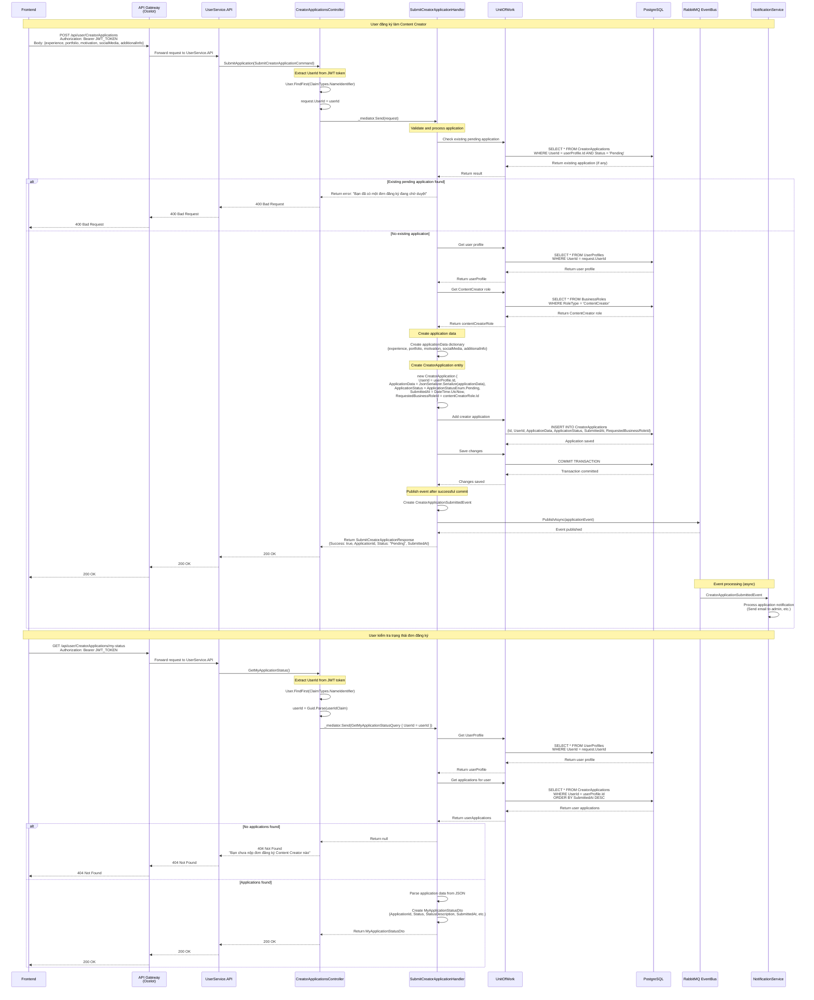

# Content Creator Registration Sequence Diagram

## Luồng đăng ký làm Content Creator

## Các thành phần chính trong luồng:

### 1. **Frontend**
- Gửi POST request với thông tin đăng ký
- Gửi GET request để kiểm tra trạng thái

### 2. **API Gateway (Ocelot)**
- Route `/api/user/CreatorApplications` → UserService.API
- Route `/api/user/CreatorApplications/my-status` → UserService.API

### 3. **UserService.API**
- `CreatorApplicationsController.SubmitApplication()`
- `CreatorApplicationsController.GetMyApplicationStatus()`

### 4. **Application Layer**
- `SubmitCreatorApplicationHandler`
- `GetMyApplicationStatusHandler`

### 5. **Infrastructure Layer**
- `UnitOfWork` (Repository pattern)
- PostgreSQL Database
- RabbitMQ EventBus

### 6. **External Services**
- NotificationService (xử lý event async)

## Các bước chính:

1. **Validation**: Kiểm tra đơn đăng ký đã tồn tại chưa
2. **Data Processing**: Tạo application data và entity
3. **Persistence**: Lưu vào database với transaction
4. **Event Publishing**: Publish event sau khi commit thành công
5. **Status Retrieval**: Tìm và trả về trạng thái đơn đăng ký

## Lưu ý quan trọng:

- **JWT Token**: User ID được trích xuất từ JWT token
- **Foreign Key**: Sử dụng `userProfile.Id` thay vì JWT User ID để tránh lỗi foreign key constraint
- **Transaction**: Commit database trước khi publish event
- **Error Handling**: Xử lý các trường hợp lỗi và validation
