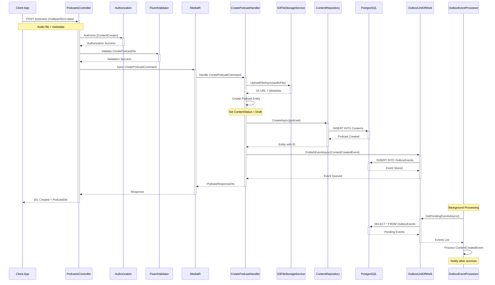
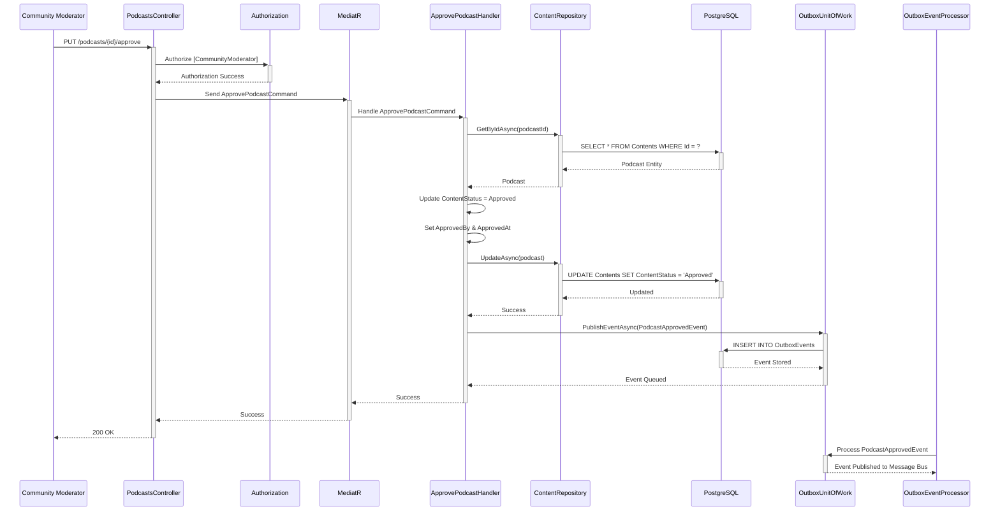
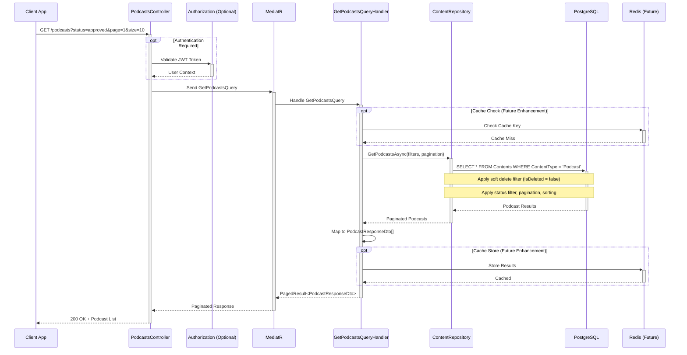
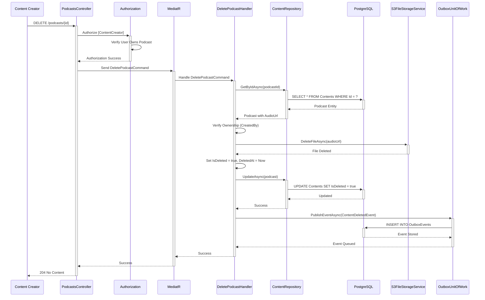
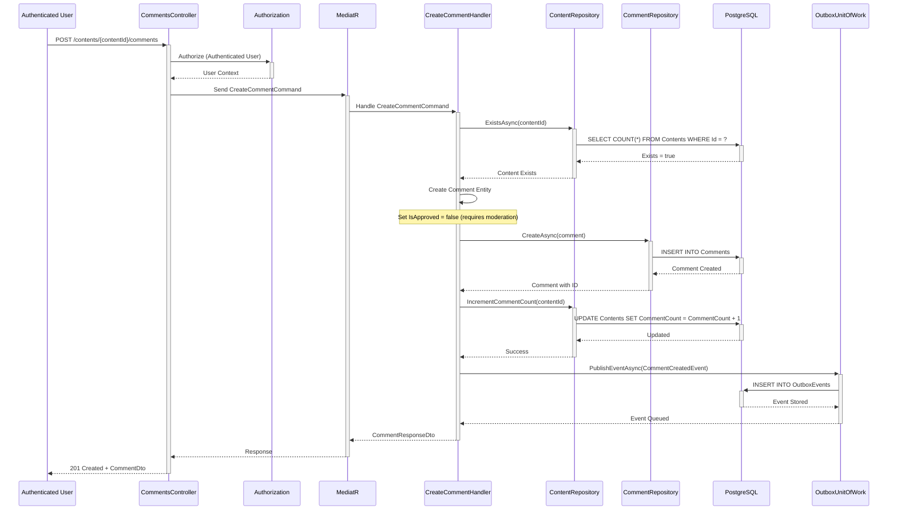
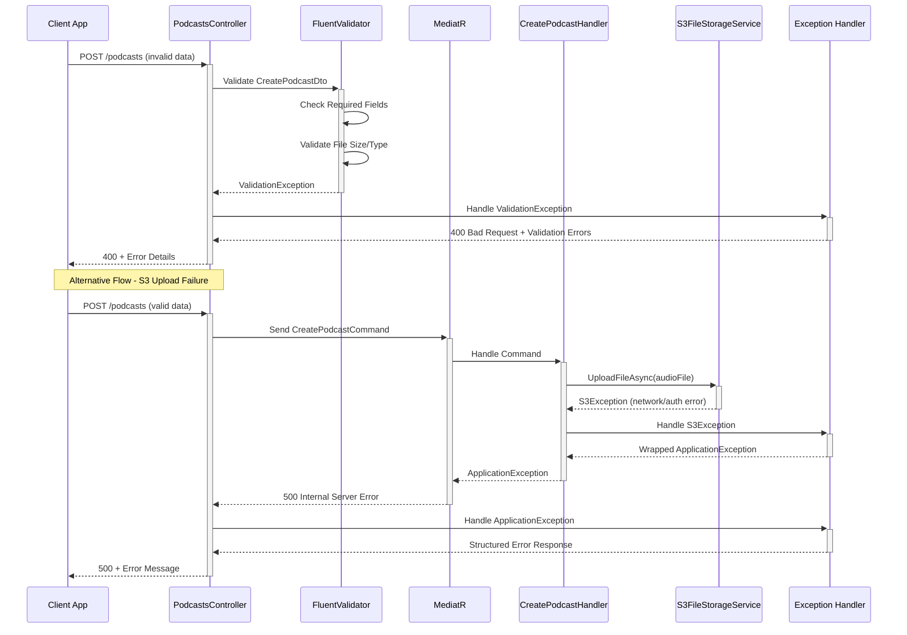

# ContentService Sequence Diagrams

## 1. Create Podcast Flow (Complete CQRS with S3 Upload)



## 2. Approve/Reject Podcast Flow (Moderator Action)



## 3. Get Podcasts with Filtering (Query Side)



## 4. Delete Podcast Flow (Soft Delete with S3 Cleanup)



## 5. Comment System Flow



## 6. Error Handling Flow



## 7. Background Outbox Event Processing

```mermaid
sequenceDiagram
    participant Timer as Background Timer
    participant Processor as OutboxEventProcessor
    participant Outbox as OutboxUnitOfWork
    participant DB as PostgreSQL
    participant Bus as EventBus/MessageBus
    participant External as External Services

    Timer->>+Processor: Trigger (every 30 seconds)
    
    Processor->>+Outbox: GetPendingOutboxEventsAsync(batchSize: 10)
    Outbox->>+DB: SELECT TOP 10 FROM OutboxEvents WHERE ProcessedAt IS NULL
    DB-->>-Outbox: Pending Events
    Outbox-->>-Processor: Event Batch
    
    loop For Each Event in Batch
        Processor->>+Bus: PublishAsync(event)
        
        alt Successful Publish
            Bus-->>-Processor: Success
            Processor->>+Outbox: MarkAsProcessedAsync(eventId)
            Outbox->>+DB: UPDATE OutboxEvents SET ProcessedAt = NOW()
            DB-->>-Outbox: Updated
            Outbox-->>-Processor: Marked as Processed
        else Publish Failed
            Bus-->>-Processor: Exception
            Processor->>+Outbox: IncrementRetryCountAsync(eventId)
            Outbox->>+DB: UPDATE OutboxEvents SET RetryCount++, NextRetryAt = ?
            DB-->>-Outbox: Updated
            Outbox-->>-Processor: Retry Scheduled
        end
    end
    
    Processor-->>-Timer: Batch Completed
    
    Note over External: External services receive events:
    Note over External: - UserService (for notifications)
    Note over External: - NotificationService (for alerts)
    Note over External: - AnalyticsService (for metrics)
```

## Architecture Notes

### Key Components:
1. **API Layer**: Controllers with attribute-based routing and authorization
2. **Application Layer**: CQRS with MediatR, FluentValidation, AutoMapper
3. **Domain Layer**: Entities, enums, interfaces, domain events
4. **Infrastructure Layer**: EF Core, S3 integration, repositories, outbox pattern

### Design Patterns Used:
- **CQRS**: Separate command/query responsibilities
- **Mediator Pattern**: Decoupled request/response handling
- **Repository Pattern**: Data access abstraction
- **Outbox Pattern**: Reliable event publishing
- **Clean Architecture**: Dependency inversion and separation of concerns

### Key Features:
- **Role-based Authorization**: ContentCreator, CommunityModerator policies
- **Soft Delete**: IsDeleted filter applied automatically via EF query filters
- **File Upload**: Direct S3 integration with cleanup on delete
- **Event-driven**: Async event publishing for microservice communication
- **Validation**: Comprehensive input validation with FluentValidation
- **Error Handling**: Structured exception handling with appropriate HTTP status codes