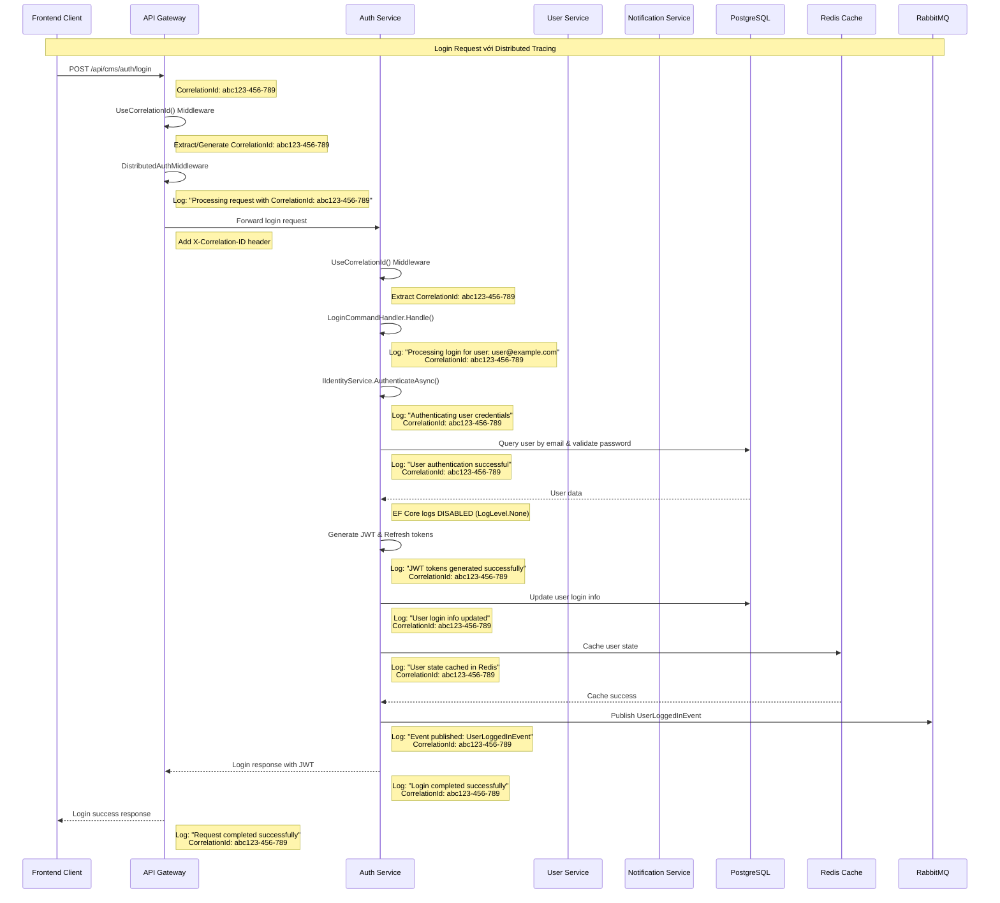

# Healink Microservices - Logging System Documentation

## 📋 Tổng quan

Hệ thống logging đã được triển khai cho toàn bộ microservices và Gateway với các tính năng:
- **Centralized Logging Configuration** từ `.env` file
- **Distributed Tracing** với Correlation ID xuyên các services
- **EF Core Log Filtering** để giảm noise trong Docker logs
- **File Logging** cho từng service riêng biệt
- **Environment-based Control** cho tất cả log categories

## 🏗️ Kiến trúc Logging System

### 1. **LoggingConfiguration.cs** - Centralized Logging
```csharp
public static class LoggingConfiguration
{
    // Environment-based configuration
    public static WebApplicationBuilder AddLoggingConfiguration(this WebApplicationBuilder builder, string? serviceName = null)
    
    // EF Core log level controls
    private static void ApplyLogFiltering(ILoggingBuilder logging, IConfiguration configuration)
    
    // Correlation ID service for distributed tracing
    public interface ICorrelationIdService
    public class CorrelationIdService : ICorrelationIdService
}
```

### 2. **CorrelationIdMiddleware.cs** - Distributed Tracing
```csharp
public class CorrelationIdMiddleware
{
    // Extract or generate Correlation ID
    // Add to response headers
    // Log with Correlation ID context
    // Propagate across services
}
```

### 3. **EnvironmentConfiguration.cs** - Environment Variables Mapping
```csharp
// Maps .env variables to IConfiguration
configuration["LoggingConfig:EnableFileLogging"] = Environment.GetEnvironmentVariable("LOG_ENABLE_FILE_LOGGING");
configuration["LoggingConfig:EfCoreLevel"] = Environment.GetEnvironmentVariable("LOG_EF_CORE_LEVEL");
// ... other mappings
```

## 🔧 Configuration Files

### **.env** - Environment Variables
```bash
# === LOGGING CONFIGURATION ===
LOG_ENABLE_FILE_LOGGING=true
LOG_ENABLE_CONSOLE_LOGGING=true
LOG_ENABLE_DISTRIBUTED_TRACING=true
LOG_MINIMUM_LEVEL=Information
LOG_FILE_SIZE_LIMIT_MB=10
LOG_RETAINED_FILE_COUNT=30

# Docker-specific logging controls
LOG_DOCKER_REDUCE_EF_CORE_NOISE=true

# EF Core log level control (None = completely disable)
LOG_EF_CORE_LEVEL=None
LOG_EF_DATABASE_COMMAND_LEVEL=None
LOG_NPGSQL_LEVEL=None
LOG_SQL_CLIENT_LEVEL=None

# Specific category controls
LOG_ENABLE_EF_COMMANDS=false
LOG_ENABLE_EF_CORE=false
LOG_ENABLE_NPGSQL=false
LOG_ENABLE_SQL_CLIENT=false
LOG_ENABLE_STATIC_FILES=false
LOG_ENABLE_HOSTING_DIAGNOSTICS=false
LOG_ENABLE_MVC_INFRASTRUCTURE=false
LOG_ENABLE_ROUTING=false
LOG_ENABLE_AUTHENTICATION=false
LOG_ENABLE_AUTHORIZATION=false
LOG_ENABLE_OCELOT=false
LOG_ENABLE_MASS_TRANSIT=false
```

## 🚀 Service Configuration

### **AuthService.API/Configurations/ServiceConfiguration.cs**
```csharp
public static WebApplicationBuilder ConfigureServices(this WebApplicationBuilder builder)
{
    // Configure microservice with shared services (includes env + logging)
    builder.ConfigureMicroserviceServices("AuthService");
    
    // Add distributed authentication
    builder.Services.AddMicroserviceDistributedAuth(builder.Configuration);
    
    // Add OTP cache service
    builder.Services.AddRedisOtpCacheService(builder.Configuration);
    
    // Add MassTransit with Saga
    builder.Services.AddMassTransitWithSaga<AuthService.Infrastructure.Context.AuthDbContext>(
        builder.Configuration, x => {
            x.AddConsumer<AuthService.Infrastructure.Consumers.CreateAuthUserConsumer>();
            x.AddConsumer<AuthService.Infrastructure.Consumers.DeleteAuthUserConsumer>();
        });
    
    // Application & Infrastructure layers
    builder.Services.AddApplication();
    builder.Services.AddInfrastructure(builder.Configuration);
    
    return builder;
}

public static WebApplication ConfigurePipeline(this WebApplication app)
{
    // Use shared pipeline configuration
    app.ConfigureSharedPipeline("AuthService");
    return app;
}
```

### **Gateway.API/Configuration/ServiceConfiguration.cs**
```csharp
public static WebApplicationBuilder ConfigureServices(this WebApplicationBuilder builder)
{
    // Load environment configuration first
    builder.AddEnvironmentConfiguration("Gateway");
    
    // Add logging configuration
    builder.AddLoggingConfiguration("Gateway");
    
    // Core ASP.NET services
    builder.Services.AddControllers();
    builder.Services.AddEndpointsApiExplorer();
    builder.Services.AddSwaggerGen();
    
    // Gateway-specific configurations
    builder.Services.AddCorsConfiguration(builder.Configuration);
    builder.Services.AddGatewayDistributedAuth(builder.Configuration);
    
    // Register JWT configuration
    builder.Services.Configure<JwtConfig>(builder.Configuration.GetSection(JwtConfig.SectionName));
    
    // Add current user service
    builder.Services.AddHttpContextAccessor();
    builder.Services.AddHttpClient("AuthService", client => {
        client.BaseAddress = new Uri("http://authservice-api");
        client.DefaultRequestHeaders.Add("Accept", "application/json");
    });
    builder.Services.AddScoped<ICurrentUserService, CurrentUserService>();
    
    // Configure Ocelot
    builder.Configuration.AddJsonFile("ocelot.json", optional: false, reloadOnChange: true);
    
    // Configure Authentication for Ocelot
    var jwtConfig = builder.Configuration.GetSection(JwtConfig.SectionName).Get<JwtConfig>();
    if (jwtConfig != null && !string.IsNullOrEmpty(jwtConfig.Key))
    {
        var key = System.Text.Encoding.UTF8.GetBytes(jwtConfig.Key);
        builder.Services.AddAuthentication()
            .AddJwtBearer("Bearer", options => {
                options.SaveToken = true;
                options.RequireHttpsMetadata = false;
                options.TokenValidationParameters = new TokenValidationParameters
                {
                    ValidateIssuer = jwtConfig.ValidateIssuer,
                    ValidateAudience = jwtConfig.ValidateAudience,
                    ValidIssuer = jwtConfig.Issuer,
                    ValidAudience = jwtConfig.Audience,
                    ValidateIssuerSigningKey = jwtConfig.ValidateIssuerSigningKey,
                    IssuerSigningKey = new SymmetricSecurityKey(key),
                    ValidateLifetime = jwtConfig.ValidateLifetime,
                    ClockSkew = TimeSpan.FromMinutes(jwtConfig.ClockSkewMinutes)
                };
            });
    }
    
    builder.Services.AddOcelot(builder.Configuration);
    builder.Services.AddAuthorization();
    
    return builder;
}

public static async Task<WebApplication> ConfigurePipelineAsync(this WebApplication app)
{
    var environment = app.Environment;
    var logger = app.Services.GetRequiredService<ILogger<WebApplication>>();
    
    logger.LogInformation("Configuring Gateway pipeline for Ocelot, Environment: {Environment}", environment.EnvironmentName);
    
    // Enable Swagger for development
    if (environment.IsDevelopment())
    {
        app.UseSwagger();
        app.UseSwaggerUI();
    }
    
    app.UseHttpsRedirection();
    
    // Use CORS - must be before authentication and Ocelot
    app.UseCorsConfiguration();
    
    // Use correlation ID middleware for distributed tracing - early in pipeline
    app.UseCorrelationId();
    
    // Use distributed auth middleware (Gateway-specific) - before Ocelot
    app.UseMiddleware<Gateway.API.Middlewares.DistributedAuthMiddleware>();
    
    // Use Ocelot - handles its own auth pipeline
    await app.UseOcelot();
    
    return app;
}
```

## 🔄 Login Log Tracing Flow

### **Login Process Overview**
Login process trong hệ thống Healink rất đơn giản:
1. **Client** gửi login request với email/password
2. **Gateway** forward request đến AuthService
3. **AuthService** authenticate user credentials
4. **AuthService** generate JWT & Refresh tokens
5. **AuthService** cache user state trong Redis
6. **AuthService** publish UserLoggedInEvent
7. **Response** trả về JWT token cho client

**Không có OTP verification** - OTP chỉ dành cho Register và Reset Password.

### **Mermaid Chart - Login Request Flow với Log Tracing**



## 📊 Log Output Examples

### **1. Gateway Logs**
```
info: Gateway.API.Middlewares.CorrelationIdMiddleware[0]
      Processing request with CorrelationId: abc123-456-789

info: Gateway.API.Middlewares.DistributedAuthMiddleware[0]
      JWT token validated successfully for user: user@example.com
      CorrelationId: abc123-456-789

info: Ocelot.Requester.Middleware.HttpRequesterMiddleware[0]
      requestId: 0HNFUHU5ME3EI:00000001, message: '200 (OK) status code of request URI: http://authservice-api/api/user/auth/login'
      CorrelationId: abc123-456-789
```

### **2. AuthService Logs**
```
info: SharedLibrary.Commons.Middlewares.CorrelationIdMiddleware[0]
      Processing request with CorrelationId: abc123-456-789

info: AuthService.Application.Features.Auth.Commands.Login.LoginCommandHandler[0]
      Processing login for user: user@example.com
      CorrelationId: abc123-456-789

info: AuthService.Application.Features.Auth.Commands.Login.LoginCommandHandler[0]
      User authentication successful for user: user@example.com
      CorrelationId: abc123-456-789

info: AuthService.Application.Features.Auth.Commands.Login.LoginCommandHandler[0]
      JWT tokens generated successfully for user: user@example.com
      CorrelationId: abc123-456-789

info: AuthService.Application.Features.Auth.Commands.Login.LoginCommandHandler[0]
      User state cached in Redis for user: user@example.com
      CorrelationId: abc123-456-789

info: SharedLibrary.Commons.Outbox.OutboxUnitOfWork[0]
      Publishing outbox event {EventId} of type UserLoggedInEvent
      CorrelationId: abc123-456-789

info: AuthService.Application.Features.Auth.Commands.Login.LoginCommandHandler[0]
      User {UserId} logged in successfully
      CorrelationId: abc123-456-789
```

## 🎯 Key Features

### **1. Distributed Tracing**
- **Correlation ID** được generate tại Gateway
- **Propagate** qua tất cả services qua HTTP headers
- **Log context** với Correlation ID trong mọi log entries
- **Request tracking** xuyên toàn bộ microservices

### **2. EF Core Log Filtering**
- **LogLevel.None** cho EF Core categories
- **Environment-based control** từ `.env` file
- **Docker noise reduction** để giảm log spam
- **Selective enabling** khi cần debug

### **3. Centralized Configuration**
- **Single source of truth** từ `.env` file
- **Environment-specific** settings
- **Service-specific** log file names
- **Flexible control** cho tất cả log categories

### **4. File Logging**
- **Service-specific** log files: `authservice-{Date}.txt`
- **Rotating logs** với size limit và retention
- **Structured logging** với correlation ID
- **Separate files** cho từng service

## 🔧 Usage Examples

### **Enable EF Core Logs for Debugging**
```bash
# .env
LOG_EF_CORE_LEVEL=Information
LOG_EF_DATABASE_COMMAND_LEVEL=Information
LOG_ENABLE_EF_COMMANDS=true
```

### **Disable All EF Core Logs**
```bash
# .env
LOG_EF_CORE_LEVEL=None
LOG_EF_DATABASE_COMMAND_LEVEL=None
LOG_NPGSQL_LEVEL=None
LOG_SQL_CLIENT_LEVEL=None
```

### **Enable Specific Log Categories**
```bash
# .env
LOG_ENABLE_AUTHENTICATION=true
LOG_ENABLE_AUTHORIZATION=true
LOG_ENABLE_OCELOT=true
LOG_ENABLE_MASS_TRANSIT=true
```

### **Disable File Logging**
```bash
# .env
LOG_ENABLE_FILE_LOGGING=false
LOG_ENABLE_CONSOLE_LOGGING=true
```

## 📁 File Structure

```
src/
├── SharedLibrary/
│   └── Commons/
│       ├── Configurations/
│       │   ├── LoggingConfiguration.cs
│       │   └── EnvironmentConfiguration.cs
│       ├── Middlewares/
│       │   └── CorrelationIdMiddleware.cs
│       └── Services/
│           └── ICorrelationIdService.cs
├── Gateway/
│   └── Gateway.API/
│       └── Configuration/
│           └── ServiceConfiguration.cs
├── AuthService/
│   └── AuthService.API/
│       └── Configurations/
│           └── ServiceConfiguration.cs
└── UserService/
    └── UserService.API/
        └── Configurations/
            └── ServiceConfiguration.cs
```

## 🚀 Benefits

1. **Complete Request Tracing** - Track requests across all services
2. **Reduced Log Noise** - EF Core logs disabled by default
3. **Centralized Control** - All logging config in `.env` file
4. **Service Isolation** - Separate log files per service
5. **Debugging Support** - Easy to enable specific log categories
6. **Production Ready** - Optimized for Docker environments
7. **Maintainable** - Clean, centralized configuration

## 🔍 Troubleshooting

### **EF Core Logs Still Appearing**
- Check `LOG_EF_CORE_LEVEL=None` in `.env`
- Verify `LoggingConfiguration.cs` is applied
- Restart Docker containers

### **Correlation ID Missing**
- Ensure `UseCorrelationId()` is called early in pipeline
- Check `ICorrelationIdService` is registered
- Verify middleware order

### **Log Files Not Created**
- Check `LOG_ENABLE_FILE_LOGGING=true`
- Verify write permissions to `Logs/` directory
- Check `LOG_FILE_SIZE_LIMIT_MB` and `LOG_RETAINED_FILE_COUNT`

---

**Tạo bởi:** Healink Development Team  
**Ngày cập nhật:** 2025-01-28  
**Phiên bản:** 1.0.0
