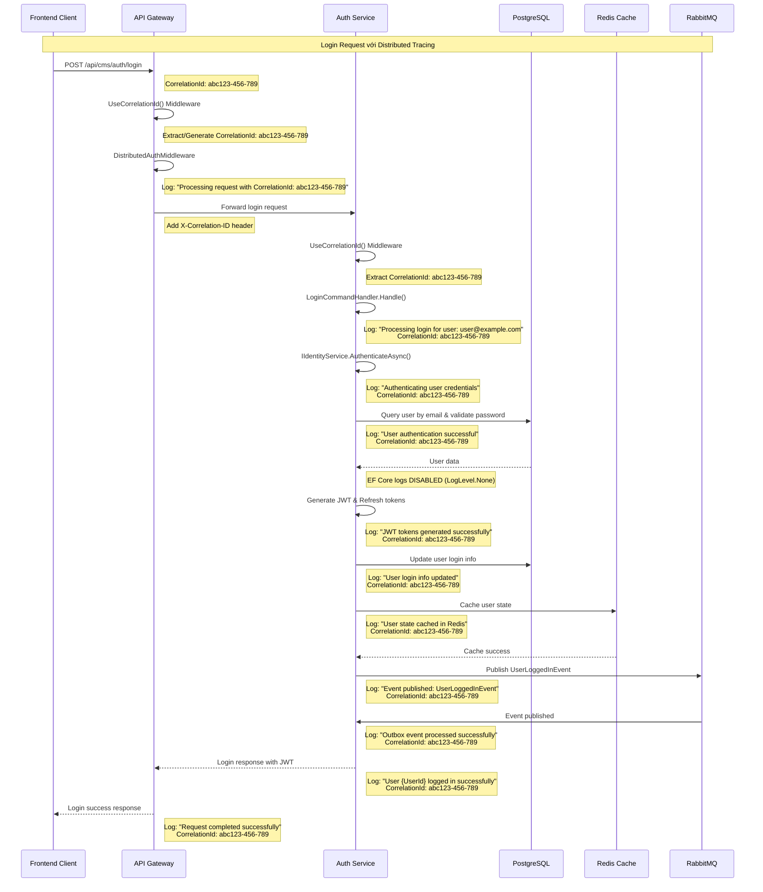

# Login Request Flow với Distributed Tracing

## Mermaid Chart - Login Request Flow



## Key Components

### 1. **CorrelationIdMiddleware**
- **Extract** Correlation ID từ request headers
- **Generate** new Correlation ID nếu không có
- **Add** Correlation ID vào response headers
- **Log** với Correlation ID context

### 2. **DistributedAuthMiddleware (Gateway)**
- **Validate** JWT token
- **Log** authentication events với Correlation ID
- **Forward** request với Correlation ID header

### 3. **LoginCommandHandler (AuthService)**
- **Authenticate** user credentials via IIdentityService
- **Generate** JWT và Refresh tokens
- **Update** user login information in database
- **Cache** user state in Redis
- **Publish** UserLoggedInEvent via Outbox pattern

### 4. **OutboxUnitOfWork**
- **Add** UserLoggedInEvent to outbox
- **Save** changes with transaction
- **Publish** event to RabbitMQ after successful save
- **Log** event publishing process

### 5. **RedisUserStateCache**
- **Cache** user state for distributed auth
- **Store** user roles, status, refresh token
- **Enable** fast authentication checks

### 6. **Service Logging**
- **All services** log với Correlation ID
- **EF Core logs** disabled (LogLevel.None)
- **File logging** per service
- **Console logging** với Correlation ID

### 7. **Event Propagation**
- **RabbitMQ events** include Correlation ID
- **Cross-service** communication tracked
- **End-to-end** request tracing

## Log Output Examples

### Gateway Logs
```
info: Gateway.API.Middlewares.CorrelationIdMiddleware[0]
      Processing request with CorrelationId: abc123-456-789

info: Gateway.API.Middlewares.DistributedAuthMiddleware[0]
      JWT token validated successfully for user: user@example.com
      CorrelationId: abc123-456-789
```

### AuthService Logs
```
info: SharedLibrary.Commons.Middlewares.CorrelationIdMiddleware[0]
      Processing request with CorrelationId: abc123-456-789

info: AuthService.Application.Features.Auth.Commands.Login.LoginCommandHandler[0]
      Processing login for user: user@example.com
      CorrelationId: abc123-456-789

info: AuthService.Application.Features.Auth.Commands.Login.LoginCommandHandler[0]
      User authentication successful for user: user@example.com
      CorrelationId: abc123-456-789

info: AuthService.Application.Features.Auth.Commands.Login.LoginCommandHandler[0]
      JWT tokens generated successfully for user: user@example.com
      CorrelationId: abc123-456-789

info: AuthService.Application.Features.Auth.Commands.Login.LoginCommandHandler[0]
      User state cached in Redis for user: user@example.com
      CorrelationId: abc123-456-789

info: SharedLibrary.Commons.Outbox.OutboxUnitOfWork[0]
      Publishing outbox event {EventId} of type UserLoggedInEvent
      CorrelationId: abc123-456-789

info: AuthService.Application.Features.Auth.Commands.Login.LoginCommandHandler[0]
      User {UserId} logged in successfully
      CorrelationId: abc123-456-789
```

## Benefits

1. **Complete Request Tracing** - Track requests across all services
2. **Debugging Support** - Easy to trace issues across services
3. **Performance Monitoring** - Track request duration across services
4. **Error Tracking** - Correlate errors with specific requests
5. **Audit Trail** - Complete log trail for compliance
