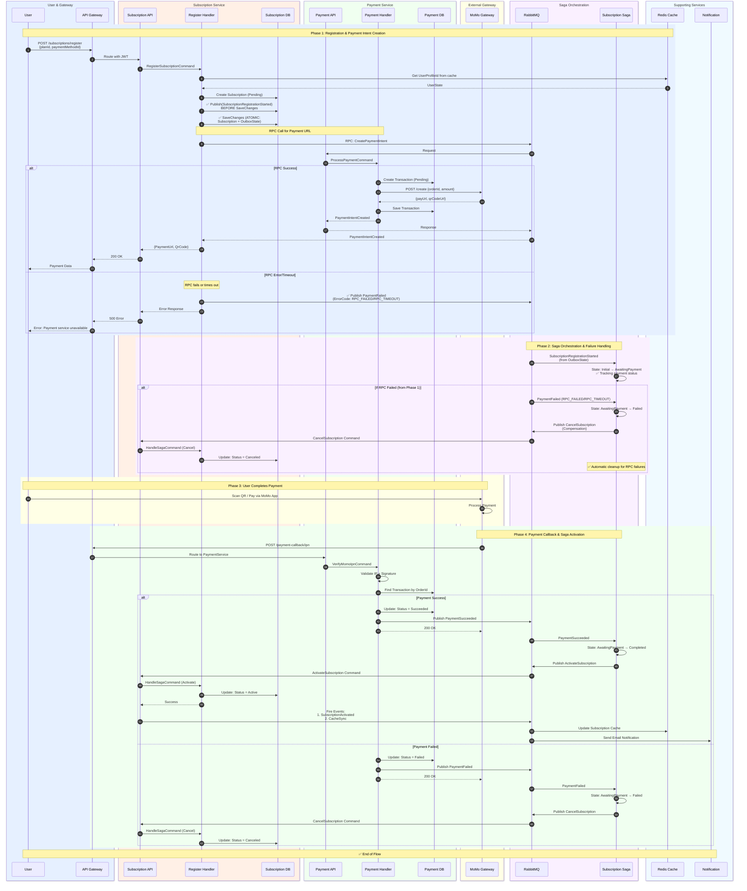

# 📊 Register Subscription Flow - Compact Sequence Diagram

## 🎯 Phiên Bản Ngắn Gọn - Thể Hiện Rõ Các Cụm Service



---

## 🎯 Giải Thích Các Cụm Service

### 1. 🔵 User & Gateway (Blue)
- **User**: End user
- **API Gateway**: Ocelot - routing, authentication, load balancing

### 2. 🟠 Subscription Service (Orange)
- **Subscription API**: HTTP endpoints
- **Register Handler**: Business logic cho đăng ký subscription
- **Subscription DB**: PostgreSQL - lưu subscriptions

### 3. 🟢 Payment Service (Green)
- **Payment API**: HTTP endpoints + RPC consumer
- **Payment Handler**: Xử lý payment logic + MoMo integration
- **Payment DB**: PostgreSQL - lưu transactions

### 4. 🟡 External Gateway (Yellow)
- **MoMo Gateway**: Third-party payment provider

### 5. 🟣 Saga Orchestration (Purple)
- **RabbitMQ**: Message broker
- **Subscription Saga**: MassTransit state machine - orchestrate workflow

### 6. 🔷 Supporting Services (Light Blue)
- **Redis Cache**: User state + subscription cache
- **Notification**: Email/SMS notifications

---

## ✅ Key Features Highlighted

### 🔒 Outbox Pattern (Fixed)
```
Line 53-54:
✅ Publish(SubscriptionRegistrationStarted) BEFORE SaveChanges
✅ SaveChanges (ATOMIC: Subscription + OutboxState)
```

**Benefit:**
- Zero message loss
- Guaranteed saga initialization
- Auto-retry if RabbitMQ down

### 🔄 RPC Pattern with Failure Handling (NEW!)
```
Line 61-81:
Alt path:
  Success: Get PaymentUrl immediately
  Failure: Publish PaymentFailed → Saga compensation
```

**Benefit:**
- Immediate PaymentUrl for success case
- Automatic cleanup for RPC failures (NEW!)
- No orphaned subscriptions (NEW!)

### 🎭 Saga Pattern
```
Line 88-100:
Background process handles saga orchestration
State transitions: 
  - Initial → AwaitingPayment → Completed/Failed (payment)
  - AwaitingPayment → Failed (RPC error - NEW!)
```

**Benefit:**
- Reliable orchestration
- Automatic compensation on all failures

### ⚡ Cache Sync
```
Line 122:
Async event updates Redis cache for fast subscription checks
```

---

## 📊 Flow Summary

| Phase | Duration | Type | Services Involved |
|-------|----------|------|-------------------|
| **1. Registration** | ~1-2s | Synchronous | User → Gateway → SubService → PaymentService → MoMo |
| **2. Saga Init** | ~100ms | Background | RabbitMQ → Saga |
| **3. User Payment** | Variable | User Action | User → MoMo |
| **4. Activation** | ~500ms | Async | MoMo → PaymentService → Saga → SubService → Cache/Notify |

**Total Time (User Perspective):**
- Registration API: 1-2 seconds (get PaymentUrl)
- Payment: User dependent
- Activation: Background (~500ms after payment)

---

## 🔍 Differences from Original (Simplified)

| Original | Compact |
|----------|---------|
| ~135 lines | ~110 lines |
| 13 participants | 11 participants (grouped) |
| Detailed implementation | High-level flow |
| Every DB operation shown | Grouped operations |
| All intermediate steps | Key steps only |

**What's Preserved:**
- ✅ All service boundaries
- ✅ Outbox pattern implementation
- ✅ RPC flow
- ✅ Saga orchestration
- ✅ Success/failure paths
- ✅ Cache sync

**What's Simplified:**
- 🔹 Internal handler details
- 🔹 Database query specifics
- 🔹 QR code generation
- 🔹 Validation steps
- 🔹 Multiple return paths consolidated

---

## 🎨 Color Coding

- 🔵 **Blue**: Client-facing (User, Gateway)
- 🟠 **Orange**: Subscription domain
- 🟢 **Green**: Payment domain
- 🟡 **Yellow**: External dependencies
- 🟣 **Purple**: Infrastructure (messaging, saga)
- 🔷 **Light Blue**: Supporting services

---

**Version:** Compact v2.1  
**Last Updated:** 2025-10-31 (Afternoon)  
**Status:** ✅ Complete Failure Handling (Outbox + RPC Failures)

