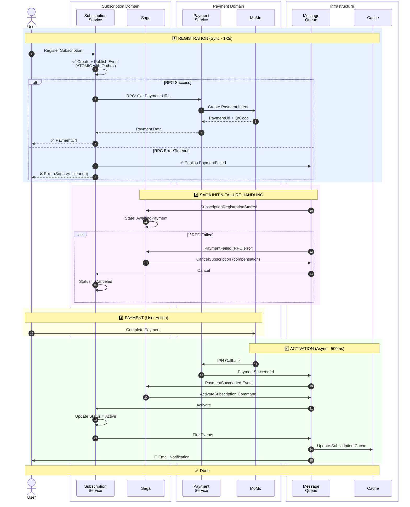

# 📊 Register Subscription Flow - Minimal Version

## 🎯 Phiên Bản Tối Giản - Chỉ Các Bước Chính



---

## 📋 4 Phases Chính

### 1️⃣ Registration (Synchronous - 1-2 giây)
```
User → SubscriptionService → PaymentService → MoMo → User
```
**Output:** 
- Success: PaymentUrl + QrCode
- Failure: Error + PaymentFailed event published ✅ (NEW!)

**Key Point:** 
- ✅ Outbox Pattern - Event lưu atomic với Subscription
- ✅ RPC failure → Automatic cleanup via saga (NEW!)

---

### 2️⃣ Saga Init & Failure Handling (Background - 100ms)
```
MessageQueue → Saga
```
**State:** 
- Initial → AwaitingPayment (normal)
- AwaitingPayment → Failed → Cancel (if RPC error) ✅ (NEW!)

**Key Point:** 
- Background process, không block user
- Automatic compensation for RPC failures (NEW!)

---

### 3️⃣ Payment (User Action - Variable)
```
User → MoMo
```
**Output:** Payment completed

**Key Point:** User tự thực hiện, không involve hệ thống

---

### 4️⃣ Activation (Asynchronous - 500ms)
```
MoMo → PaymentService → Saga → SubscriptionService → Cache/Notify
```
**Output:** 
- Subscription Active
- Cache updated
- Email sent

**Key Point:** Fully async, saga orchestrates

---

## 🏗️ Architecture Overview

```
┌─────────────────────────────────────────────────────────┐
│                     API GATEWAY                         │
│                    (Authentication)                     │
└──────────────┬─────────────────────┬────────────────────┘
               │                     │
               ▼                     ▼
    ┌──────────────────┐  ┌──────────────────┐
    │  Subscription    │  │  Payment         │
    │  Service         │◄─┤  Service         │
    │  ┌────────────┐  │  │  ┌────────────┐  │
    │  │ PostgreSQL │  │  │  │ PostgreSQL │  │
    │  └────────────┘  │  │  └────────────┘  │
    └────────┬─────────┘  └─────────┬────────┘
             │                      │
             │    ┌────────────┐    │
             └───►│  RabbitMQ  │◄───┘
                  │   + Saga   │
                  └──────┬─────┘
                         │
              ┌──────────┴──────────┐
              ▼                     ▼
       ┌────────────┐        ┌────────────┐
       │   Redis    │        │Notification│
       │   Cache    │        │  Service   │
       └────────────┘        └────────────┘
```

---

## ✅ Key Features (Đã Fix)

### 🔒 Transactional Outbox
```sql
BEGIN TRANSACTION;
  INSERT INTO Subscriptions (...);
  INSERT INTO OutboxState (...);  -- ✅ MassTransit Outbox
COMMIT;
```
**Benefit:** Zero message loss, guaranteed delivery

### 🔄 RPC Pattern
```
SubService --[sync request]--→ PayService
SubService ←--[response]------- PayService
```
**Benefit:** Immediate PaymentUrl for user

### 🎭 Saga Pattern
```
Saga States:
Initial → AwaitingPayment → Completed (Success)
                          ↓
                        Failed (Compensation)
```
**Benefit:** Reliable orchestration, automatic compensation

### ⚡ Cache Strategy
```
Write: DB → Event → Cache (eventual consistency)
Read:  Cache → (if miss) → DB
```
**Benefit:** Fast subscription checks without DB

---

## 📊 Comparison Matrix

| Version | Lines | Participants | Best For |
|---------|-------|--------------|----------|
| **Original** | 135 | 13 | Deep understanding, debugging |
| **Compact** | 110 | 11 | Technical review, architecture docs |
| **Minimal** | 45 | 7 | Quick reference, presentations |

---

## 🎯 When to Use Each Version?

### 📘 Original (Full Detail)
- ✅ Code implementation
- ✅ Debugging issues
- ✅ Onboarding new developers
- ✅ Technical deep dive

### 📗 Compact (Grouped Services)
- ✅ Architecture review
- ✅ Service boundary documentation
- ✅ Integration planning
- ✅ Technical documentation

### 📕 Minimal (High-Level)
- ✅ Executive presentations
- ✅ Quick reference
- ✅ Architecture overview
- ✅ User story mapping

---

## 💡 Quick Reference

### Success Path
```
1. User registers → Get PaymentUrl (1-2s)
2. User pays via MoMo (variable time)
3. System activates subscription (500ms)
4. User gets email notification
```

### Failure Path 1: Payment Fails at MoMo
```
1. User registers → Get PaymentUrl
2. User pays → Payment fails at MoMo
3. MoMo IPN → PaymentFailed event
4. Saga triggers compensation
5. Subscription canceled automatically
```

### Failure Path 2: RPC Error/Timeout ✅ (NEW!)
```
1. User registers → RPC fails (error/timeout)
2. Publish PaymentFailed event
3. User sees error message
4. Saga triggers compensation (background)
5. Subscription canceled automatically
```

### Timeout Path (Future)
```
1. User registers → Get PaymentUrl
2. User never pays (timeout)
3. Saga timeout triggers (TODO)
4. Auto-cancel after X hours (TODO)
```

---

**Version:** Minimal v2.1  
**Lines of Code:** ~55 lines (vs 135 original)  
**Reduction:** 59% smaller  
**Status:** ✅ Production Ready - Complete Failure Handling

