# Subscription System - Complete Documentation

## 📚 Table of Contents

1. [System Overview](#system-overview)
2. [Architecture Diagrams](#architecture-diagrams)
3. [Sequence Diagrams](#sequence-diagrams)
4. [State Machine Diagrams](#state-machine-diagrams)
5. [Flow Diagrams](#flow-diagrams)
6. [Technical Components](#technical-components)
7. [Security & Validation](#security--validation)
8. [Error Handling & Compensation](#error-handling--compensation)
9. [Database Schema](#database-schema)
10. [API Endpoints](#api-endpoints)

---

## System Overview

### High-Level Architecture


---

## Architecture Diagrams

### 1. Microservices Communication Pattern


### 2. Saga Pattern with Compensation


---

## Sequence Diagrams

### Complete Subscription Registration Flow (Success Case)

```mermaid
sequenceDiagram
    autonumber
    participant User
    participant Gateway as API Gateway<br/>(Ocelot)
    participant SubAPI as Subscription<br/>API
    participant Handler as RegisterSubscription<br/>Handler
    participant Cache as Redis<br/>Cache
    participant SubDB as Subscription<br/>Database
    participant RabbitMQ as RabbitMQ<br/>Message Bus
    participant PayConsumer as Payment<br/>RPC Consumer
    participant PayHandler as ProcessPayment<br/>Handler
    participant PayFactory as Payment<br/>Gateway Factory
    participant MoMo as MoMo<br/>Gateway
    participant PayDB as Payment<br/>Database
    participant Saga as RegisterSubscription<br/>Saga
    participant ActivateConsumer as Activate<br/>Consumer
    participant ActivateHandler as HandleSubscriptionSaga<br/>Handler
    participant NotifyConsumer as Notification<br/>Consumer
    participant Email as Email<br/>Service
    
    Note over User,Email: Phase 1: Registration & Payment Intent
    User->>Gateway: POST /api/user/subscriptions/register<br/>{planId, paymentMethodId}
    Gateway->>Gateway: Validate JWT Token<br/>(authUserId from token)
    Gateway->>SubAPI: Forward Request
    SubAPI->>Handler: RegisterSubscriptionCommand
    
    Handler->>Cache: GetUserStateAsync(authUserId)
    Cache-->>Handler: UserState {UserProfileId, Email, ...}
    Note over Handler: ✅ authUserId for auth<br/>✅ UserProfileId for business logic
    
    Handler->>SubDB: Create Subscription<br/>Status: Pending<br/>CreatedBy: authUserId ✅
    SubDB-->>Handler: Subscription Created
    
    Handler->>SubDB: Publish Custom Outbox Event<br/>SubscriptionRegisteredActivityEvent
    Handler->>SubDB: SaveChangesWithOutboxAsync()<br/>(Atomic: Entity + Custom Outbox)
    
    Note over Handler,PayHandler: Phase 2: RPC Payment Intent (Synchronous)
    Handler->>RabbitMQ: Request CreatePaymentIntent (RPC)<br/>Timeout: 30s
    RabbitMQ->>PayConsumer: CreatePaymentIntentRequest
    PayConsumer->>PayHandler: ProcessPaymentCommand
    
    PayHandler->>PayDB: Create PaymentTransaction<br/>Status: Pending<br/>CreatedBy: authUserId ✅
    PayHandler->>PayFactory: GetPaymentGatewayService(Momo)
    PayFactory-->>PayHandler: MomoService
    
    PayHandler->>MoMo: POST /create<br/>{orderId, amount, signature}
    MoMo-->>PayHandler: MomoResponse<br/>{payUrl, qrCodeUrl, deeplink}
    
    PayHandler->>PayDB: Save Transaction + Outbox<br/>SaveChangesAsync()
    PayHandler-->>PayConsumer: PaymentIntentResult
    PayConsumer-->>RabbitMQ: Response PaymentIntentCreated
    RabbitMQ-->>Handler: PaymentIntentCreated
    
    Note over Handler: Generate QR Code from qrCodeUrl
    Handler-->>SubAPI: Success Result<br/>{PaymentUrl, QrCodeBase64}
    SubAPI-->>Gateway: 200 OK
    Gateway-->>User: Payment Data<br/>(Redirect to MoMo)
    
    Note over Handler,Saga: Phase 3: Saga Orchestration Starts
    Handler->>RabbitMQ: Publish SubscriptionRegistrationStarted<br/>(MassTransit Bus Outbox)<br/>CreatedBy: authUserId ✅
    RabbitMQ->>Saga: SubscriptionRegistrationStarted Event
    Saga->>Saga: State: Initial → AwaitingPayment
    Saga->>RabbitMQ: Publish RequestPayment
    Note over Saga: Saga State Saved with<br/>Entity Framework Outbox
    
    Note over User,MoMo: Phase 4: User Payment
    User->>MoMo: Scan QR / Click PayUrl<br/>Complete Payment
    MoMo->>MoMo: Process Payment
    
    Note over MoMo,Saga: Phase 5: IPN Callback & Payment Verification
    MoMo->>Gateway: POST /api/payment-callback/momo/ipn<br/>(IPN Callback)
    Note over Gateway: ⚠️ Public Endpoint<br/>(No JWT required)
    Gateway->>SubAPI: Route to PaymentService
    SubAPI->>PayHandler: VerifyMomoIpnCommand
    
    PayHandler->>PayHandler: Validate IP Whitelist<br/>(118.69.208.0/20)
    PayHandler->>PayHandler: Verify HMAC SHA256 Signature
    PayHandler->>PayDB: Find PaymentTransaction<br/>by OrderId (SubscriptionId)
    
    alt Payment Success (ResultCode = 0)
        PayHandler->>PayDB: Update Transaction<br/>Status: Succeeded<br/>TransactionId: MoMo TransId
        PayHandler->>RabbitMQ: Publish PaymentSucceeded<br/>(MassTransit Outbox)
        PayHandler->>PayDB: SaveChangesAsync()
        PayHandler-->>MoMo: 200 OK<br/>{resultCode: 0, signature}
        
        Note over Saga: Phase 6: Saga Continues - Activation
        RabbitMQ->>Saga: PaymentSucceeded Event
        Saga->>Saga: State: AwaitingPayment → PaymentCompleted
        Saga->>RabbitMQ: Publish ActivateSubscription Command<br/>UpdatedBy: authUserId ✅
        Saga->>Saga: State: Finalize
        
        RabbitMQ->>ActivateConsumer: ActivateSubscription Command
        ActivateConsumer->>ActivateHandler: HandleSubscriptionSagaCommand<br/>Action: Activate
        
        ActivateHandler->>SubDB: Update Subscription<br/>Status: Active<br/>CurrentPeriodStart/End
        ActivateHandler->>SubDB: SaveChangesAsync()
        ActivateHandler-->>ActivateConsumer: Result<SubscriptionSagaResponse>
        
        Note over ActivateConsumer: Phase 7: Fire-and-Forget Notification
        ActivateConsumer->>RabbitMQ: Publish SubscriptionActivatedNotificationEvent<br/>UserId: authUserId ✅
        
        RabbitMQ->>NotifyConsumer: SubscriptionActivatedNotificationEvent
        NotifyConsumer->>Cache: GetUserStateAsync(authUserId) ✅
        Cache-->>NotifyConsumer: UserState {Email}
        NotifyConsumer->>Email: Send Email<br/>Template: SubscriptionActivated
        Email-->>NotifyConsumer: Email Sent
        
    else Payment Failed (ResultCode != 0)
        PayHandler->>PayDB: Update Transaction<br/>Status: Failed
        PayHandler->>RabbitMQ: Publish PaymentFailed<br/>(MassTransit Outbox)
        PayHandler->>PayDB: SaveChangesAsync()
        PayHandler-->>MoMo: 200 OK<br/>{resultCode: error, signature}
        
        Note over Saga: Phase 6 (Failure): Compensation
        RabbitMQ->>Saga: PaymentFailed Event
        Saga->>Saga: State: AwaitingPayment → Failed
        Saga->>RabbitMQ: Publish CancelSubscription Command<br/>(Compensation)<br/>UpdatedBy: authUserId
        Saga->>Saga: State: Finalize
        
        RabbitMQ->>ActivateConsumer: CancelSubscription Command
        ActivateConsumer->>ActivateHandler: HandleSubscriptionSagaCommand<br/>Action: Cancel
        ActivateHandler->>SubDB: Update Subscription<br/>Status: Canceled + Inactive
        ActivateHandler->>SubDB: SaveChangesAsync()
    end
    
    Note over User,Email: ✅ End of Flow
```



### Payment Gateway Integration Flow


---

## State Machine Diagrams

### Subscription Saga State Machine


### Subscription Entity State Machine


### Payment Transaction State Machine


---

## Flow Diagrams

### End-to-End Subscription Flow


---

## Technical Components

### 1. MassTransit Configuration

#### Entity Framework Outbox Configuration

```csharp
// SubscriptionService Configuration
services.AddMassTransitWithSaga<SubscriptionDbContext>(
    configuration,
    configureSagas: x =>
    {
        // Configure Saga with EF Repository
        x.AddSagaStateMachine<RegisterSubscriptionSaga, RegisterSubscriptionSagaState>()
            .EntityFrameworkRepository(r =>
            {
                r.ExistingDbContext<SubscriptionDbContext>();
                r.UsePostgres();
            });
    },
    configureConsumers: x =>
    {
        x.AddConsumer<ActivateSubscriptionConsumer>();
        x.AddConsumer<CancelSubscriptionConsumer>();
    },
    configureEndpoints: (cfg, context) =>
    {
        // Configure endpoints with Entity Framework Outbox
        cfg.ReceiveEndpoint("activate-subscription", e =>
        {
            e.UseEntityFrameworkOutbox<SubscriptionDbContext>(context);
            e.ConfigureConsumer<ActivateSubscriptionConsumer>(context);
        });
    }
);
```

#### PaymentService Configuration

```csharp
// PaymentService Configuration with Outbox
services.AddMassTransitWithConsumers<PaymentDbContext>(
    configuration,
    configureConsumers: x =>
    {
        x.AddConsumer<CreatePaymentIntentConsumer>(); // RPC Consumer
    },
    useEntityFrameworkOutbox: true,  // ✅ Enable EF Outbox
    useBusOutbox: true               // ✅ Enable Bus Outbox for IPublishEndpoint
);
```

### 2. Saga State Machine Implementation

```csharp
public class RegisterSubscriptionSaga : MassTransitStateMachine<RegisterSubscriptionSagaState>
{
    public RegisterSubscriptionSaga()
    {
        // CorrelationId = SubscriptionId (unified tracking)
        InstanceState(x => x.CurrentState);
        
        Event(() => SubscriptionRegistrationStarted, 
            x => x.CorrelateById(m => m.Message.SubscriptionId));
        Event(() => PaymentSucceeded, 
            x => x.CorrelateById(m => m.Message.SubscriptionId));
        Event(() => PaymentFailed, 
            x => x.CorrelateById(m => m.Message.SubscriptionId));
        
        Initially(
            When(SubscriptionRegistrationStarted)
                .Then(context =>
                {
                    // Initialize saga state
                    context.Saga.CorrelationId = context.Message.SubscriptionId;
                    context.Saga.CreatedBy = context.Message.CreatedBy; // authUserId
                    // ... other fields
                })
                .PublishAsync(context => context.Init<RequestPayment>(...))
                .TransitionTo(AwaitingPayment)
        );
        
        During(AwaitingPayment,
            When(PaymentSucceeded)
                .Then(context =>
                {
                    context.Saga.PaymentIntentId = context.Message.PaymentIntentId;
                    context.Saga.PaymentStatus = "Succeeded";
                })
                .PublishAsync(context => context.Init<ActivateSubscription>(new
                {
                    SubscriptionId = context.Saga.CorrelationId,
                    UpdatedBy = context.Saga.CreatedBy // authUserId for cache query
                }))
                .TransitionTo(PaymentCompleted)
                .Finalize(),
                
            When(PaymentFailed)
                .Then(context =>
                {
                    context.Saga.ErrorMessage = context.Message.ErrorMessage;
                })
                .PublishAsync(context => context.Init<CancelSubscription>(new
                {
                    SubscriptionId = context.Saga.CorrelationId,
                    IsCompensation = true, // Rollback flag
                    UpdatedBy = context.Saga.CreatedBy
                }))
                .TransitionTo(Failed)
                .Finalize()
        );
        
        SetCompletedWhenFinalized();
    }
    
    public State AwaitingPayment { get; private set; }
    public State PaymentCompleted { get; private set; }
    public State Failed { get; private set; }
    
    public Event<SubscriptionRegistrationStarted> SubscriptionRegistrationStarted { get; private set; }
    public Event<PaymentSucceeded> PaymentSucceeded { get; private set; }
    public Event<PaymentFailed> PaymentFailed { get; private set; }
}
```

### 3. Payment Gateway Factory Pattern

```csharp
public interface IPaymentGatewayFactory
{
    IPaymentGatewayService GetPaymentGatewayService(PaymentGatewayType gatewayType);
}

public class PaymentGatewayFactory : IPaymentGatewayFactory
{
    private readonly IServiceProvider _serviceProvider;
    
    public IPaymentGatewayService GetPaymentGatewayService(PaymentGatewayType gatewayType)
    {
        return gatewayType switch
        {
            PaymentGatewayType.Momo => _serviceProvider.GetRequiredService<MomoService>(),
            PaymentGatewayType.VnPay => _serviceProvider.GetRequiredService<VnPayService>(),
            _ => throw new NotImplementedException($"Gateway {gatewayType} not implemented")
        };
    }
}
```

### 4. Payment Gateway Helpers

```csharp
// Helper 1: Request Builder
public static class PaymentGatewayRequestBuilder
{
    public static object BuildPaymentRequest(
        PaymentGatewayType gatewayType,
        Guid subscriptionId,
        Guid userId,
        decimal amount,
        string currency,
        ...)
    {
        return gatewayType switch
        {
            PaymentGatewayType.Momo => new RequestPayment
            {
                SubscriptionId = subscriptionId,
                Amount = amount,
                // ... MoMo specific fields
            },
            _ => throw new NotImplementedException()
        };
    }
}

// Helper 2: Response Validator
public static class PaymentGatewayResponseValidator
{
    public static ValidationResult ValidateResponse(
        PaymentGatewayType gatewayType,
        object response,
        ILogger logger)
    {
        return gatewayType switch
        {
            PaymentGatewayType.Momo => ValidateMomoResponse(response as MomoResponse, logger),
            _ => throw new NotImplementedException()
        };
    }
    
    private static ValidationResult ValidateMomoResponse(MomoResponse? response, ILogger logger)
    {
        if (response == null)
            return new ValidationResult { IsValid = false, ErrorCode = "NULL_RESPONSE" };
            
        if (response.ResultCode != 0)
            return new ValidationResult { IsValid = false, ErrorCode = response.ResultCode.ToString() };
            
        if (string.IsNullOrWhiteSpace(response.PayUrl))
            return new ValidationResult { IsValid = false, ErrorCode = "MISSING_PAYURL" };
            
        return new ValidationResult { IsValid = true };
    }
}

// Helper 3: Response Parser
public static class PaymentGatewayResponseParser
{
    public static PaymentIntentCreated ParseToPaymentIntentCreated(
        PaymentGatewayType gatewayType,
        object response,
        Guid subscriptionId)
    {
        return gatewayType switch
        {
            PaymentGatewayType.Momo => ParseMomoResponse(response as MomoResponse, subscriptionId),
            _ => throw new NotImplementedException()
        };
    }
    
    private static PaymentIntentCreated ParseMomoResponse(MomoResponse? response, Guid subscriptionId)
    {
        return new PaymentIntentCreated
        {
            Success = true,
            SubscriptionId = subscriptionId,
            PaymentUrl = response.PayUrl,
            QrCodeUrl = response.QrCodeUrl,
            DeepLink = response.Deeplink,
            PaymentTransactionId = // From handler, not from MoMo response
        };
    }
}
```

### 5. MoMo IPN Callback with IP Whitelist

```csharp
public class VerifyMomoIpnCommandHandler
{
    private readonly HashSet<string> _ipnWhitelist;
    
    public VerifyMomoIpnCommandHandler(IConfiguration configuration)
    {
        // Load IP whitelist from env (supports CIDR notation)
        var whitelistConfig = configuration.GetValue<string>("Momo:IpnWhitelist") 
            ?? "118.69.208.0/20,210.245.113.71,127.0.0.1,::1";
        
        _ipnWhitelist = whitelistConfig
            .Split(',', StringSplitOptions.RemoveEmptyEntries)
            .Select(ip => ip.Trim())
            .ToHashSet();
    }
    
    public async Task<Result<MoMoIpnResponse>> Handle(VerifyMomoIpnCommand request)
    {
        // Step 1: Validate IP Whitelist
        if (!ValidateMomoIpWhitelist(request.CallerIpAddress))
        {
            _logger.LogWarning("REJECTED - Unauthorized IP: {IP}", request.CallerIpAddress);
            return CreateMomoErrorResponse(ipnRequest, ErrorCode, "Unauthorized IP");
        }
        
        // Step 2: Verify HMAC SHA256 Signature
        if (!momoService.VerifyIpnRequest(ipnRequest))
        {
            _logger.LogError("REJECTED - Invalid signature");
            return CreateMomoErrorResponse(ipnRequest, ErrorCode, "Invalid signature");
        }
        
        // Step 3: Find Payment Transaction
        var transaction = await FindTransaction(ipnRequest.OrderId);
        if (transaction == null)
            return CreateMomoErrorResponse(ipnRequest, ErrorCode, "Transaction not found");
        
        // Step 4: Check Idempotency (duplicate IPN handling)
        if (transaction.PaymentStatus == PayementStatus.Succeeded)
        {
            _logger.LogInformation("DUPLICATE - Already processed");
            return CreateMomoSuccessResponse(ipnRequest); // Idempotent
        }
        
        // Step 5: Validate Amount
        if (transaction.Amount != (decimal)ipnRequest.Amount)
            return CreateMomoErrorResponse(ipnRequest, ErrorCode, "Amount mismatch");
        
        // Step 6: Process Result
        if (ipnRequest.ResultCode == 0) // Success
        {
            transaction.PaymentStatus = PayementStatus.Succeeded;
            transaction.TransactionId = ipnRequest.TransId.ToString();
            
            await _publishEndpoint.Publish(new PaymentSucceeded
            {
                SubscriptionId = subscriptionId,
                TransactionId = ipnRequest.TransId.ToString()
            });
        }
        else // Failed
        {
            transaction.PaymentStatus = PayementStatus.Failed;
            
            await _publishEndpoint.Publish(new PaymentFailed
            {
                SubscriptionId = subscriptionId,
                ErrorMessage = ipnRequest.Message
            });
        }
        
        await _unitOfWork.SaveChangesAsync();
        
        // Step 7: Return Proper Response (always 200 OK per MoMo spec)
        return CreateMomoSuccessResponse(ipnRequest);
    }
    
    // CIDR range validation for IP whitelist
    private bool IsIpInCidrRange(IPAddress ip, string cidr)
    {
        // 118.69.208.0/20 covers 118.69.208.0 to 118.69.223.255
        // Implementation: bit masking
    }
}
```

---

## Security & Validation

### 1. Authentication & Authorization Pattern

```
┌─────────────────────────────────────────────────┐
│ JWT Token (from Frontend)                      │
│ ✅ UserId (authUserId)                         │
│ ✅ Roles                                        │
│ ✅ Email                                        │
└─────────────────────────────────────────────────┘
                    ↓
┌─────────────────────────────────────────────────┐
│ Redis Cache (UserStateInfo)                    │
│ ✅ UserId = authUserId (key)                   │
│ ✅ UserProfileId (from UserService)            │
│ ✅ Email                                        │
│ ✅ Roles                                        │
│ ✅ Status                                       │
└─────────────────────────────────────────────────┘
                    ↓
┌─────────────────────────────────────────────────┐
│ Handler Logic                                   │
│ ✅ authUserId → for CreatedBy/UpdatedBy (audit)│
│ ✅ UserProfileId → for foreign keys (business) │
└─────────────────────────────────────────────────┘
```

**Key Rules**:
1. **authUserId** (from JWT): Used for `CreatedBy`/`UpdatedBy` audit fields
2. **UserProfileId** (from cache): Used for business logic foreign keys
3. **Cache Query**: Always by `authUserId`
4. **Notification**: Query cache by `authUserId` to get email

### 2. MoMo Security

#### Signature Calculation (HMAC SHA256)

```
Raw Signature String (alphabetically sorted):
accessKey=ACCESSKEY&amount=10000&extraData=BASE64&ipnUrl=...&orderId=GUID&...

HMAC_SHA256(rawSignature, secretKey) → signature
```

#### IP Whitelist Validation

```
Official MoMo IPs (per documentation):
- 118.69.208.0/20 (covers 118.69.208.0 to 118.69.223.255)
- 210.245.113.71
- 127.0.0.1, ::1 (for local testing)

Validation:
1. Extract IP from X-Forwarded-For or X-Real-IP header
2. Check exact match or CIDR range
3. Reject if not in whitelist
```

---

## Error Handling & Compensation

### Compensation Flow (Saga)


### Retry Policies

```csharp
// MassTransit Retry Configuration
cfg.UseMessageRetry(r => r.Intervals(100, 500, 1000, 2000, 5000));

// Saga Endpoint Retry
e.UseMessageRetry(r => r.Intervals(100, 500, 1000, 2000, 5000));
e.UseEntityFrameworkOutbox<SubscriptionDbContext>(context);
```

### Idempotency Handling

| Component | Strategy |
|-----------|----------|
| **Saga** | Use `CorrelationId` (SubscriptionId) - MassTransit handles duplicates |
| **IPN Callback** | Check `PaymentStatus == Succeeded` before processing |
| **Activate Subscription** | Check `SubscriptionStatus == Active` before updating |
| **MassTransit Inbox** | `DuplicateDetectionWindow = 30s` |

---

## Database Schema

### Saga State Table

```sql
CREATE TABLE "RegisterSubscriptionSagaStates" (
    "CorrelationId" UUID PRIMARY KEY,  -- = SubscriptionId
    "Version" INT NOT NULL,             -- Optimistic concurrency
    "CurrentState" VARCHAR(255) NOT NULL,
    
    -- Subscription Info
    "UserProfileId" UUID NOT NULL,
    "SubscriptionPlanId" UUID NOT NULL,
    "PaymentMethodId" UUID NOT NULL,
    "Amount" DECIMAL(18,2) NOT NULL,
    "Currency" VARCHAR(10) NOT NULL,
    
    -- Payment Tracking
    "PaymentIntentId" UUID NULL,
    "PaymentStatus" VARCHAR(50) NULL,
    "PaymentProvider" VARCHAR(50) NULL,
    "TransactionId" VARCHAR(255) NULL,
    
    -- Audit
    "CreatedBy" UUID NULL,              -- authUserId for cache queries
    
    -- Timestamps
    "StartedAt" TIMESTAMP NOT NULL,
    "PaymentRequestedAt" TIMESTAMP NULL,
    "PaymentCompletedAt" TIMESTAMP NULL,
    "CompletedAt" TIMESTAMP NULL,
    "FailedAt" TIMESTAMP NULL,
    
    -- Error Handling
    "ErrorMessage" TEXT NULL,
    "RetryCount" INT NOT NULL DEFAULT 0,
    
    -- Status Flags
    "IsPaymentCompleted" BOOLEAN NOT NULL DEFAULT FALSE,
    "IsSubscriptionActivated" BOOLEAN NOT NULL DEFAULT FALSE,
    "IsFailed" BOOLEAN NOT NULL DEFAULT FALSE,
    
    -- Indexes
    INDEX "IX_SagaState_UserProfileId" ("UserProfileId"),
    INDEX "IX_SagaState_CurrentState" ("CurrentState"),
    INDEX "IX_SagaState_CreatedBy" ("CreatedBy")
);
```

### MassTransit Outbox Tables

```sql
-- Inbox State (Deduplication)
CREATE TABLE "InboxState" (
    "Id" BIGSERIAL PRIMARY KEY,
    "MessageId" UUID NOT NULL,
    "ConsumerId" UUID NOT NULL,
    "LockId" UUID NOT NULL,
    "RowVersion" BYTEA NULL,
    "Received" TIMESTAMP NOT NULL,
    "ReceiveCount" INT NOT NULL,
    "ExpirationTime" TIMESTAMP NULL,
    "Consumed" TIMESTAMP NULL,
    "Delivered" TIMESTAMP NULL,
    "LastSequenceNumber" BIGINT NULL,
    
    UNIQUE ("MessageId", "ConsumerId")
);

-- Outbox Message (Transactional Outbox)
CREATE TABLE "OutboxMessage" (
    "SequenceNumber" BIGSERIAL PRIMARY KEY,
    "EnqueueTime" TIMESTAMP NULL,
    "SentTime" TIMESTAMP NULL,
    "Headers" JSONB NULL,
    "Properties" JSONB NULL,
    "InboxMessageId" UUID NULL,
    "InboxConsumerId" UUID NULL,
    "OutboxId" UUID NULL,
    "MessageId" UUID NOT NULL,
    "ContentType" VARCHAR(256) NOT NULL,
    "Body" JSONB NOT NULL,
    "ConversationId" UUID NULL,
    "CorrelationId" UUID NULL,
    "InitiatorId" UUID NULL,
    "RequestId" UUID NULL,
    "SourceAddress" VARCHAR(256) NULL,
    "DestinationAddress" VARCHAR(256) NULL,
    "ResponseAddress" VARCHAR(256) NULL,
    "FaultAddress" VARCHAR(256) NULL,
    "ExpirationTime" TIMESTAMP NULL,
    
    INDEX "IX_OutboxMessage_EnqueueTime" ("EnqueueTime"),
    INDEX "IX_OutboxMessage_OutboxId" ("OutboxId")
);

-- Outbox State (Delivery Tracking)
CREATE TABLE "OutboxState" (
    "OutboxId" UUID PRIMARY KEY,
    "LockId" UUID NOT NULL,
    "RowVersion" BYTEA NULL,
    "Created" TIMESTAMP NOT NULL,
    "Delivered" TIMESTAMP NULL,
    "LastSequenceNumber" BIGINT NULL
);
```

---

## API Endpoints

### Gateway Routes (Ocelot)

```json
{
  "Routes": [
    {
      "UpstreamPathTemplate": "/api/user/subscriptions/register",
      "DownstreamPathTemplate": "/api/user/subscriptions/register",
      "DownstreamScheme": "http",
      "DownstreamHostAndPorts": [{"Host": "subscriptionservice-api", "Port": 80}],
      "UpstreamHttpMethod": ["POST"],
      "AuthenticationOptions": {
        "AuthenticationProviderKey": "Bearer"
      }
    },
    {
      "UpstreamPathTemplate": "/api/user/subscriptions/me",
      "DownstreamPathTemplate": "/api/user/subscriptions/me",
      "DownstreamScheme": "http",
      "DownstreamHostAndPorts": [{"Host": "subscriptionservice-api", "Port": 80}],
      "UpstreamHttpMethod": ["GET"],
      "AuthenticationOptions": {
        "AuthenticationProviderKey": "Bearer"
      }
    },
    {
      "UpstreamPathTemplate": "/api/payment-callback/momo/ipn",
      "DownstreamPathTemplate": "/api/payment-callback/momo/ipn",
      "DownstreamScheme": "http",
      "DownstreamHostAndPorts": [{"Host": "paymentservice-api", "Port": 80}],
      "UpstreamHttpMethod": ["POST"]
      // ⚠️ No Authentication - Public endpoint for MoMo callbacks
    }
  ]
}
```

### Subscription API

| Method | Endpoint | Auth | Description |
|--------|----------|------|-------------|
| POST | `/api/user/subscriptions/register` | ✅ User | Register new subscription |
| GET | `/api/user/subscriptions/me` | ✅ User | Get current user's subscription |

### Payment Callback API

| Method | Endpoint | Auth | Description |
|--------|----------|------|-------------|
| POST | `/api/payment-callback/momo/ipn` | ⚠️ None | MoMo IPN callback (IP whitelist validated) |

---

## Environment Configuration

### Required Environment Variables

```bash
# MoMo Configuration
MOMO_PARTNER_CODE=MOMOXXXX
MOMO_PARTNER_NAME=Your Company
MOMO_STORE_ID=STORE001
MOMO_ACCESS_KEY=your-access-key
MOMO_SECRET_KEY=your-secret-key
MOMO_API_ENDPOINT=https://test-payment.momo.vn/v2/gateway/api
MOMO_IPN_URL=https://yourdomain.com/api/payment-callback/momo/ipn
MOMO_REDIRECT_URL=https://yourfrontend.com/payment/result
MOMO_IPN_WHITELIST=118.69.208.0/20,210.245.113.71,127.0.0.1,::1

# RabbitMQ Configuration
RABBITMQ_HOSTNAME=localhost
RABBITMQ_PORT=5672
RABBITMQ_USERNAME=guest
RABBITMQ_PASSWORD=guest
RABBITMQ_VIRTUALHOST=/

# Database Configuration
CONNECTIONSTRINGS__DEFAULTCONNECTION=Host=localhost;Database=SubscriptionDB;Username=postgres;Password=postgres

# Redis Configuration
REDIS__ENABLED=true
REDIS__CONNECTION=localhost:6379
REDIS__INSTANCENAME=Healink:
```

---

## Monitoring & Observability

### Key Metrics to Monitor

1. **Saga Metrics**
   - Active sagas count
   - Stuck sagas (in AwaitingPayment > 15 min)
   - Failed sagas count
   - Average saga duration

2. **Payment Metrics**
   - Payment success rate
   - Payment failure reasons
   - IPN callback latency
   - Rejected IPN callbacks (unauthorized IP)

3. **Outbox Metrics**
   - Outbox message delivery latency
   - Failed message delivery count
   - Inbox duplicate detection count

### Monitoring Queries

```sql
-- Active Sagas
SELECT "CurrentState", COUNT(*) 
FROM "RegisterSubscriptionSagaStates"
WHERE "CompletedAt" IS NULL
GROUP BY "CurrentState";

-- Stuck Sagas (payment pending > 15 min)
SELECT *
FROM "RegisterSubscriptionSagaStates"
WHERE "CurrentState" = 'AwaitingPayment'
AND "PaymentRequestedAt" < NOW() - INTERVAL '15 minutes';

-- Failed Payments by Reason
SELECT "ErrorCode", "ErrorMessage", COUNT(*)
FROM "PaymentTransactions"
WHERE "PaymentStatus" = 2 -- Failed
AND "CreatedAt" >= NOW() - INTERVAL '24 hours'
GROUP BY "ErrorCode", "ErrorMessage";

-- Outbox Delivery Status
SELECT 
    CASE WHEN "SentTime" IS NULL THEN 'Pending' ELSE 'Delivered' END AS Status,
    COUNT(*)
FROM "OutboxMessage"
GROUP BY CASE WHEN "SentTime" IS NULL THEN 'Pending' ELSE 'Delivered' END;
```

---

## Conclusion

### System Characteristics

✅ **Distributed Transaction Management**: MassTransit Saga with Entity Framework Outbox  
✅ **Event-Driven Architecture**: Asynchronous communication via RabbitMQ  
✅ **RPC Pattern**: Synchronous payment intent creation  
✅ **Compensation Pattern**: Automatic rollback on payment failure  
✅ **Factory Pattern**: Payment gateway abstraction  
✅ **Security**: IP whitelist, HMAC signature validation  
✅ **Audit Trail**: Complete tracking with authUserId  
✅ **Idempotency**: Duplicate handling at multiple levels  
✅ **Notification**: Fire-and-forget email sending

### Key Design Decisions

| Decision | Rationale |
|----------|-----------|
| **Saga as Orchestrator** | Centralized workflow management, easier to maintain |
| **SubscriptionId as CorrelationId** | Unified tracking, simpler queries |
| **authUserId for Audit** | JWT userId for all CreatedBy/UpdatedBy fields |
| **UserProfileId for Business** | Separate business entity relationships |
| **Entity Framework Outbox** | Atomic operations, guaranteed delivery |
| **Soft Delete on Compensation** | Preserve audit trail, prevent orphan transactions |
| **IP Whitelist for IPN** | Security against unauthorized callbacks |
| **CIDR Notation Support** | Flexible IP range management |

---

**Status**: ✅ Production Ready  
**Last Updated**: 2025-10-13  
**Version**: 1.0  
**Author**: Development Team

---


