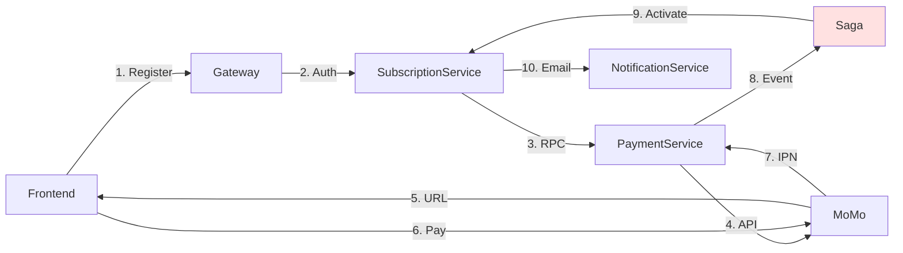

# Subscription System - Quick Reference

## 🚀 Quick Start Guide

### Architecture Overview (One Diagram)



---

## 📋 Component Checklist

### 1. SubscriptionService Components

```
✅ RegisterSubscriptionCommandHandler
   - Get authUserId from JWT
   - Get UserProfileId from Redis cache
   - Create Subscription (Pending)
   - RPC: CreatePaymentIntent
   - Publish: SubscriptionRegistrationStarted

✅ RegisterSubscriptionSaga
   - CorrelationId = SubscriptionId
   - State: AwaitingPayment
   - On PaymentSucceeded → ActivateSubscription
   - On PaymentFailed → CancelSubscription (Compensation)

✅ ActivateSubscriptionConsumer
   - Delegates to HandleSubscriptionSagaCommand
   - Publish notification (fire-and-forget)

✅ CancelSubscriptionConsumer
   - Delegates to HandleSubscriptionSagaCommand
   - Soft delete (Canceled + Inactive)

✅ HandleSubscriptionSagaCommandHandler
   - Switch case: Activate | Cancel
   - Returns SubscriptionSagaResponse for notification
```

### 2. PaymentService Components

```
✅ CreatePaymentIntentConsumer (RPC)
   - Delegates to ProcessPaymentCommandHandler
   - Returns PaymentIntentCreated immediately

✅ ProcessPaymentCommandHandler
   - Create PaymentTransaction (Pending)
   - Use PaymentGatewayFactory
   - Call gateway API (MoMo)
   - Return gateway response

✅ VerifyMomoIpnCommandHandler
   - Validate IP whitelist (118.69.208.0/20)
   - Verify HMAC SHA256 signature
   - Find transaction by OrderId
   - Check idempotency
   - Publish PaymentSucceeded/Failed
   - Return IPN response (always 200 OK)

✅ MomoService
   - BuildSignature (HMAC SHA256)
   - CreatePaymentIntentAsync
   - VerifyIpnRequest
   - QueryTransactionAsync

✅ Payment Gateway Helpers
   - PaymentGatewayRequestBuilder
   - PaymentGatewayResponseValidator
   - PaymentGatewayResponseParser
```

### 3. NotificationService Components

```
✅ SubscriptionActivatedNotificationConsumer
   - Query cache by authUserId
   - Get user email
   - Send email via EmailService
```

---

## 🔑 Key Patterns

### 1. UserId vs UserProfileId Pattern

```csharp
// JWT Token → authUserId (authentication)
var authUserId = _currentUserService.UserId; // From JWT

// Redis Cache → UserProfileId (business logic)
var userState = await _userStateCache.GetUserStateAsync(authUserId);
var userProfileId = userState.UserProfileId;

// Usage:
subscription.InitializeEntity(authUserId);          // ✅ CreatedBy = authUserId
subscription.UserProfileId = userProfileId;         // ✅ Business FK = UserProfileId

// Saga Event:
CreatedBy = authUserId                              // ✅ For cache query in notification
```

### 2. Hybrid Outbox Pattern

```csharp
// MassTransit Bus Outbox (Saga orchestration)
await _publishEndpoint.Publish(new SubscriptionRegistrationStarted {...});
await _unitOfWork.SaveChangesAsync(); // ✅ Atomic with entity

// Custom Outbox (User activity logging)
await _unitOfWork.AddOutboxEventAsync(new SubscriptionRegisteredActivityEvent {...});
await _unitOfWork.SaveChangesWithOutboxAsync(); // ✅ Publish immediately
```

### 3. RPC Request-Response Pattern

```csharp
// Request Client (SubscriptionService)
var _paymentClient = bus.CreateRequestClient<CreatePaymentIntentRequest>(timeout: 30s);

// Send Request
var response = await _paymentClient.GetResponse<PaymentIntentCreated>(request, cancellationToken);
var result = response.Message; // Synchronous response

// Consumer (PaymentService)
public class CreatePaymentIntentConsumer : IConsumer<CreatePaymentIntentRequest>
{
    public async Task Consume(ConsumeContext<CreatePaymentIntentRequest> context)
    {
        var result = await _mediator.Send(command);
        await context.RespondAsync(new PaymentIntentCreated {...}); // ✅ Respond
    }
}
```

### 4. Saga Compensation Pattern

```csharp
When(PaymentFailed)
    .Then(context =>
    {
        context.Saga.ErrorMessage = context.Message.ErrorMessage;
    })
    .PublishAsync(context => context.Init<CancelSubscription>(new
    {
        SubscriptionId = context.Saga.CorrelationId,
        IsCompensation = true, // ✅ Rollback flag
        UpdatedBy = context.Saga.CreatedBy
    }))
    .TransitionTo(Failed)
    .Finalize();
```

---

## 🛠️ Configuration Templates

### 1. SubscriptionService - MassTransit with Saga

```csharp
builder.Services.AddMassTransitWithSaga<SubscriptionDbContext>(
    builder.Configuration,
    configureSagas: x =>
    {
        SubscriptionSagaConfiguration.ConfigureRegisterSubscriptionSaga<SubscriptionDbContext>(x);
    },
    configureConsumers: x =>
    {
        x.AddConsumer<ActivateSubscriptionConsumer>();
        x.AddConsumer<CancelSubscriptionConsumer>();
    },
    configureEndpoints: (cfg, context) =>
    {
        SubscriptionSagaConfiguration.ConfigureSagaEndpoints(cfg, context);
    }
);

// RPC Client
builder.Services.AddScoped(provider =>
{
    var bus = provider.GetRequiredService<IBus>();
    return bus.CreateRequestClient<CreatePaymentIntentRequest>(RequestTimeout.After(s: 30));
});
```

### 2. PaymentService - MassTransit with Outbox

```csharp
builder.Services.AddMassTransitWithConsumers<PaymentDbContext>(
    builder.Configuration,
    configureConsumers: x =>
    {
        x.AddConsumer<CreatePaymentIntentConsumer>(); // RPC
    },
    useEntityFrameworkOutbox: true,  // ✅
    useBusOutbox: true               // ✅
);
```

### 3. Saga DbContext Extensions

```csharp
public static class SubscriptionSagaDbContextExtensions
{
    public static void AddSubscriptionSagaEntities(this ModelBuilder modelBuilder)
    {
        modelBuilder.Entity<RegisterSubscriptionSagaState>(entity =>
        {
            entity.HasKey(e => e.CorrelationId);
            
            // ✅ Optimistic Concurrency
            entity.Property(e => e.Version)
                .IsConcurrencyToken()
                .IsRequired();
            
            entity.Property(e => e.CurrentState)
                .HasMaxLength(255)
                .IsRequired();
            
            // ✅ Indexes for performance
            entity.HasIndex(e => e.UserProfileId);
            entity.HasIndex(e => e.CurrentState);
            entity.HasIndex(e => e.CreatedBy);
        });
        
        // ✅ MassTransit Outbox Tables
        modelBuilder.AddInboxStateEntity();
        modelBuilder.AddOutboxMessageEntity();
        modelBuilder.AddOutboxStateEntity();
    }
}
```

---

## 🔒 Security Checklist

### MoMo IPN Security

```csharp
// 1. IP Whitelist (CIDR notation)
MOMO_IPN_WHITELIST=118.69.208.0/20,210.245.113.71,127.0.0.1,::1

// 2. Signature Verification
var parameters = new Dictionary<string, string>
{
    { "accessKey", _accessKey },
    { "amount", ipnRequest.Amount.ToString() },
    { "extraData", ipnRequest.ExtraData },
    // ... all fields alphabetically sorted
};
var rawSignature = string.Join("&", parameters.OrderBy(x => x.Key).Select(p => $"{p.Key}={p.Value}"));
var signature = HMAC_SHA256(rawSignature, _secretKey);

if (signature != ipnRequest.Signature)
    return Error("Invalid signature");

// 3. Idempotency Check
if (transaction.PaymentStatus == PayementStatus.Succeeded)
    return CreateMomoSuccessResponse(ipnRequest); // Already processed

// 4. Amount Validation
if (transaction.Amount != (decimal)ipnRequest.Amount)
    return Error("Amount mismatch");
```

---

## 📊 Database Schema Quick Reference

### Core Tables

```sql
-- Subscription
CREATE TABLE "Subscriptions" (
    "Id" UUID PRIMARY KEY,
    "UserProfileId" UUID NOT NULL,           -- Business FK
    "SubscriptionPlanId" UUID NOT NULL,
    "SubscriptionStatus" INT NOT NULL,       -- Pending/Active/Canceled
    "Status" INT NOT NULL,                   -- Active/Inactive (soft delete)
    "CreatedBy" UUID,                        -- authUserId (audit)
    "UpdatedBy" UUID,                        -- authUserId (audit)
    "CanceledAt" TIMESTAMP NULL,
    "CancelReason" TEXT NULL,
    -- Period tracking
    "CurrentPeriodStart" TIMESTAMP NULL,
    "CurrentPeriodEnd" TIMESTAMP NULL
);

-- PaymentTransaction
CREATE TABLE "PaymentTransactions" (
    "Id" UUID PRIMARY KEY,
    "PaymentMethodId" UUID NOT NULL,
    "TransactionType" INT NOT NULL,          -- Subscription/Order/Refund
    "ReferenceId" UUID NOT NULL,             -- SubscriptionId
    "Amount" DECIMAL(18,2) NOT NULL,
    "Currency" VARCHAR(10) NOT NULL,
    "PaymentStatus" INT NOT NULL,            -- Pending/Succeeded/Failed
    "TransactionId" VARCHAR(255) NULL,       -- MoMo TransId (after callback)
    "ErrorCode" VARCHAR(50) NULL,
    "ErrorMessage" TEXT NULL,
    "CreatedBy" UUID,                        -- authUserId (audit)
    INDEX "IX_PaymentTransaction_ReferenceId_Type" ("ReferenceId", "TransactionType")
);

-- Saga State
CREATE TABLE "RegisterSubscriptionSagaStates" (
    "CorrelationId" UUID PRIMARY KEY,        -- = SubscriptionId
    "Version" INT NOT NULL,                  -- Optimistic concurrency
    "CurrentState" VARCHAR(255) NOT NULL,    -- AwaitingPayment/PaymentCompleted/Failed
    "UserProfileId" UUID NOT NULL,
    "CreatedBy" UUID NULL,                   -- authUserId (for cache query)
    "PaymentIntentId" UUID NULL,
    "TransactionId" VARCHAR(255) NULL,
    "ErrorMessage" TEXT NULL,
    INDEX "IX_SagaState_CurrentState" ("CurrentState"),
    INDEX "IX_SagaState_CreatedBy" ("CreatedBy")
);
```

---

## 🧪 Testing Scenarios

### 1. Success Flow Test

```bash
# Step 1: Register Subscription
POST http://localhost:5010/api/user/subscriptions/register
Authorization: Bearer <JWT>
{
  "subscriptionPlanId": "3fa85f64-...",
  "paymentMethodId": "7fa85f64-..."
}

# Expected Response:
{
  "isSuccess": true,
  "data": {
    "subscriptionId": "...",
    "paymentUrl": "https://test-payment.momo.vn/...",
    "qrCodeBase64": "iVBORw0KGgoAAAANSUhEUgAA...",
    "paymentTransactionId": "..."
  }
}

# Step 2: Simulate MoMo IPN Callback
POST http://localhost:5010/api/payment-callback/momo/ipn
{
  "partnerCode": "MOMOXXXX",
  "orderId": "<subscriptionId>",
  "requestId": "REQ_<subscriptionId>",
  "amount": 100000,
  "transId": 123456789,
  "resultCode": 0,
  "message": "Success",
  "signature": "..."
}

# Step 3: Check Subscription Status
GET http://localhost:5010/api/user/subscriptions/me
Authorization: Bearer <JWT>

# Expected: Status = Active
```

### 2. Failure Flow Test (Payment Failed)

```bash
# Simulate Failed IPN
POST http://localhost:5010/api/payment-callback/momo/ipn
{
  "partnerCode": "MOMOXXXX",
  "orderId": "<subscriptionId>",
  "requestId": "REQ_<subscriptionId>",
  "amount": 100000,
  "transId": 0,
  "resultCode": 1006,  # Payment failed
  "message": "Transaction is failed",
  "signature": "..."
}

# Expected:
# - PaymentTransaction: Status = Failed
# - Subscription: Status = Canceled, EntityStatus = Inactive
# - Saga: State = Failed, Finalized
```

---

## 📈 Monitoring Queries

### Saga Health Check

```sql
-- Stuck Sagas (>15 min in AwaitingPayment)
SELECT "CorrelationId", "UserProfileId", "PaymentRequestedAt"
FROM "RegisterSubscriptionSagaStates"
WHERE "CurrentState" = 'AwaitingPayment'
AND "PaymentRequestedAt" < NOW() - INTERVAL '15 minutes';

-- Saga State Distribution
SELECT "CurrentState", COUNT(*)
FROM "RegisterSubscriptionSagaStates"
GROUP BY "CurrentState";
```

### Payment Metrics

```sql
-- Success Rate (last 24h)
SELECT 
    ROUND(COUNT(*) FILTER (WHERE "PaymentStatus" = 1) * 100.0 / COUNT(*), 2) AS success_rate,
    COUNT(*) FILTER (WHERE "PaymentStatus" = 1) AS succeeded,
    COUNT(*) FILTER (WHERE "PaymentStatus" = 2) AS failed,
    COUNT(*) AS total
FROM "PaymentTransactions"
WHERE "CreatedAt" >= NOW() - INTERVAL '24 hours';
```

---

## 🚨 Common Issues & Solutions

### Issue 1: UserProfileId is Empty

**Symptom**: `UserProfileId is empty for UserId=...`

**Root Cause**: User not in Redis cache

**Solution**:
```csharp
// Ensure LoginCommandHandler includes UserProfileId
var loginEvent = new UserLoggedInEvent
{
    UserId = user.Id,
    UserProfileId = userProfileId, // ✅ Must include
    Email = user.Email,
    // ...
};
```

### Issue 2: Saga Stuck in AwaitingPayment

**Symptom**: Saga never transitions from AwaitingPayment

**Root Cause**: IPN callback not processed (IP rejected or signature invalid)

**Solution**:
1. Check PaymentService logs for IPN rejection
2. Verify IP whitelist includes MoMo's IP
3. Verify signature calculation matches MoMo's spec
4. Implement cleanup job for stuck sagas

### Issue 3: Duplicate Key Error (PK_SubscriptionPlans)

**Symptom**: `DbUpdateException: duplicate key value violates unique constraint "PK_SubscriptionPlans"`

**Root Cause**: Setting navigation property `Plan = plan` causes EF to try INSERT

**Solution**:
```csharp
// ❌ WRONG
var subscription = new Subscription
{
    Plan = plan, // ❌ Causes EF to track plan for insert
    // ...
};

// ✅ CORRECT
var subscription = new Subscription
{
    SubscriptionPlanId = plan.Id, // ✅ Only set FK
    // ...
};
```

### Issue 4: Notification Email Empty

**Symptom**: Email sent but no content

**Root Cause**: Missing template case in `EmailService.BuildEmailContent`

**Solution**:
```csharp
case NotificationTemplateEnums.SubscriptionActivated:
{
    var built = NotificationTemplateHelper.BuildSubscriptionActivatedNotification(...);
    subject = built.Subject;
    htmlContent = built.HtmlContent ?? built.Content;
    break;
}
```

---

## 🎯 Best Practices

### 1. Always Use authUserId for Audit

```csharp
// ✅ CORRECT
subscription.InitializeEntity(authUserId);  // CreatedBy = authUserId
subscription.UpdateEntity(authUserId);      // UpdatedBy = authUserId

var event = new SubscriptionRegistrationStarted
{
    CreatedBy = authUserId // ✅ For cache query in notification
};

// ❌ WRONG
subscription.InitializeEntity(userProfileId); // ❌ UserProfileId is business FK
```

### 2. Use UserProfileId for Business Logic

```csharp
// ✅ CORRECT
var subscription = new Subscription
{
    UserProfileId = userProfileId, // ✅ Business relationship
    SubscriptionPlanId = plan.Id
};

var existingSubscription = await _unitOfWork.Repository<Subscription>()
    .GetFirstOrDefaultAsync(s => s.UserProfileId == userProfileId); // ✅ Query by business FK
```

### 3. Use SaveChangesWithOutboxAsync for Custom Events

```csharp
// Custom Outbox Event (immediate activity logging)
await _outboxUnitOfWork.AddOutboxEventAsync(activityEvent);
await _outboxUnitOfWork.SaveChangesWithOutboxAsync(cancellationToken); // ✅ Publish immediately

// MassTransit Bus Outbox (saga orchestration)
await _publishEndpoint.Publish(sagaEvent);
await _unitOfWork.SaveChangesAsync(cancellationToken); // ✅ Atomic with entity
```

### 4. Always Return 200 OK for IPN

```csharp
// ✅ CORRECT (per MoMo spec)
public async Task<IActionResult> MomoIpnCallback([FromBody] MoMoIpnRequest ipnRequest)
{
    var result = await _mediator.Send(command);
    
    // Always return 200 OK with proper response body
    return Ok(result.Data); // ✅ MoMoIpnResponse with signature
}

// ❌ WRONG
if (!isValid)
    return BadRequest("Invalid signature"); // ❌ Never return 4xx/5xx
```

---

## 📚 Related Documentation

- **[Complete Documentation](SUBSCRIPTION_SYSTEM_COMPLETE_DOCUMENTATION.md)** - Full system documentation with detailed diagrams
- **[MassTransit Official Docs](https://masstransit.io/documentation/configuration/middleware/outbox)** - Entity Framework Outbox
- **[MoMo AIO v2 Docs](https://developers.momo.vn/v2/#/docs/aiov2/)** - Payment gateway integration

---

**Status**: ✅ Production Ready  
**Last Updated**: 2025-01-12  
**Version**: 1.0


