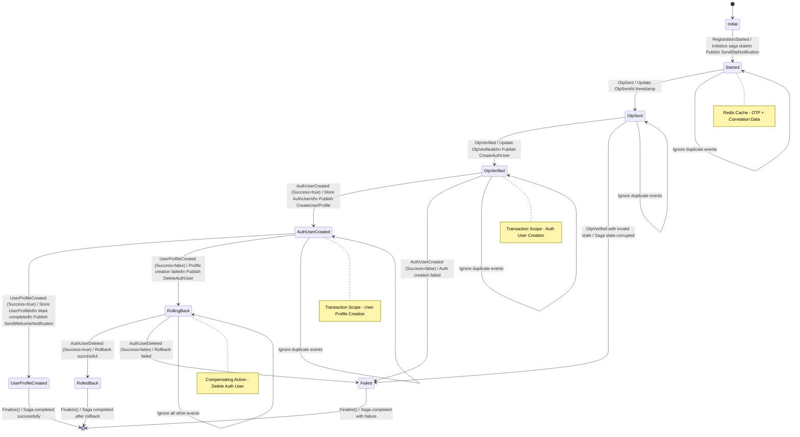

# Registration User Flow Diagrams

## 1. Sequence Diagram - Happy Path

```mermaid
sequenceDiagram
    participant User
    participant Gateway as API Gateway<br/>(Ocelot)
    participant AuthService as AuthService<br/>(Container)
    participant AuthController
    participant RegisterHandler
    participant RedisCache
    participant RegistrationSaga
    participant NotificationService as NotificationService<br/>(Container)
    participant NotificationConsumer
    participant EmailService
    participant VerifyOtpHandler
    participant CreateAuthConsumer
    participant AuthIdentityService as Auth Identity<br/>Service
    participant UserService as UserService<br/>(Container)
    participant CreateProfileConsumer
    participant UserDbService as User DB<br/>Service
    participant WelcomeConsumer

    Note over User, WelcomeConsumer: Distributed Registration Flow - Happy Path

    %% Step 1: Start Registration via Gateway
    User->>Gateway: POST /api/user/auth/register
    Note over Gateway: Route: /api/user/auth/register<br/>→ authservice-api:80
    Gateway->>AuthService: Forward to AuthService
    AuthService->>AuthController: Handle request
    AuthController->>RegisterHandler: RegisterCommand
    
    %% Step 2: Generate OTP and Cache
    RegisterHandler->>RegisterHandler: Validate email/phone uniqueness
    RegisterHandler->>RegisterHandler: Generate CorrelationId
    RegisterHandler->>RegisterHandler: Encrypt password
    RegisterHandler->>RedisCache: Generate & Store OTP with correlation data
    Note over RedisCache: OtpCacheItem {<br/>Contact, OtpCode, Channel,<br/>ExpiresAt, userData: RegistrationCorrelationData}
    
    %% Step 3: Start Saga & Return Response
    RegisterHandler->>RegistrationSaga: Publish RegistrationStarted (MassTransit)
    Note over RegistrationSaga: State: Initial → Started
    RegisterHandler->>AuthController: Success response
    AuthController->>AuthService: HTTP 200 OK
    AuthService->>Gateway: Forward response
    Gateway->>User: "Registration started. Check email/phone for OTP"
    
    %% Step 4: Send OTP Notification (Async via MassTransit)
    RegistrationSaga->>NotificationService: Publish SendOtpNotification
    NotificationService->>NotificationConsumer: Route to consumer
    NotificationConsumer->>NotificationConsumer: Check idempotency cache
    NotificationConsumer->>EmailService: Send OTP email/SMS
    EmailService-->>NotificationConsumer: Success
    NotificationConsumer->>RegistrationSaga: Publish OtpSent (MassTransit)
    Note over RegistrationSaga: State: Started → OtpSent

    %% Step 5: User Verifies OTP via Gateway
    User->>Gateway: POST /api/user/auth/verify-otp
    Note over Gateway: Route: /api/user/auth/verify-otp<br/>→ authservice-api:80
    Gateway->>AuthService: Forward to AuthService
    AuthService->>AuthController: Handle verify request
    AuthController->>VerifyOtpHandler: VerifyOtpCommand
    VerifyOtpHandler->>RedisCache: Verify OTP & get correlation data
    RedisCache-->>VerifyOtpHandler: RegistrationCorrelationData
    VerifyOtpHandler->>RegistrationSaga: Publish OtpVerified (MassTransit)
    Note over RegistrationSaga: State: OtpSent → OtpVerified
    VerifyOtpHandler->>AuthController: Success response
    AuthController->>AuthService: HTTP 200 OK
    AuthService->>Gateway: Forward response
    Gateway->>User: "OTP verified. Creating account..."

    %% Step 6: Create Auth User (Async via MassTransit)
    RegistrationSaga->>AuthService: Publish CreateAuthUser (MassTransit)
    AuthService->>CreateAuthConsumer: Route to consumer
    CreateAuthConsumer->>AuthIdentityService: Create AppUser with role
    Note over CreateAuthConsumer: Transaction scope for atomicity
    AuthIdentityService-->>CreateAuthConsumer: User created with ID
    CreateAuthConsumer->>RegistrationSaga: Publish AuthUserCreated (Success=true, MassTransit)
    Note over RegistrationSaga: State: OtpVerified → AuthUserCreated

    %% Step 7: Create User Profile (Cross-Service via MassTransit)
    RegistrationSaga->>UserService: Publish CreateUserProfile (MassTransit)
    UserService->>CreateProfileConsumer: Route to consumer
    CreateProfileConsumer->>UserDbService: Create UserProfile
    Note over CreateProfileConsumer: Transaction scope for atomicity
    UserDbService-->>CreateProfileConsumer: Profile created
    CreateProfileConsumer->>RegistrationSaga: Publish UserProfileCreated (Success=true, MassTransit)
    Note over RegistrationSaga: State: AuthUserCreated → UserProfileCreated

    %% Step 8: Send Welcome Notification (Fire & Forget)
    RegistrationSaga->>NotificationService: Publish SendWelcomeNotification (MassTransit)
    Note over RegistrationSaga: State: UserProfileCreated → Final (Saga completes)
    NotificationService->>WelcomeConsumer: Route to consumer
    WelcomeConsumer->>EmailService: Send welcome email (fire & forget)

    Note over User, WelcomeConsumer: ✅ Distributed Registration Completed Successfully<br/>🔄 MassTransit handles all inter-service communication<br/>🌐 API Gateway routes all external requests

```

## 2. Sequence Diagram - Rollback Scenario (Distributed)

```mermaid
sequenceDiagram
    participant User
    participant Gateway as API Gateway<br/>(Ocelot)
    participant AuthService as AuthService<br/>(Container)
    participant AuthController
    participant RegisterHandler
    participant RedisCache
    participant RegistrationSaga
    participant NotificationService as NotificationService<br/>(Container)
    participant NotificationConsumer
    participant VerifyOtpHandler
    participant CreateAuthConsumer
    participant AuthIdentityService as Auth Identity<br/>Service
    participant UserService as UserService<br/>(Container)
    participant CreateProfileConsumer
    participant UserDbService as User DB<br/>Service
    participant DeleteAuthConsumer

    Note over User, DeleteAuthConsumer: Distributed Registration Flow - Rollback Scenario

    %% Steps 1-6 same as happy path (abbreviated)
    User->>Gateway: POST /api/user/auth/register
    Gateway->>AuthService: Route to AuthService
    AuthService->>RegisterHandler: Process registration
    RegisterHandler->>RedisCache: Store OTP + correlation data
    RegisterHandler->>RegistrationSaga: Publish RegistrationStarted (MassTransit)
    RegistrationSaga->>NotificationService: Publish SendOtpNotification (MassTransit)
    NotificationService->>NotificationConsumer: Send OTP
    NotificationConsumer->>RegistrationSaga: Publish OtpSent (MassTransit)

    User->>Gateway: POST /api/user/auth/verify-otp
    Gateway->>AuthService: Route to AuthService
    AuthService->>VerifyOtpHandler: Process verification
    VerifyOtpHandler->>RedisCache: Verify OTP
    VerifyOtpHandler->>RegistrationSaga: Publish OtpVerified (MassTransit)

    RegistrationSaga->>AuthService: Publish CreateAuthUser (MassTransit)
    AuthService->>CreateAuthConsumer: Process auth user creation
    CreateAuthConsumer->>AuthIdentityService: Create AppUser
    CreateAuthConsumer->>RegistrationSaga: Publish AuthUserCreated (Success=true, MassTransit)
    Note over RegistrationSaga: State: OtpVerified → AuthUserCreated

    %% Step 7: User Profile Creation FAILS
    RegistrationSaga->>UserService: Publish CreateUserProfile (MassTransit)
    UserService->>CreateProfileConsumer: Route to consumer
    CreateProfileConsumer->>UserDbService: Create UserProfile
    Note over CreateProfileConsumer: ❌ Database error / Business rule violation
    UserDbService-->>CreateProfileConsumer: Creation failed
    CreateProfileConsumer->>RegistrationSaga: Publish UserProfileCreated (Success=false, MassTransit)
    Note over RegistrationSaga: State: AuthUserCreated → RollingBack

    %% Step 8: Rollback Auth User (Compensating Transaction)
    RegistrationSaga->>AuthService: Publish DeleteAuthUser (MassTransit)
    AuthService->>DeleteAuthConsumer: Route to consumer
    DeleteAuthConsumer->>AuthIdentityService: Delete AppUser by ID
    AuthIdentityService-->>DeleteAuthConsumer: User deleted
    DeleteAuthConsumer->>RegistrationSaga: Publish AuthUserDeleted (Success=true, MassTransit)
    Note over RegistrationSaga: State: RollingBack → RolledBack → Final

    Note over User, DeleteAuthConsumer: ❌ Distributed Registration Failed - Data Consistency Maintained<br/>🔄 Saga Pattern ensures automatic rollback across services<br/>🌐 API Gateway provides single entry point for client
```

## 3. State Flow Diagram

## 4. Distributed Component Flow Diagram

## 5. Redis Cache Structure

## Key Features

### 🔒 Security & Data Integrity
- **Password Encryption**: Passwords encrypted before storing in cache
- **Transaction Scopes**: Atomic operations for user creation
- **Pessimistic Concurrency**: Prevents duplicate saga creation
- **Idempotency**: Duplicate message handling at all levels

### 📊 Monitoring & Observability
- **Correlation Tracking**: End-to-end request tracing
- **Comprehensive Logging**: All state transitions logged
- **Error Handling**: Detailed error messages and recovery paths

### 🔄 Reliability Patterns
- **Saga Pattern**: Distributed transaction management
- **Compensating Actions**: Automatic rollback on failures
- **Circuit Breaker**: Fail-fast on repeated errors
- **Retry Logic**: Configurable retry mechanisms

### ⚡ Performance Optimizations
- **Redis Caching**: Fast OTP verification
- **Fire & Forget**: Non-critical notifications
- **Message Partitioning**: Load distribution
- **Memory Caching**: Duplicate request prevention

## 🌐 Distributed System Architecture

### API Gateway (Ocelot) Features
- **Single Entry Point**: All client requests route through gateway
- **Service Discovery**: Routes map to container services (authservice-api:80, userservice-api:80)
- **Load Balancing**: Distribute requests across service instances
- **Authentication**: Centralized JWT token validation
- **Rate Limiting**: Protect downstream services from overload

### Inter-Service Communication
- **MassTransit Message Bus**: RabbitMQ-based event-driven communication
- **Event Correlation**: Guid-based correlation across service boundaries
- **Service Isolation**: Each service runs in separate container
- **Async Processing**: Non-blocking saga state transitions

### Container Architecture

```mermaid
graph TB
    subgraph "External"
        User[👤 User]
    end
    
    subgraph "Gateway Layer"
        Gateway[🌐 API Gateway<br/>Ocelot<br/>Port: 5000]
    end
    
    subgraph "Service Layer"
        AuthService[🔐 AuthService<br/>Container<br/>authservice-api:80]
        UserService[👤 UserService<br/>Container<br/>userservice-api:80]
        NotificationService[📧 NotificationService<br/>Container<br/>notificationservice-api:80]
    end
    
    subgraph "Infrastructure Layer"
        Redis[(🗄️ Redis Cache<br/>OTP Storage)]
        RabbitMQ[🐰 RabbitMQ<br/>Message Bus]
        AuthDB[(📊 Auth Database)]
        UserDB[(📊 User Database)]
    end
    
    User --> Gateway
    Gateway --> AuthService
    Gateway --> UserService
    
    AuthService --> Redis
    AuthService --> RabbitMQ
    AuthService --> AuthDB
    
    UserService --> RabbitMQ
    UserService --> UserDB
    
    NotificationService --> RabbitMQ
    
    style Gateway fill:#f9f9f9,stroke:#333,stroke-width:3px
    style AuthService fill:#e3f2fd,stroke:#1976d2,stroke-width:2px
    style UserService fill:#fff3e0,stroke:#f57c00,stroke-width:2px
    style NotificationService fill:#e8f5e8,stroke:#388e3c,stroke-width:2px
    style Redis fill:#ffebee,stroke:#d32f2f,stroke-width:2px
    style RabbitMQ fill:#f3e5f5,stroke:#7b1fa2,stroke-width:2px
```

### 🔗 Gateway Routing Configuration (ocelot.json)

| Route | Downstream Service | Purpose |
|-------|-------------------|---------|
| `POST /api/user/auth/register` | `authservice-api:80` | User registration |
| `POST /api/user/auth/verify-otp` | `authservice-api:80` | OTP verification |
| `POST /api/user/auth/login` | `authservice-api:80` | User login |
| `GET/POST/PUT/DELETE /api/user/auth/{everything}` | `authservice-api:80` | Auth operations (with Bearer auth) |
| `GET/POST/PUT/DELETE /api/user/profile/{everything}` | `userservice-api:80` | Profile operations (with Bearer auth) |
| `GET /api/auth/health` | `authservice-api:80/health` | Auth health check |
| `GET /api/users/health` | `userservice-api:80/health` | User health check |

### 💡 Benefits of This Architecture

1. **Scalability**: Each service can scale independently
2. **Resilience**: Service isolation prevents cascade failures  
3. **Maintainability**: Clear service boundaries and responsibilities
4. **Security**: Centralized authentication at gateway level
5. **Monitoring**: Centralized logging and tracing through correlation IDs
6. **Development**: Teams can work independently on different services
