# Healink System - Entity Relationship Diagram (ERD)

## ERD Overview

```mermaid
erDiagram
    %% Auth Service Entities
    AppUser {
        Guid Id PK
        string UserName
        string Email
        string RefreshToken
        DateTime RefreshTokenExpiryTime
        DateTime CreatedAt
        DateTime UpdatedAt
        EntityStatusEnum Status
        DateTime LastLoginAt
        DateTime LastLogoutAt
    }
    
    AppRole {
        Guid Id PK
        string Name
        string NormalizedName
        string ConcurrencyStamp
    }
    
    Permission {
        Guid Id PK
        string Name
        string Description
        string Resource
        string Action
    }
    
    RolePermission {
        Guid Id PK
        Guid RoleId FK
        Guid PermissionId FK
    }
    
    %% User Service Entities
    UserProfile {
        Guid Id PK
        Guid UserId FK "nullable"
        string FullName
        string Email
        string PhoneNumber
        string Address
        string AvatarPath
        DateTime LastLoginAt
        DateTime CreatedAt
        DateTime UpdatedAt
        EntityStatusEnum Status
    }
    
    BusinessRole {
        Guid Id PK
        string Name
        string DisplayName
        string Description
        BusinessRoleEnum RoleType
        RoleEnum RequiredCoreRole
        bool RequiresApproval
        string Permissions
        bool IsActive
        int Priority
    }
    
    UserBusinessRole {
        Guid Id PK
        Guid UserId FK
        Guid BusinessRoleId FK
        DateTime AssignedAt
        Guid AssignedBy FK
        DateTime ExpiresAt
        string Notes
    }
    
    CreatorApplication {
        Guid Id PK
        Guid UserId FK
        string ApplicationData
        ApplicationStatusEnum ApplicationStatus
        DateTime SubmittedAt
        DateTime ReviewedAt
        Guid ReviewedBy FK
        string RejectionReason
        string ReviewNotes
        Guid RequestedBusinessRoleId FK
    }
    
    UserActivityLog {
        Guid Id PK
        Guid UserId FK
        string ActivityType
        string Description
        string Metadata
        string IpAddress
        string UserAgent
        DateTime OccurredAt
    }
    
    %% Content Service Entities
    Content {
        Guid Id PK
        string Title
        string Description
        string ThumbnailUrl
        ContentType ContentType
        ContentStatus ContentStatus
        DateTime ApprovedAt
        Guid ApprovedBy FK
        DateTime PublishedAt
        string Tags
        EmotionCategory EmotionCategories
        TopicCategory TopicCategories
        int ViewCount
        int LikeCount
        int ShareCount
        int CommentCount
        double AverageRating
        string ContentData
        DateTime CreatedAt
        DateTime UpdatedAt
        EntityStatusEnum Status
    }
    
    Comment {
        Guid Id PK
        string Content
        Guid ContentId FK
        Guid ParentCommentId FK
        bool IsApproved
        int LikeCount
        int ReplyCount
        DateTime CreatedAt
        DateTime UpdatedAt
        EntityStatusEnum Status
    }
    
    CommentLike {
        Guid Id PK
        Guid CommentId FK
        Guid UserId FK
        DateTime CreatedAt
    }
    
    ContentInteraction {
        Guid Id PK
        Guid ContentId FK
        Guid UserId FK
        InteractionType InteractionType
        DateTime InteractionDate
        string AdditionalData
        DateTime CreatedAt
    }
    
    ContentRating {
        Guid Id PK
        Guid ContentId FK
        Guid UserId FK
        int Rating
        string Review
        DateTime CreatedAt
        DateTime UpdatedAt
    }
    
    %% Subscription Service Entities
    SubscriptionPlan {
        Guid Id PK
        string Name
        string DisplayName
        string Description
        string FeatureConfig
        string Currency
        int BillingPeriodCount
        BillingPeriodUnit BillingPeriodUnit
        decimal Amount
        int TrialDays
        DateTime CreatedAt
        DateTime UpdatedAt
        EntityStatusEnum Status
    }
    
    Subscription {
        Guid Id PK
        Guid UserProfileId FK
        Guid SubscriptionPlanId FK
        SubscriptionStatus SubscriptionStatus
        DateTime CurrentPeriodStart
        DateTime CurrentPeriodEnd
        DateTime CanceledAt
        bool CancelAtPeriodEnd
        RenewalBehavior RenewalBehavior
        string CancelReason
        DateTime CreatedAt
        DateTime UpdatedAt
        EntityStatusEnum Status
    }
    
    %% Payment Service Entities
    PaymentMethod {
        Guid Id PK
        string Name
        string Description
        PaymentType Type
        string ProviderName
        string Configuration
        DateTime CreatedAt
        DateTime UpdatedAt
        EntityStatusEnum Status
    }
    
    PaymentTransaction {
        Guid Id PK
        string TransactionId
        Guid PaymentMethodId FK
        TransactionType TransactionType
        Guid ReferenceId FK
        decimal Amount
        string Currency
        string ErrorCode
        string ErrorMessage
        PayementStatus PaymentStatus
        DateTime CreatedAt
        DateTime UpdatedAt
        EntityStatusEnum Status
    }
    
    %% Outbox Pattern
    OutboxEvent {
        Guid Id PK
        string EventType
        string EventData
        DateTime CreatedAt
        DateTime ProcessedAt
        DateTime NextRetryAt
        int RetryCount
        int MaxRetries
    }
    
    %% Relationships
    AppUser ||--o{ UserProfile : "has profile"
    AppUser ||--o{ AppRole : "has roles"
    AppRole ||--o{ RolePermission : "has permissions"
    Permission ||--o{ RolePermission : "assigned to roles"
    
    UserProfile ||--o{ UserBusinessRole : "has business roles"
    BusinessRole ||--o{ UserBusinessRole : "assigned to users"
    UserProfile ||--o{ CreatorApplication : "submits applications"
    UserProfile ||--o{ CreatorApplication : "reviews applications"
    BusinessRole ||--o{ CreatorApplication : "requested role"
    UserProfile ||--o{ UserActivityLog : "performs activities"
    
    UserProfile ||--o{ Content : "creates content"
    UserProfile ||--o{ Content : "approves content"
    Content ||--o{ Comment : "has comments"
    Comment ||--o{ Comment : "replies to"
    Comment ||--o{ CommentLike : "liked by users"
    UserProfile ||--o{ CommentLike : "likes comments"
    Content ||--o{ ContentInteraction : "interacted by users"
    UserProfile ||--o{ ContentInteraction : "interacts with content"
    Content ||--o{ ContentRating : "rated by users"
    UserProfile ||--o{ ContentRating : "rates content"
    
    UserProfile ||--o{ Subscription : "has subscriptions"
    SubscriptionPlan ||--o{ Subscription : "plan for"
    
    PaymentMethod ||--o{ PaymentTransaction : "processes payments"
    Subscription ||--o{ PaymentTransaction : "paid for"
    
    %% Cross-service relationships (via events)
    AppUser ||--o{ OutboxEvent : "generates events"
    UserProfile ||--o{ OutboxEvent : "generates events"
    Content ||--o{ OutboxEvent : "generates events"
    Subscription ||--o{ OutboxEvent : "generates events"
    PaymentTransaction ||--o{ OutboxEvent : "generates events"
```



## Database Schema Details

### **Auth Service Database (AuthDB)**

#### **Core Tables**
- **Users**: ASP.NET Core Identity users với JWT support
- **Roles**: System roles (User, Staff, Admin)
- **UserRoles**: Many-to-many relationship
- **Permissions**: Granular permissions
- **RolePermissions**: Role-permission mapping
- **OutboxEvents**: Event publishing for saga pattern

#### **Key Features**
- JWT token management với refresh tokens
- Role-based access control (RBAC)
- Permission-based authorization
- Event-driven architecture với outbox pattern

### **User Service Database (UserDB)**

#### **Core Tables**
- **UserProfiles**: Extended user information
- **BusinessRoles**: Content Creator, Community Moderator, etc.
- **UserBusinessRoles**: Many-to-many business role assignment
- **CreatorApplications**: Creator application workflow
- **UserActivityLogs**: Audit trail cho user activities

#### **Key Features**
- Business role management
- Creator application approval workflow
- User activity tracking
- Profile management với avatar support

### **Content Service Database (ContentDB)**

#### **Core Tables**
- **Contents**: Polymorphic content (Podcasts, Articles)
- **Comments**: Hierarchical comment system
- **CommentLikes**: Comment engagement
- **ContentInteractions**: User interactions (view, like, share)
- **ContentRatings**: User ratings và reviews

#### **Key Features**
- Polymorphic content storage với JSON data
- Hierarchical comment system
- Content analytics (views, likes, shares)
- Content approval workflow
- SEO metadata (tags, categories)

### **Subscription Service Database (SubscriptionDB)**

#### **Core Tables**
- **SubscriptionPlans**: Available subscription tiers
- **Subscriptions**: User subscription instances
- **OutboxEvents**: Event publishing

#### **Key Features**
- Flexible subscription plans với JSON configuration
- Subscription lifecycle management
- Billing period management
- Trial period support

### **Payment Service Database (PaymentDB)**

#### **Core Tables**
- **PaymentMethods**: Payment gateway configurations
- **PaymentTransactions**: Transaction records
- **OutboxEvents**: Event publishing

#### **Key Features**
- Multi-provider payment support (MoMo, VNPay)
- Transaction tracking với reference IDs
- Error handling và retry logic
- Integration với subscription system

## **Key Relationships**

### **1. User Identity Flow**
```
AppUser (Auth) → UserProfile (User) → BusinessRoles → Content Creation
```

### **2. Content Lifecycle**
```
Content Creation → Approval → Publishing → User Interaction → Analytics
```

### **3. Subscription Flow**
```
UserProfile → Subscription → PaymentTransaction → Content Access
```

### **4. Creator Application Flow**
```
UserProfile → CreatorApplication → BusinessRole Assignment → Content Creation Rights
```

## **Data Types & Constraints**

### **Common Fields (BaseEntity)**
- **Id**: GUID primary key
- **CreatedAt/UpdatedAt**: Timestamp tracking
- **CreatedBy/UpdatedBy**: Audit trail
- **IsDeleted**: Soft delete support
- **Status**: Entity status enum

### **Specialized Fields**
- **JSON Fields**: FeatureConfig, ApplicationData, ContentData, Metadata
- **Enum Fields**: ContentType, ContentStatus, SubscriptionStatus, PaymentStatus
- **Array Fields**: Tags, EmotionCategories, TopicCategories
- **Decimal Fields**: Amount (precision 18,2)

## **Indexes & Performance**

### **Primary Indexes**
- Primary keys on all entities
- Foreign key indexes for relationships
- Composite indexes for common queries

### **Performance Indexes**
- **Users.Status** - Active user filtering
- **Users.LastLoginAt** - Recent activity
- **Contents.ContentStatus** - Published content filtering
- **Contents.CreatedBy** - User content queries
- **OutboxEvents.ProcessedAt** - Event processing

### **Search Indexes**
- **Contents.Title** - Content search
- **Contents.Tags** - Tag-based filtering
- **UserProfiles.FullName** - User search

## **Data Integrity**

### **Referential Integrity**
- Foreign key constraints across services
- Cascade delete policies
- Check constraints for enum values

### **Business Rules**
- One active subscription per user
- Content approval workflow
- Creator application approval process
- Payment transaction uniqueness

### **Data Validation**
- Email format validation
- Phone number format validation
- Rating range validation (1-5)
- Amount precision validation

## **Scalability Considerations**

### **Partitioning Strategy**
- **Time-based partitioning** for logs và transactions
- **User-based partitioning** for large user bases
- **Content-based partitioning** for content tables

### **Caching Strategy**
- **Redis caching** for frequently accessed data
- **Query result caching** for complex queries
- **Session caching** for user data

### **Archival Strategy**
- **Soft delete** for data retention
- **Archive old logs** after retention period
- **Compress historical data** for storage optimization

