# Healink System - Physical Database Diagram

## Physical Database Overview

```mermaid
erDiagram
    %% Auth Service Database (AuthDB)
    Users {
        Guid Id PK "PRIMARY KEY"
        string UserName "VARCHAR(256) NOT NULL"
        string NormalizedUserName "VARCHAR(256) UNIQUE"
        string Email "VARCHAR(256) NOT NULL"
        string NormalizedEmail "VARCHAR(256) UNIQUE"
        bool EmailConfirmed "BOOLEAN DEFAULT FALSE"
        string PasswordHash "TEXT"
        string SecurityStamp "TEXT"
        string ConcurrencyStamp "TEXT"
        string PhoneNumber "VARCHAR(50)"
        bool PhoneNumberConfirmed "BOOLEAN DEFAULT FALSE"
        bool TwoFactorEnabled "BOOLEAN DEFAULT FALSE"
        DateTime LockoutEnd "TIMESTAMP"
        bool LockoutEnabled "BOOLEAN DEFAULT TRUE"
        int AccessFailedCount "INTEGER DEFAULT 0"
        string RefreshToken "TEXT"
        DateTime RefreshTokenExpiryTime "TIMESTAMP"
        DateTime CreatedAt "TIMESTAMP DEFAULT NOW()"
        DateTime UpdatedAt "TIMESTAMP DEFAULT NOW()"
        Guid CreatedBy "UUID"
        Guid UpdatedBy "UUID"
        EntityStatusEnum Status "INTEGER DEFAULT 1"
        DateTime LastLoginAt "TIMESTAMP"
        DateTime LastLogoutAt "TIMESTAMP"
    }
    
    Roles {
        Guid Id PK "PRIMARY KEY"
        string Name "VARCHAR(256) NOT NULL"
        string NormalizedName "VARCHAR(256) UNIQUE"
        string ConcurrencyStamp "TEXT"
    }
    
    UserRoles {
        Guid UserId PK "PRIMARY KEY, FK"
        Guid RoleId PK "PRIMARY KEY, FK"
    }
    
    UserClaims {
        int Id PK "PRIMARY KEY"
        Guid UserId FK "NOT NULL"
        string ClaimType "TEXT"
        string ClaimValue "TEXT"
    }
    
    UserLogins {
        string LoginProvider PK "PRIMARY KEY"
        string ProviderKey PK "PRIMARY KEY"
        string ProviderDisplayName "TEXT"
        Guid UserId FK "NOT NULL"
    }
    
    UserTokens {
        Guid UserId PK "PRIMARY KEY"
        string LoginProvider PK "PRIMARY KEY"
        string Name PK "PRIMARY KEY"
        string Value "TEXT"
    }
    
    RoleClaims {
        int Id PK "PRIMARY KEY"
        Guid RoleId FK "NOT NULL"
        string ClaimType "TEXT"
        string ClaimValue "TEXT"
    }
    
    Permissions {
        Guid Id PK "PRIMARY KEY"
        string Name "VARCHAR(100) NOT NULL UNIQUE"
        string Description "TEXT"
        string Resource "VARCHAR(50) NOT NULL"
        string Action "VARCHAR(50) NOT NULL"
        DateTime CreatedAt "TIMESTAMP DEFAULT NOW()"
        DateTime UpdatedAt "TIMESTAMP DEFAULT NOW()"
        EntityStatusEnum Status "INTEGER DEFAULT 1"
    }
    
    RolePermissions {
        Guid Id PK "PRIMARY KEY"
        Guid RoleId FK "NOT NULL"
        Guid PermissionId FK "NOT NULL"
        DateTime CreatedAt "TIMESTAMP DEFAULT NOW()"
        DateTime UpdatedAt "TIMESTAMP DEFAULT NOW()"
        EntityStatusEnum Status "INTEGER DEFAULT 1"
    }
    
    OutboxEvents {
        Guid Id PK "PRIMARY KEY"
        string EventType "VARCHAR(100) NOT NULL"
        string EventData "TEXT NOT NULL"
        DateTime CreatedAt "TIMESTAMP DEFAULT NOW()"
        DateTime ProcessedAt "TIMESTAMP"
        DateTime NextRetryAt "TIMESTAMP"
        int RetryCount "INTEGER DEFAULT 0"
        int MaxRetries "INTEGER DEFAULT 3"
        EntityStatusEnum Status "INTEGER DEFAULT 1"
    }
    
    %% User Service Database (UserDB)
    UserProfiles {
        Guid Id PK "PRIMARY KEY"
        Guid UserId FK "UNIQUE, NULLABLE"
        string FullName "VARCHAR(200) NOT NULL"
        string Email "VARCHAR(256) NOT NULL"
        string PhoneNumber "VARCHAR(20)"
        string Address "TEXT"
        string AvatarPath "VARCHAR(500)"
        DateTime LastLoginAt "TIMESTAMP"
        DateTime CreatedAt "TIMESTAMP DEFAULT NOW()"
        DateTime UpdatedAt "TIMESTAMP DEFAULT NOW()"
        Guid CreatedBy "UUID"
        Guid UpdatedBy "UUID"
        bool IsDeleted "BOOLEAN DEFAULT FALSE"
        Guid DeletedBy "UUID"
        DateTime DeletedAt "TIMESTAMP"
        EntityStatusEnum Status "INTEGER DEFAULT 1"
    }
    
    BusinessRoles {
        Guid Id PK "PRIMARY KEY"
        string Name "VARCHAR(50) NOT NULL UNIQUE"
        string DisplayName "VARCHAR(100) NOT NULL"
        string Description "TEXT"
        BusinessRoleEnum RoleType "INTEGER NOT NULL"
        RoleEnum RequiredCoreRole "INTEGER DEFAULT 0"
        bool RequiresApproval "BOOLEAN DEFAULT FALSE"
        string Permissions "JSONB DEFAULT '[]'"
        bool IsActive "BOOLEAN DEFAULT TRUE"
        int Priority "INTEGER DEFAULT 999"
        DateTime CreatedAt "TIMESTAMP DEFAULT NOW()"
        DateTime UpdatedAt "TIMESTAMP DEFAULT NOW()"
        Guid CreatedBy "UUID"
        Guid UpdatedBy "UUID"
        bool IsDeleted "BOOLEAN DEFAULT FALSE"
        EntityStatusEnum Status "INTEGER DEFAULT 1"
    }
    
    UserBusinessRoles {
        Guid Id PK "PRIMARY KEY"
        Guid UserId FK "NOT NULL"
        Guid BusinessRoleId FK "NOT NULL"
        DateTime AssignedAt "TIMESTAMP DEFAULT NOW()"
        Guid AssignedBy "UUID"
        DateTime ExpiresAt "TIMESTAMP"
        string Notes "TEXT"
        DateTime CreatedAt "TIMESTAMP DEFAULT NOW()"
        DateTime UpdatedAt "TIMESTAMP DEFAULT NOW()"
        EntityStatusEnum Status "INTEGER DEFAULT 1"
    }
    
    CreatorApplications {
        Guid Id PK "PRIMARY KEY"
        Guid UserId FK "NOT NULL"
        string ApplicationData "JSONB NOT NULL DEFAULT '{}'"
        ApplicationStatusEnum ApplicationStatus "INTEGER DEFAULT 0"
        DateTime SubmittedAt "TIMESTAMP DEFAULT NOW()"
        DateTime ReviewedAt "TIMESTAMP"
        Guid ReviewedBy "UUID"
        string RejectionReason "TEXT"
        string ReviewNotes "TEXT"
        Guid RequestedBusinessRoleId FK "UUID"
        DateTime CreatedAt "TIMESTAMP DEFAULT NOW()"
        DateTime UpdatedAt "TIMESTAMP DEFAULT NOW()"
        EntityStatusEnum Status "INTEGER DEFAULT 1"
    }
    
    UserActivityLogs {
        Guid Id PK "PRIMARY KEY"
        Guid UserId FK "NOT NULL"
        string ActivityType "VARCHAR(50) NOT NULL"
        string Description "TEXT NOT NULL"
        string Metadata "JSONB DEFAULT '{}'"
        string IpAddress "INET"
        string UserAgent "TEXT"
        DateTime OccurredAt "TIMESTAMP DEFAULT NOW()"
        DateTime CreatedAt "TIMESTAMP DEFAULT NOW()"
        EntityStatusEnum Status "INTEGER DEFAULT 1"
    }
    
    %% Content Service Database (ContentDB)
    Contents {
        Guid Id PK "PRIMARY KEY"
        string Title "VARCHAR(500) NOT NULL"
        string Description "TEXT"
        string ThumbnailUrl "VARCHAR(1000)"
        ContentType ContentType "INTEGER NOT NULL"
        ContentStatus ContentStatus "INTEGER DEFAULT 0"
        DateTime ApprovedAt "TIMESTAMP"
        Guid ApprovedBy "UUID"
        DateTime PublishedAt "TIMESTAMP"
        string Tags "JSONB DEFAULT '[]'"
        EmotionCategory EmotionCategories "JSONB DEFAULT '[]'"
        TopicCategory TopicCategories "JSONB DEFAULT '[]'"
        int ViewCount "INTEGER DEFAULT 0"
        int LikeCount "INTEGER DEFAULT 0"
        int ShareCount "INTEGER DEFAULT 0"
        int CommentCount "INTEGER DEFAULT 0"
        decimal AverageRating "DECIMAL(3,2)"
        string ContentData "JSONB"
        DateTime CreatedAt "TIMESTAMP DEFAULT NOW()"
        DateTime UpdatedAt "TIMESTAMP DEFAULT NOW()"
        Guid CreatedBy "UUID"
        Guid UpdatedBy "UUID"
        bool IsDeleted "BOOLEAN DEFAULT FALSE"
        EntityStatusEnum Status "INTEGER DEFAULT 1"
    }
    
    Comments {
        Guid Id PK "PRIMARY KEY"
        string Content "TEXT NOT NULL"
        Guid ContentId FK "NOT NULL"
        Guid ParentCommentId FK "NULLABLE"
        bool IsApproved "BOOLEAN DEFAULT FALSE"
        int LikeCount "INTEGER DEFAULT 0"
        int ReplyCount "INTEGER DEFAULT 0"
        DateTime CreatedAt "TIMESTAMP DEFAULT NOW()"
        DateTime UpdatedAt "TIMESTAMP DEFAULT NOW()"
        Guid CreatedBy "UUID"
        Guid UpdatedBy "UUID"
        bool IsDeleted "BOOLEAN DEFAULT FALSE"
        EntityStatusEnum Status "INTEGER DEFAULT 1"
    }
    
    CommentLikes {
        Guid Id PK "PRIMARY KEY"
        Guid CommentId FK "NOT NULL"
        Guid UserId FK "NOT NULL"
        DateTime CreatedAt "TIMESTAMP DEFAULT NOW()"
        EntityStatusEnum Status "INTEGER DEFAULT 1"
    }
    
    ContentInteractions {
        Guid Id PK "PRIMARY KEY"
        Guid ContentId FK "NOT NULL"
        Guid UserId FK "NOT NULL"
        InteractionType InteractionType "INTEGER NOT NULL"
        DateTime InteractionDate "TIMESTAMP DEFAULT NOW()"
        string AdditionalData "JSONB DEFAULT '{}'"
        DateTime CreatedAt "TIMESTAMP DEFAULT NOW()"
        EntityStatusEnum Status "INTEGER DEFAULT 1"
    }
    
    ContentRatings {
        Guid Id PK "PRIMARY KEY"
        Guid ContentId FK "NOT NULL"
        Guid UserId FK "NOT NULL"
        int Rating "INTEGER CHECK (Rating >= 1 AND Rating <= 5)"
        string Review "TEXT"
        DateTime CreatedAt "TIMESTAMP DEFAULT NOW()"
        DateTime UpdatedAt "TIMESTAMP DEFAULT NOW()"
        EntityStatusEnum Status "INTEGER DEFAULT 1"
    }
    
    %% Subscription Service Database (SubscriptionDB)
    SubscriptionPlans {
        Guid Id PK "PRIMARY KEY"
        string Name "VARCHAR(100) NOT NULL UNIQUE"
        string DisplayName "VARCHAR(200) NOT NULL"
        string Description "TEXT"
        string FeatureConfig "JSONB DEFAULT '{}'"
        string Currency "VARCHAR(3) DEFAULT 'VND'"
        int BillingPeriodCount "INTEGER DEFAULT 1"
        BillingPeriodUnit BillingPeriodUnit "INTEGER DEFAULT 1"
        decimal Amount "DECIMAL(18,2) NOT NULL"
        int TrialDays "INTEGER DEFAULT 0"
        DateTime CreatedAt "TIMESTAMP DEFAULT NOW()"
        DateTime UpdatedAt "TIMESTAMP DEFAULT NOW()"
        Guid CreatedBy "UUID"
        Guid UpdatedBy "UUID"
        bool IsDeleted "BOOLEAN DEFAULT FALSE"
        EntityStatusEnum Status "INTEGER DEFAULT 1"
    }
    
    Subscriptions {
        Guid Id PK "PRIMARY KEY"
        Guid UserProfileId FK "NOT NULL"
        Guid SubscriptionPlanId FK "NOT NULL"
        SubscriptionStatus SubscriptionStatus "INTEGER DEFAULT 0"
        DateTime CurrentPeriodStart "TIMESTAMP"
        DateTime CurrentPeriodEnd "TIMESTAMP"
        DateTime CanceledAt "TIMESTAMP"
        bool CancelAtPeriodEnd "BOOLEAN DEFAULT FALSE"
        RenewalBehavior RenewalBehavior "INTEGER DEFAULT 0"
        string CancelReason "TEXT"
        DateTime CreatedAt "TIMESTAMP DEFAULT NOW()"
        DateTime UpdatedAt "TIMESTAMP DEFAULT NOW()"
        Guid CreatedBy "UUID"
        Guid UpdatedBy "UUID"
        bool IsDeleted "BOOLEAN DEFAULT FALSE"
        EntityStatusEnum Status "INTEGER DEFAULT 1"
    }
    
    %% Payment Service Database (PaymentDB)
    PaymentMethods {
        Guid Id PK "PRIMARY KEY"
        string Name "VARCHAR(100) NOT NULL"
        string Description "TEXT"
        PaymentType Type "INTEGER NOT NULL"
        string ProviderName "VARCHAR(50) NOT NULL"
        string Configuration "JSONB DEFAULT '{}'"
        DateTime CreatedAt "TIMESTAMP DEFAULT NOW()"
        DateTime UpdatedAt "TIMESTAMP DEFAULT NOW()"
        Guid CreatedBy "UUID"
        Guid UpdatedBy "UUID"
        bool IsDeleted "BOOLEAN DEFAULT FALSE"
        EntityStatusEnum Status "INTEGER DEFAULT 1"
    }
    
    PaymentTransactions {
        Guid Id PK "PRIMARY KEY"
        string TransactionId "VARCHAR(100) UNIQUE"
        Guid PaymentMethodId FK "NOT NULL"
        TransactionType TransactionType "INTEGER DEFAULT 0"
        Guid ReferenceId FK "NOT NULL"
        decimal Amount "DECIMAL(18,2) NOT NULL"
        string Currency "VARCHAR(3) DEFAULT 'VND'"
        string ErrorCode "VARCHAR(20)"
        string ErrorMessage "TEXT"
        PayementStatus PaymentStatus "INTEGER DEFAULT 0"
        DateTime CreatedAt "TIMESTAMP DEFAULT NOW()"
        DateTime UpdatedAt "TIMESTAMP DEFAULT NOW()"
        Guid CreatedBy "UUID"
        Guid UpdatedBy "UUID"
        bool IsDeleted "BOOLEAN DEFAULT FALSE"
        EntityStatusEnum Status "INTEGER DEFAULT 1"
    }
    
    %% Relationships
    Users ||--o{ UserProfiles : "has profile"
    Users ||--o{ UserRoles : "has roles"
    Roles ||--o{ UserRoles : "assigned to users"
    Roles ||--o{ RolePermissions : "has permissions"
    Permissions ||--o{ RolePermissions : "assigned to roles"
    
    UserProfiles ||--o{ UserBusinessRoles : "has business roles"
    BusinessRoles ||--o{ UserBusinessRoles : "assigned to users"
    UserProfiles ||--o{ CreatorApplications : "submits applications"
    UserProfiles ||--o{ CreatorApplications : "reviews applications"
    BusinessRoles ||--o{ CreatorApplications : "requested role"
    UserProfiles ||--o{ UserActivityLogs : "performs activities"
    
    UserProfiles ||--o{ Contents : "creates content"
    UserProfiles ||--o{ Contents : "approves content"
    Contents ||--o{ Comments : "has comments"
    Comments ||--o{ Comments : "replies to"
    Comments ||--o{ CommentLikes : "liked by users"
    UserProfiles ||--o{ CommentLikes : "likes comments"
    Contents ||--o{ ContentInteractions : "interacted by users"
    UserProfiles ||--o{ ContentInteractions : "interacts with content"
    Contents ||--o{ ContentRatings : "rated by users"
    UserProfiles ||--o{ ContentRatings : "rates content"
    
    UserProfiles ||--o{ Subscriptions : "has subscriptions"
    SubscriptionPlans ||--o{ Subscriptions : "plan for"
    
    PaymentMethods ||--o{ PaymentTransactions : "processes payments"
    Subscriptions ||--o{ PaymentTransactions : "paid for"
    
    %% Cross-service relationships
    Users ||--o{ OutboxEvents : "generates events"
    UserProfiles ||--o{ OutboxEvents : "generates events"
    Contents ||--o{ OutboxEvents : "generates events"
    Subscriptions ||--o{ OutboxEvents : "generates events"
    PaymentTransactions ||--o{ OutboxEvents : "generates events"
```



## Database Configuration Details

### **PostgreSQL Configuration**

#### **Connection Settings**
```sql
-- Database Creation
CREATE DATABASE healink_authdb;
CREATE DATABASE healink_userdb;
CREATE DATABASE healink_contentdb;
CREATE DATABASE healink_subscriptiondb;
CREATE DATABASE healink_paymentdb;

-- Connection Pool Settings
max_connections = 200
shared_buffers = 256MB
effective_cache_size = 1GB
work_mem = 4MB
maintenance_work_mem = 64MB
```

#### **Extensions**
```sql
-- Required Extensions
CREATE EXTENSION IF NOT EXISTS "uuid-ossp";
CREATE EXTENSION IF NOT EXISTS "pg_trgm";
CREATE EXTENSION IF NOT EXISTS "btree_gin";
CREATE EXTENSION IF NOT EXISTS "btree_gist";
```

### **Index Strategy**

#### **Primary Indexes**
```sql
-- All tables have UUID primary keys
CREATE INDEX CONCURRENTLY idx_users_id ON Users(Id);
CREATE INDEX CONCURRENTLY idx_userprofiles_id ON UserProfiles(Id);
CREATE INDEX CONCURRENTLY idx_contents_id ON Contents(Id);
CREATE INDEX CONCURRENTLY idx_subscriptions_id ON Subscriptions(Id);
CREATE INDEX CONCURRENTLY idx_paymenttransactions_id ON PaymentTransactions(Id);
```

#### **Performance Indexes**
```sql
-- Auth Service Indexes
CREATE INDEX CONCURRENTLY idx_users_status ON Users(Status) WHERE Status = 1;
CREATE INDEX CONCURRENTLY idx_users_lastlogin ON Users(LastLoginAt) WHERE LastLoginAt IS NOT NULL;
CREATE INDEX CONCURRENTLY idx_users_email ON Users(NormalizedEmail);
CREATE INDEX CONCURRENTLY idx_outboxevents_processed ON OutboxEvents(ProcessedAt, NextRetryAt, RetryCount);

-- User Service Indexes
CREATE INDEX CONCURRENTLY idx_userprofiles_userid ON UserProfiles(UserId) WHERE UserId IS NOT NULL;
CREATE INDEX CONCURRENTLY idx_userprofiles_email ON UserProfiles(Email);
CREATE INDEX CONCURRENTLY idx_userbusinessroles_userid ON UserBusinessRoles(UserId);
CREATE INDEX CONCURRENTLY idx_userbusinessroles_roleid ON UserBusinessRoles(BusinessRoleId);
CREATE INDEX CONCURRENTLY idx_creatorapplications_status ON CreatorApplications(ApplicationStatus);
CREATE INDEX CONCURRENTLY idx_useractivitylogs_userid ON UserActivityLogs(UserId);
CREATE INDEX CONCURRENTLY idx_useractivitylogs_occurred ON UserActivityLogs(OccurredAt);

-- Content Service Indexes
CREATE INDEX CONCURRENTLY idx_contents_status ON Contents(ContentStatus);
CREATE INDEX CONCURRENTLY idx_contents_type ON Contents(ContentType);
CREATE INDEX CONCURRENTLY idx_contents_createdby ON Contents(CreatedBy);
CREATE INDEX CONCURRENTLY idx_contents_published ON Contents(PublishedAt) WHERE PublishedAt IS NOT NULL;
CREATE INDEX CONCURRENTLY idx_contents_tags ON Contents USING GIN(Tags);
CREATE INDEX CONCURRENTLY idx_comments_contentid ON Comments(ContentId);
CREATE INDEX CONCURRENTLY idx_comments_parent ON Comments(ParentCommentId) WHERE ParentCommentId IS NOT NULL;
CREATE INDEX CONCURRENTLY idx_contentinteractions_contentid ON ContentInteractions(ContentId);
CREATE INDEX CONCURRENTLY idx_contentinteractions_userid ON ContentInteractions(UserId);
CREATE INDEX CONCURRENTLY idx_contentratings_contentid ON ContentRatings(ContentId);
CREATE INDEX CONCURRENTLY idx_contentratings_userid ON ContentRatings(UserId);

-- Subscription Service Indexes
CREATE INDEX CONCURRENTLY idx_subscriptions_userid ON Subscriptions(UserProfileId);
CREATE INDEX CONCURRENTLY idx_subscriptions_status ON Subscriptions(SubscriptionStatus);
CREATE INDEX CONCURRENTLY idx_subscriptions_period ON Subscriptions(CurrentPeriodStart, CurrentPeriodEnd);
CREATE INDEX CONCURRENTLY idx_subscriptionplans_active ON SubscriptionPlans(Status) WHERE Status = 1;

-- Payment Service Indexes
CREATE INDEX CONCURRENTLY idx_paymenttransactions_referenceid ON PaymentTransactions(ReferenceId);
CREATE INDEX CONCURRENTLY idx_paymenttransactions_status ON PaymentTransactions(PaymentStatus);
CREATE INDEX CONCURRENTLY idx_paymenttransactions_created ON PaymentTransactions(CreatedAt);
CREATE INDEX CONCURRENTLY idx_paymenttransactions_transactionid ON PaymentTransactions(TransactionId) WHERE TransactionId IS NOT NULL;
```

#### **Composite Indexes**
```sql
-- Multi-column indexes for common queries
CREATE INDEX CONCURRENTLY idx_contents_status_type ON Contents(ContentStatus, ContentType);
CREATE INDEX CONCURRENTLY idx_contents_createdby_status ON Contents(CreatedBy, ContentStatus);
CREATE INDEX CONCURRENTLY idx_userbusinessroles_user_role ON UserBusinessRoles(UserId, BusinessRoleId);
CREATE INDEX CONCURRENTLY idx_subscriptions_user_status ON Subscriptions(UserProfileId, SubscriptionStatus);
CREATE INDEX CONCURRENTLY idx_paymenttransactions_reference_status ON PaymentTransactions(ReferenceId, PaymentStatus);
```

### **Constraints & Validation**

#### **Check Constraints**
```sql
-- Rating validation
ALTER TABLE ContentRatings ADD CONSTRAINT chk_rating_range CHECK (Rating >= 1 AND Rating <= 5);

-- Amount validation
ALTER TABLE SubscriptionPlans ADD CONSTRAINT chk_amount_positive CHECK (Amount >= 0);
ALTER TABLE PaymentTransactions ADD CONSTRAINT chk_amount_positive CHECK (Amount >= 0);

-- Date validation
ALTER TABLE Subscriptions ADD CONSTRAINT chk_period_valid CHECK (CurrentPeriodEnd > CurrentPeriodStart);

-- Status validation
ALTER TABLE Users ADD CONSTRAINT chk_status_valid CHECK (Status IN (0, 1, 2));
ALTER TABLE Contents ADD CONSTRAINT chk_contentstatus_valid CHECK (ContentStatus IN (0, 1, 2, 3));
ALTER TABLE Subscriptions ADD CONSTRAINT chk_subscriptionstatus_valid CHECK (SubscriptionStatus IN (0, 1, 2, 3, 4));
```

#### **Foreign Key Constraints**
```sql
-- Auth Service FKs
ALTER TABLE UserRoles ADD CONSTRAINT fk_userroles_userid FOREIGN KEY (UserId) REFERENCES Users(Id) ON DELETE CASCADE;
ALTER TABLE UserRoles ADD CONSTRAINT fk_userroles_roleid FOREIGN KEY (RoleId) REFERENCES Roles(Id) ON DELETE CASCADE;
ALTER TABLE RolePermissions ADD CONSTRAINT fk_rolepermissions_roleid FOREIGN KEY (RoleId) REFERENCES Roles(Id) ON DELETE CASCADE;
ALTER TABLE RolePermissions ADD CONSTRAINT fk_rolepermissions_permissionid FOREIGN KEY (PermissionId) REFERENCES Permissions(Id) ON DELETE CASCADE;

-- User Service FKs
ALTER TABLE UserProfiles ADD CONSTRAINT fk_userprofiles_userid FOREIGN KEY (UserId) REFERENCES Users(Id) ON DELETE SET NULL;
ALTER TABLE UserBusinessRoles ADD CONSTRAINT fk_userbusinessroles_userid FOREIGN KEY (UserId) REFERENCES UserProfiles(Id) ON DELETE CASCADE;
ALTER TABLE UserBusinessRoles ADD CONSTRAINT fk_userbusinessroles_roleid FOREIGN KEY (BusinessRoleId) REFERENCES BusinessRoles(Id) ON DELETE CASCADE;
ALTER TABLE CreatorApplications ADD CONSTRAINT fk_creatorapplications_userid FOREIGN KEY (UserId) REFERENCES UserProfiles(Id) ON DELETE CASCADE;
ALTER TABLE CreatorApplications ADD CONSTRAINT fk_creatorapplications_reviewedby FOREIGN KEY (ReviewedBy) REFERENCES UserProfiles(Id) ON DELETE SET NULL;
ALTER TABLE CreatorApplications ADD CONSTRAINT fk_creatorapplications_roleid FOREIGN KEY (RequestedBusinessRoleId) REFERENCES BusinessRoles(Id) ON DELETE SET NULL;
ALTER TABLE UserActivityLogs ADD CONSTRAINT fk_useractivitylogs_userid FOREIGN KEY (UserId) REFERENCES UserProfiles(Id) ON DELETE CASCADE;

-- Content Service FKs
ALTER TABLE Comments ADD CONSTRAINT fk_comments_contentid FOREIGN KEY (ContentId) REFERENCES Contents(Id) ON DELETE CASCADE;
ALTER TABLE Comments ADD CONSTRAINT fk_comments_parentid FOREIGN KEY (ParentCommentId) REFERENCES Comments(Id) ON DELETE CASCADE;
ALTER TABLE CommentLikes ADD CONSTRAINT fk_commentlikes_commentid FOREIGN KEY (CommentId) REFERENCES Comments(Id) ON DELETE CASCADE;
ALTER TABLE ContentInteractions ADD CONSTRAINT fk_contentinteractions_contentid FOREIGN KEY (ContentId) REFERENCES Contents(Id) ON DELETE CASCADE;
ALTER TABLE ContentRatings ADD CONSTRAINT fk_contentratings_contentid FOREIGN KEY (ContentId) REFERENCES Contents(Id) ON DELETE CASCADE;

-- Subscription Service FKs
ALTER TABLE Subscriptions ADD CONSTRAINT fk_subscriptions_userid FOREIGN KEY (UserProfileId) REFERENCES UserProfiles(Id) ON DELETE CASCADE;
ALTER TABLE Subscriptions ADD CONSTRAINT fk_subscriptions_planid FOREIGN KEY (SubscriptionPlanId) REFERENCES SubscriptionPlans(Id) ON DELETE RESTRICT;

-- Payment Service FKs
ALTER TABLE PaymentTransactions ADD CONSTRAINT fk_paymenttransactions_methodid FOREIGN KEY (PaymentMethodId) REFERENCES PaymentMethods(Id) ON DELETE RESTRICT;
```

### **Partitioning Strategy**

#### **Time-based Partitioning**
```sql
-- Partition UserActivityLogs by month
CREATE TABLE UserActivityLogs_2024_01 PARTITION OF UserActivityLogs
FOR VALUES FROM ('2024-01-01') TO ('2024-02-01');

CREATE TABLE UserActivityLogs_2024_02 PARTITION OF UserActivityLogs
FOR VALUES FROM ('2024-02-01') TO ('2024-03-01');

-- Partition OutboxEvents by month
CREATE TABLE OutboxEvents_2024_01 PARTITION OF OutboxEvents
FOR VALUES FROM ('2024-01-01') TO ('2024-02-01');
```

#### **Hash Partitioning**
```sql
-- Partition large tables by user ID hash
CREATE TABLE Contents_P0 PARTITION OF Contents
FOR VALUES WITH (MODULUS 4, REMAINDER 0);

CREATE TABLE Contents_P1 PARTITION OF Contents
FOR VALUES WITH (MODULUS 4, REMAINDER 1);
```

### **Backup & Recovery**

#### **Backup Strategy**
```bash
# Daily full backup
pg_dump -h localhost -U postgres -d healink_authdb > backup_authdb_$(date +%Y%m%d).sql
pg_dump -h localhost -U postgres -d healink_userdb > backup_userdb_$(date +%Y%m%d).sql
pg_dump -h localhost -U postgres -d healink_contentdb > backup_contentdb_$(date +%Y%m%d).sql
pg_dump -h localhost -U postgres -d healink_subscriptiondb > backup_subscriptiondb_$(date +%Y%m%d).sql
pg_dump -h localhost -U postgres -d healink_paymentdb > backup_paymentdb_$(date +%Y%m%d).sql

# Continuous WAL archiving
archive_mode = on
archive_command = 'cp %p /backup/wal/%f'
```

#### **Recovery Strategy**
```bash
# Point-in-time recovery
pg_basebackup -h localhost -U postgres -D /backup/base -Ft -z -P
# Restore from backup
pg_restore -h localhost -U postgres -d healink_authdb backup_authdb_20241201.sql
```

### **Monitoring & Maintenance**

#### **Performance Monitoring**
```sql
-- Query performance analysis
SELECT query, mean_time, calls, total_time
FROM pg_stat_statements
ORDER BY mean_time DESC
LIMIT 10;

-- Index usage analysis
SELECT schemaname, tablename, indexname, idx_scan, idx_tup_read, idx_tup_fetch
FROM pg_stat_user_indexes
ORDER BY idx_scan DESC;

-- Table size analysis
SELECT schemaname, tablename, pg_size_pretty(pg_total_relation_size(schemaname||'.'||tablename)) as size
FROM pg_tables
WHERE schemaname NOT IN ('information_schema', 'pg_catalog')
ORDER BY pg_total_relation_size(schemaname||'.'||tablename) DESC;
```

#### **Maintenance Tasks**
```sql
-- Regular VACUUM and ANALYZE
VACUUM ANALYZE Users;
VACUUM ANALYZE Contents;
VACUUM ANALYZE Subscriptions;

-- Reindex for performance
REINDEX INDEX CONCURRENTLY idx_contents_status_type;
REINDEX INDEX CONCURRENTLY idx_userbusinessroles_user_role;

-- Update statistics
ANALYZE Users;
ANALYZE Contents;
ANALYZE Subscriptions;
```

### **Security Configuration**

#### **Row Level Security (RLS)**
```sql
-- Enable RLS on sensitive tables
ALTER TABLE UserProfiles ENABLE ROW LEVEL SECURITY;
ALTER TABLE Contents ENABLE ROW LEVEL SECURITY;
ALTER TABLE Subscriptions ENABLE ROW LEVEL SECURITY;

-- Create policies
CREATE POLICY user_profile_policy ON UserProfiles
FOR ALL TO authenticated_users
USING (UserId = current_user_id());

CREATE POLICY content_creator_policy ON Contents
FOR ALL TO content_creators
USING (CreatedBy = current_user_id());
```

#### **Encryption**
```sql
-- Enable transparent data encryption
-- (Requires additional setup with pgcrypto extension)
CREATE EXTENSION IF NOT EXISTS pgcrypto;

-- Encrypt sensitive data
UPDATE UserProfiles SET PhoneNumber = pgp_sym_encrypt(PhoneNumber, 'encryption_key');
```

### **Connection Pooling**

#### **PgBouncer Configuration**
```ini
[databases]
healink_authdb = host=localhost port=5432 dbname=healink_authdb
healink_userdb = host=localhost port=5432 dbname=healink_userdb
healink_contentdb = host=localhost port=5432 dbname=healink_contentdb
healink_subscriptiondb = host=localhost port=5432 dbname=healink_subscriptiondb
healink_paymentdb = host=localhost port=5432 dbname=healink_paymentdb

[pgbouncer]
listen_port = 6432
listen_addr = 0.0.0.0
auth_type = md5
auth_file = /etc/pgbouncer/userlist.txt
pool_mode = transaction
max_client_conn = 1000
default_pool_size = 25
```

Physical Database này cung cấp cấu trúc chi tiết với các kiểu dữ liệu PostgreSQL cụ thể, indexes tối ưu, constraints đảm bảo tính toàn vẹn dữ liệu, và các chiến lược backup/recovery cho hệ thống Healink.

