# Healink System Overview Diagram

## System Overview Diagram

```mermaid
graph TB
    %% External Users
    subgraph "External Users"
        Guest[Guest User]
        Reader[Reader/User]
        Creator[Content Creator]
        Admin[Administrator]
        Moderator[Community Moderator]
    end

    %% Client Applications
    subgraph "Client Applications"
        WebApp[Next.js Web App<br/>Port: 3000<br/>- React Components<br/>- API Integration<br/>- User Interface]
        MobileApp[Mobile App<br/>iOS/Android<br/>- Podcast Streaming<br/>- Offline Listening<br/>- Push Notifications]
    end

    %% API Gateway Layer
    subgraph "API Gateway Layer"
        Gateway[Ocelot API Gateway<br/>Port: 5010<br/>- Request Routing<br/>- Authentication<br/>- Load Balancing<br/>- Rate Limiting]
    end

    %% Microservices Layer
    subgraph "Microservices Architecture"
        subgraph "Core Services"
            AuthService[Auth Service<br/>Port: 5001<br/>- JWT Authentication<br/>- User Management<br/>- Role-Based Access]
            UserService[User Service<br/>Port: 5002<br/>- Profile Management<br/>- Creator Applications<br/>- File Uploads]
            ContentService[Content Service<br/>Port: 5004<br/>- Podcast Management<br/>- Community Features<br/>- Content Approval]
        end
        
        subgraph "Business Services"
            SubscriptionService[Subscription Service<br/>Port: 5003<br/>- Plan Management<br/>- Billing<br/>- Usage Tracking]
            PaymentService[Payment Service<br/>Port: 5005<br/>- MoMo Integration<br/>- Transaction Processing<br/>- Refund Handling]
            NotificationService[Notification Service<br/>Port: 5006<br/>- Email/SMS<br/>- Push Notifications<br/>- Alert Management]
            RecommendationService[Recommendation Service<br/>Port: 5007<br/>- AI Suggestions<br/>- Content Analysis<br/>- Personalization]
        end
    end

    %% Data Layer
    subgraph "Data Layer"
        subgraph "Primary Databases"
            AuthDB[(Auth Database<br/>PostgreSQL<br/>- Users & Roles<br/>- Permissions<br/>- Saga Tables)]
            UserDB[(User Database<br/>PostgreSQL<br/>- Profiles<br/>- Applications<br/>- Activity Logs)]
            ContentDB[(Content Database<br/>PostgreSQL<br/>- Podcasts<br/>- Community<br/>- Interactions)]
        end
        
        subgraph "Business Databases"
            SubscriptionDB[(Subscription Database<br/>PostgreSQL<br/>- Plans<br/>- Subscriptions<br/>- Billing)]
            PaymentDB[(Payment Database<br/>PostgreSQL<br/>- Transactions<br/>- Payment Methods<br/>- History)]
            NotificationDB[(Notification Database<br/>PostgreSQL<br/>- Templates<br/>- Delivery Logs<br/>- Settings)]
        end
        
        subgraph "Cache & Message Broker"
            Redis[(Redis Cache<br/>- Session Storage<br/>- Distributed Cache<br/>- Rate Limiting)]
            RabbitMQ[(RabbitMQ<br/>- Message Broker<br/>- Event Communication<br/>- Service Coordination)]
        end
    end

    %% External Services
    subgraph "External Services"
        MoMo[MoMo Payment Gateway<br/>- Payment Processing<br/>- Transaction Verification<br/>- IPN Callbacks]
        S3[Amazon S3<br/>- File Storage<br/>- Podcast Audio<br/>- Thumbnail Images]
        Firebase[Firebase<br/>- Push Notifications<br/>- Real-time Messaging<br/>- User Engagement]
        AIService[AI Service<br/>FastAPI<br/>- Content Analysis<br/>- ML Recommendations<br/>- Personalization]
        SMTP[SMTP Server<br/>- Email Delivery<br/>- OTP Verification<br/>- Notifications]
    end

    %% Infrastructure
    subgraph "Infrastructure"
        Docker[Docker Containers<br/>- Service Isolation<br/>- Scalability<br/>- Environment Management]
        Terraform[Terraform<br/>- Infrastructure as Code<br/>- AWS Resource Management<br/>- Deployment Automation]
        Monitoring[Monitoring & Logging<br/>- Health Checks<br/>- Performance Metrics<br/>- Error Tracking]
    end

    %% User Interactions
    Guest --> WebApp
    Reader --> WebApp
    Creator --> WebApp
    Admin --> WebApp
    Moderator --> WebApp
    
    Guest --> MobileApp
    Reader --> MobileApp
    Creator --> MobileApp

    %% Client to Gateway
    WebApp --> Gateway
    MobileApp --> Gateway

    %% Gateway to Services
    Gateway --> AuthService
    Gateway --> UserService
    Gateway --> ContentService
    Gateway --> SubscriptionService
    Gateway --> PaymentService
    Gateway --> NotificationService
    Gateway --> RecommendationService

    %% Service to Database
    AuthService --> AuthDB
    UserService --> UserDB
    ContentService --> ContentDB
    SubscriptionService --> SubscriptionDB
    PaymentService --> PaymentDB
    NotificationService --> NotificationDB
    RecommendationService --> ContentDB

    %% Cache Connections
    AuthService --> Redis
    UserService --> Redis
    ContentService --> Redis
    SubscriptionService --> Redis
    PaymentService --> Redis
    NotificationService --> Redis
    RecommendationService --> Redis

    %% Message Broker Connections
    AuthService --> RabbitMQ
    UserService --> RabbitMQ
    ContentService --> RabbitMQ
    SubscriptionService --> RabbitMQ
    PaymentService --> RabbitMQ
    NotificationService --> RabbitMQ
    RecommendationService --> RabbitMQ

    %% External Service Integrations
    PaymentService --> MoMo
    UserService --> S3
    ContentService --> S3
    NotificationService --> Firebase
    NotificationService --> SMTP
    RecommendationService --> AIService

    %% Inter-service Communication (Event-Driven)
    AuthService -.->|Events| UserService
    UserService -.->|Events| ContentService
    ContentService -.->|Events| SubscriptionService
    SubscriptionService -.->|Events| PaymentService
    PaymentService -.->|Events| NotificationService
    ContentService -.->|Events| RecommendationService

    %% Infrastructure Management
    Docker -.-> AuthService
    Docker -.-> UserService
    Docker -.-> ContentService
    Docker -.-> SubscriptionService
    Docker -.-> PaymentService
    Docker -.-> NotificationService
    Docker -.-> RecommendationService
    Docker -.-> Gateway
    
    Terraform -.-> Docker
    Monitoring -.-> Gateway
    Monitoring -.-> AuthService
    Monitoring -.-> UserService
    Monitoring -.-> ContentService

    %% Styling
    classDef userClass fill:#e1f5fe,stroke:#01579b,stroke-width:2px
    classDef clientClass fill:#f3e5f5,stroke:#4a148c,stroke-width:2px
    classDef gatewayClass fill:#e8f5e8,stroke:#1b5e20,stroke-width:3px
    classDef serviceClass fill:#fff3e0,stroke:#e65100,stroke-width:2px
    classDef dbClass fill:#fce4ec,stroke:#880e4f,stroke-width:2px
    classDef externalClass fill:#f1f8e9,stroke:#33691e,stroke-width:2px
    classDef infraClass fill:#e0f2f1,stroke:#004d40,stroke-width:2px

    class Guest,Reader,Creator,Admin,Moderator userClass
    class WebApp,MobileApp clientClass
    class Gateway gatewayClass
    class AuthService,UserService,ContentService,SubscriptionService,PaymentService,NotificationService,RecommendationService serviceClass
    class AuthDB,UserDB,ContentDB,SubscriptionDB,PaymentDB,NotificationDB,Redis,RabbitMQ dbClass
    class MoMo,S3,Firebase,AIService,SMTP externalClass
    class Docker,Terraform,Monitoring infraClass
```

## System Architecture Overview

### **Architecture Pattern**
- **Microservices Architecture**: Independent, loosely coupled services
- **Event-Driven Architecture**: Asynchronous communication via RabbitMQ
- **API Gateway Pattern**: Single entry point for client applications
- **CQRS Pattern**: Command Query Responsibility Segregation
- **Saga Pattern**: Distributed transaction management

### **Technology Stack**

#### **Frontend**
- **Next.js 14**: React framework with App Router
- **TypeScript**: Type-safe development
- **Tailwind CSS**: Utility-first CSS framework
- **Framer Motion**: Animation library

#### **Backend**
- **.NET 8**: Core framework
- **ASP.NET Core**: Web API framework
- **Entity Framework Core**: ORM for data access
- **MassTransit**: Message broker integration
- **Ocelot**: API Gateway
- **MediatR**: CQRS implementation

#### **Data Layer**
- **PostgreSQL**: Primary database
- **Redis**: Distributed caching
- **RabbitMQ**: Message broker

#### **External Integrations**
- **MoMo Payment Gateway**: Vietnamese payment processing
- **Amazon S3**: File storage
- **Firebase**: Push notifications
- **FastAPI**: AI service integration
- **SMTP**: Email delivery

#### **Infrastructure**
- **Docker**: Containerization
- **Docker Compose**: Multi-container orchestration
- **Terraform**: Infrastructure as Code
- **AWS**: Cloud platform

### **Service Responsibilities**

#### **Core Services**
1. **Auth Service (Port 5001)**
   - User authentication and authorization
   - JWT token management
   - Role-based access control
   - User registration and login

2. **User Service (Port 5002)**
   - User profile management
   - Creator application processing
   - File upload handling
   - User activity tracking

3. **Content Service (Port 5004)**
   - Podcast content management
   - Community features
   - Content approval workflows
   - File processing and storage

#### **Business Services**
4. **Subscription Service (Port 5003)**
   - Subscription plan management
   - Billing and invoicing
   - Usage tracking and analytics
   - Subscription lifecycle management

5. **Payment Service (Port 5005)**
   - Payment processing via MoMo
   - Transaction management
   - Refund handling
   - Payment verification

6. **Notification Service (Port 5006)**
   - Email and SMS notifications
   - Push notifications via Firebase
   - Alert management
   - Notification templates

7. **Recommendation Service (Port 5007)**
   - AI-powered content recommendations
   - User behavior analysis
   - Personalized content suggestions
   - Machine learning integration

### **Data Flow Patterns**

#### **Request Flow**
1. Client → API Gateway → Microservice → Database
2. Client → API Gateway → Microservice → External Service
3. Client → API Gateway → Microservice → Cache

#### **Event Flow**
1. Service A → RabbitMQ → Service B (Event-driven communication)
2. Service → Outbox Pattern → Reliable Event Publishing
3. Saga Orchestration → Distributed Transaction Management

#### **File Upload Flow**
1. Client → API Gateway → Content Service → S3 Storage
2. Content Service → Background Processing → File Processing
3. Content Service → Database → Metadata Storage

### **Security & Authentication**
- **JWT Tokens**: Stateless authentication
- **Role-Based Access Control**: Granular permissions
- **API Gateway Authentication**: Centralized auth handling
- **HTTPS**: Encrypted communication
- **Input Validation**: Request validation and sanitization

### **Scalability & Performance**
- **Horizontal Scaling**: Independent service scaling
- **Caching Strategy**: Redis for performance optimization
- **Load Balancing**: API Gateway load distribution
- **Database Optimization**: Connection pooling and indexing
- **Background Processing**: Asynchronous task handling

### **Monitoring & Observability**
- **Health Checks**: Service health monitoring
- **Logging**: Centralized logging system
- **Metrics**: Performance and usage metrics
- **Error Tracking**: Exception monitoring
- **Distributed Tracing**: Request flow tracking

