# Healink System - Use Case Diagram Detail

## Use Case Diagram Overview

```mermaid
graph TB
    %% Actors
    Guest[Guest User<br/>- Browse content<br/>- Discover podcasts<br/>- Sign up]
    Reader[Reader/User<br/>- Listen to podcasts<br/>- Manage subscription<br/>- Interact with community]
    Creator[Content Creator<br/>- Upload podcasts<br/>- Manage content<br/>- View analytics]
    Moderator[Community Moderator<br/>- Moderate content<br/>- Review reports<br/>- Manage community]
    Admin[Administrator<br/>- Manage users<br/>- Approve content<br/>- Monitor system]
    System[System<br/>- AI Recommendations<br/>- Payment Processing<br/>- Notification Service]

    %% Guest Use Cases
    subgraph "Guest User Use Cases"
        UC001[UC001: Browse Podcasts<br/>- View featured content<br/>- Browse by category<br/>- Search podcasts]
        UC002[UC002: View Podcast Details<br/>- Read description<br/>- See ratings<br/>- Preview content]
        UC003[UC003: Sign Up<br/>- Create account<br/>- Email verification<br/>- Complete profile]
        UC004[UC004: Sign In<br/>- Login with credentials<br/>- Social login<br/>- Password recovery]
        UC005[UC005: View Subscription Plans<br/>- See pricing<br/>- Compare features<br/>- Read terms]
    end

    %% Reader Use Cases
    subgraph "Reader/User Use Cases"
        UC101[UC101: Listen to Podcasts<br/>- Stream audio<br/>- Download offline<br/>- Resume playback]
        UC102[UC102: Manage Subscription<br/>- Subscribe to plan<br/>- Upgrade/downgrade<br/>- Cancel subscription]
        UC103[UC103: Manage Profile<br/>- Update information<br/>- Change password<br/>- Upload avatar]
        UC104[UC104: Rate & Review<br/>- Rate podcasts<br/>- Write reviews<br/>- Like content]
        UC105[UC105: Interact with Community<br/>- Comment on podcasts<br/>- Reply to comments<br/>- Share content]
        UC106[UC106: Get Recommendations<br/>- View AI suggestions<br/>- Personalized content<br/>- Trending podcasts]
        UC107[UC107: Manage Library<br/>- Save favorites<br/>- Create playlists<br/>- View history]
        UC108[UC108: Apply as Creator<br/>- Submit application<br/>- Upload portfolio<br/>- Track status]
    end

    %% Creator Use Cases
    subgraph "Content Creator Use Cases"
        UC201[UC201: Upload Podcast<br/>- Upload audio file<br/>- Add metadata<br/>- Set categories]
        UC202[UC202: Manage Content<br/>- Edit podcast info<br/>- Update thumbnail<br/>- Delete content]
        UC203[UC203: View Analytics<br/>- Listen statistics<br/>- User engagement<br/>- Revenue data]
        UC204[UC204: Manage Comments<br/>- Moderate comments<br/>- Reply to users<br/>- Delete inappropriate]
        UC205[UC205: Content Approval<br/>- Submit for review<br/>- Track approval status<br/>- Handle feedback]
        UC206[UC206: Creator Dashboard<br/>- Overview metrics<br/>- Content performance<br/>- User feedback]
    end

    %% Moderator Use Cases
    subgraph "Community Moderator Use Cases"
        UC301[UC301: Moderate Content<br/>- Review submissions<br/>- Approve/reject content<br/>- Provide feedback]
        UC302[UC302: Manage Reports<br/>- Review user reports<br/>- Investigate issues<br/>- Take action]
        UC303[UC303: Manage Users<br/>- Warn users<br/>- Suspend accounts<br/>- Ban users]
        UC304[UC304: Moderate Comments<br/>- Review comments<br/>- Delete inappropriate<br/>- Warn commenters]
        UC305[UC305: Content Quality Control<br/>- Check content quality<br/>- Verify metadata<br/>- Ensure compliance]
    end

    %% Admin Use Cases
    subgraph "Administrator Use Cases"
        UC401[UC401: Manage Users<br/>- View all users<br/>- Edit user profiles<br/>- Deactivate accounts]
        UC402[UC402: Manage Creators<br/>- Approve applications<br/>- Assign roles<br/>- Monitor performance]
        UC403[UC403: Manage Content<br/>- Review all content<br/>- Bulk operations<br/>- Content policies]
        UC404[UC404: Manage Subscriptions<br/>- View subscription data<br/>- Handle refunds<br/>- Update plans]
        UC405[UC405: System Monitoring<br/>- View system health<br/>- Monitor performance<br/>- Check logs]
        UC406[UC406: Manage Business Roles<br/>- Create roles<br/>- Assign permissions<br/>- Update policies]
        UC407[UC407: Financial Management<br/>- View revenue reports<br/>- Process payments<br/>- Handle disputes]
        UC408[UC408: Platform Settings<br/>- Configure features<br/>- Update policies<br/>- Manage integrations]
    end

    %% System Use Cases
    subgraph "System Use Cases"
        UC501[UC501: AI Recommendations<br/>- Analyze user behavior<br/>- Generate suggestions<br/>- Update models]
        UC502[UC502: Payment Processing<br/>- Process payments<br/>- Handle refunds<br/>- Generate invoices]
        UC503[UC503: Notification Service<br/>- Send emails<br/>- Push notifications<br/>- SMS alerts]
        UC504[UC504: Content Processing<br/>- Transcode audio<br/>- Generate thumbnails<br/>- Extract metadata]
        UC505[UC505: Analytics Processing<br/>- Collect metrics<br/>- Generate reports<br/>- Update dashboards]
        UC506[UC506: Backup & Recovery<br/>- Backup data<br/>- Restore systems<br/>- Disaster recovery]
    end

    %% Relationships
    Guest --> UC001
    Guest --> UC002
    Guest --> UC003
    Guest --> UC004
    Guest --> UC005

    Reader --> UC101
    Reader --> UC102
    Reader --> UC103
    Reader --> UC104
    Reader --> UC105
    Reader --> UC106
    Reader --> UC107
    Reader --> UC108

    Creator --> UC201
    Creator --> UC202
    Creator --> UC203
    Creator --> UC204
    Creator --> UC205
    Creator --> UC206

    Moderator --> UC301
    Moderator --> UC302
    Moderator --> UC303
    Moderator --> UC304
    Moderator --> UC305

    Admin --> UC401
    Admin --> UC402
    Admin --> UC403
    Admin --> UC404
    Admin --> UC405
    Admin --> UC406
    Admin --> UC407
    Admin --> UC408

    System --> UC501
    System --> UC502
    System --> UC503
    System --> UC504
    System --> UC505
    System --> UC506

    %% Include relationships
    UC101 -.->|includes| UC504
    UC201 -.->|includes| UC504
    UC102 -.->|includes| UC502
    UC108 -.->|includes| UC503
    UC301 -.->|includes| UC503
    UC401 -.->|includes| UC505

    %% Extend relationships
    UC001 -.->|extends| UC106
    UC002 -.->|extends| UC104
    UC201 -.->|extends| UC205
    UC301 -.->|extends| UC401

    %% Styling
    classDef actorClass fill:#e1f5fe,stroke:#01579b,stroke-width:2px
    classDef guestClass fill:#f3e5f5,stroke:#4a148c,stroke-width:2px
    classDef readerClass fill:#e8f5e8,stroke:#1b5e20,stroke-width:2px
    classDef creatorClass fill:#fff3e0,stroke:#e65100,stroke-width:2px
    classDef moderatorClass fill:#fce4ec,stroke:#880e4f,stroke-width:2px
    classDef adminClass fill:#e0f2f1,stroke:#004d40,stroke-width:2px
    classDef systemClass fill:#f1f8e9,stroke:#33691e,stroke-width:2px

    class Guest,Reader,Creator,Moderator,Admin,System actorClass
    class UC001,UC002,UC003,UC004,UC005 guestClass
    class UC101,UC102,UC103,UC104,UC105,UC106,UC107,UC108 readerClass
    class UC201,UC202,UC203,UC204,UC205,UC206 creatorClass
    class UC301,UC302,UC303,UC304,UC305 moderatorClass
    class UC401,UC402,UC403,UC404,UC405,UC406,UC407,UC408 adminClass
    class UC501,UC502,UC503,UC504,UC505,UC506 systemClass
```

## Detailed Use Case Descriptions

### **Guest User Use Cases**

#### **UC001: Browse Podcasts**
- **Primary Actor**: Guest User
- **Goal**: Discover and explore available podcast content
- **Preconditions**: None
- **Main Flow**:
  1. Guest accesses homepage
  2. System displays featured podcasts
  3. Guest browses by category
  4. Guest searches for specific content
  5. System returns search results
- **Alternative Flows**:
  - 3a. Guest filters by duration, rating, or date
  - 4a. Guest uses advanced search with multiple criteria
- **Postconditions**: Guest can view podcast details

#### **UC002: View Podcast Details**
- **Primary Actor**: Guest User
- **Goal**: Get detailed information about a podcast
- **Preconditions**: Guest has selected a podcast
- **Main Flow**:
  1. Guest clicks on podcast
  2. System displays podcast details
  3. Guest views description, duration, ratings
  4. Guest sees subscription requirements
- **Alternative Flows**:
  - 3a. Guest views related podcasts
  - 3b. Guest reads user reviews
- **Postconditions**: Guest understands podcast content and requirements

#### **UC003: Sign Up**
- **Primary Actor**: Guest User
- **Goal**: Create a new user account
- **Preconditions**: Guest is not registered
- **Main Flow**:
  1. Guest clicks "Sign Up"
  2. Guest fills registration form
  3. System validates information
  4. System creates account
  5. System sends verification email
  6. Guest verifies email
- **Alternative Flows**:
  - 3a. Validation fails, system shows errors
  - 5a. Guest uses social login
- **Postconditions**: Guest becomes registered user

### **Reader/User Use Cases**

#### **UC101: Listen to Podcasts**
- **Primary Actor**: Reader/User
- **Goal**: Listen to podcast content
- **Preconditions**: User is authenticated and has access
- **Main Flow**:
  1. User selects podcast
  2. System checks subscription status
  3. System streams audio content
  4. User controls playback
  5. System tracks listening progress
- **Alternative Flows**:
  - 2a. User needs subscription, system redirects to subscription page
  - 4a. User downloads for offline listening
- **Postconditions**: User has listened to content, progress is saved

#### **UC102: Manage Subscription**
- **Primary Actor**: Reader/User
- **Goal**: Manage subscription plan
- **Preconditions**: User is authenticated
- **Main Flow**:
  1. User accesses subscription page
  2. User views current plan
  3. User selects new plan
  4. System processes payment
  5. System updates subscription
- **Alternative Flows**:
  - 3a. User cancels subscription
  - 4a. Payment fails, system shows error
- **Postconditions**: User has updated subscription status

#### **UC106: Get Recommendations**
- **Primary Actor**: Reader/User
- **Goal**: Receive personalized content suggestions
- **Preconditions**: User is authenticated
- **Main Flow**:
  1. User requests recommendations
  2. System analyzes user behavior
  3. AI service generates suggestions
  4. System displays recommendations
  5. User interacts with suggestions
- **Alternative Flows**:
  - 3a. AI service unavailable, system shows trending content
  - 4a. User provides feedback on recommendations
- **Postconditions**: User receives personalized content suggestions

### **Content Creator Use Cases**

#### **UC201: Upload Podcast**
- **Primary Actor**: Content Creator
- **Goal**: Upload new podcast content
- **Preconditions**: Creator is authenticated and approved
- **Main Flow**:
  1. Creator accesses upload page
  2. Creator uploads audio file
  3. Creator adds metadata (title, description, tags)
  4. Creator sets categories and topics
  5. Creator submits for review
  6. System processes and stores content
- **Alternative Flows**:
  - 2a. File format invalid, system shows error
  - 5a. Creator saves as draft
- **Postconditions**: Podcast is uploaded and pending approval

#### **UC203: View Analytics**
- **Primary Actor**: Content Creator
- **Goal**: Monitor content performance
- **Preconditions**: Creator has published content
- **Main Flow**:
  1. Creator accesses analytics dashboard
  2. System displays performance metrics
  3. Creator views listener statistics
  4. Creator analyzes engagement data
  5. Creator views revenue information
- **Alternative Flows**:
  - 3a. Creator filters by date range
  - 4a. Creator exports data
- **Postconditions**: Creator understands content performance

### **Community Moderator Use Cases**

#### **UC301: Moderate Content**
- **Primary Actor**: Community Moderator
- **Goal**: Review and approve content submissions
- **Preconditions**: Moderator is authenticated and authorized
- **Main Flow**:
  1. Moderator accesses moderation queue
  2. Moderator reviews submitted content
  3. Moderator checks content quality
  4. Moderator approves or rejects content
  5. Moderator provides feedback
  6. System notifies creator
- **Alternative Flows**:
  - 4a. Moderator requests content revision
  - 5a. Moderator escalates to admin
- **Postconditions**: Content is approved or rejected with feedback

#### **UC302: Manage Reports**
- **Primary Actor**: Community Moderator
- **Goal**: Handle user reports and complaints
- **Preconditions**: Moderator is authenticated and authorized
- **Main Flow**:
  1. Moderator accesses reports queue
  2. Moderator reviews reported content
  3. Moderator investigates issue
  4. Moderator takes appropriate action
  5. Moderator documents resolution
- **Alternative Flows**:
  - 4a. Moderator dismisses false report
  - 4b. Moderator escalates serious violations
- **Postconditions**: Report is resolved and documented

### **Administrator Use Cases**

#### **UC401: Manage Users**
- **Primary Actor**: Administrator
- **Goal**: Oversee user accounts and activities
- **Preconditions**: Admin is authenticated and authorized
- **Main Flow**:
  1. Admin accesses user management
  2. Admin views user list
  3. Admin searches/filters users
  4. Admin views user details
  5. Admin performs user actions
- **Alternative Flows**:
  - 5a. Admin deactivates user account
  - 5b. Admin resets user password
- **Postconditions**: User account is managed appropriately

#### **UC402: Manage Creators**
- **Primary Actor**: Administrator
- **Goal**: Oversee creator applications and performance
- **Preconditions**: Admin is authenticated and authorized
- **Main Flow**:
  1. Admin accesses creator management
  2. Admin reviews creator applications
  3. Admin approves/rejects applications
  4. Admin assigns business roles
  5. Admin monitors creator performance
- **Alternative Flows**:
  - 3a. Admin requests additional information
  - 5a. Admin revokes creator privileges
- **Postconditions**: Creator status is updated

### **System Use Cases**

#### **UC501: AI Recommendations**
- **Primary Actor**: System
- **Goal**: Provide personalized content recommendations
- **Preconditions**: User data is available
- **Main Flow**:
  1. System receives recommendation request
  2. System analyzes user behavior
  3. AI service processes data
  4. System generates recommendations
  5. System returns suggestions
- **Alternative Flows**:
  - 3a. AI service unavailable, system uses fallback
- **Postconditions**: User receives personalized recommendations

#### **UC502: Payment Processing**
- **Primary Actor**: System
- **Goal**: Process subscription payments
- **Preconditions**: Payment method is configured
- **Main Flow**:
  1. System receives payment request
  2. System validates payment data
  3. System processes payment with gateway
  4. System handles payment response
  5. System updates subscription status
- **Alternative Flows**:
  - 4a. Payment fails, system retries
  - 4b. Payment gateway unavailable, system queues
- **Postconditions**: Payment is processed and subscription updated

## Use Case Relationships

### **Include Relationships**
- **UC101 includes UC504**: Listening requires content processing
- **UC201 includes UC504**: Uploading requires content processing
- **UC102 includes UC502**: Subscription management requires payment processing
- **UC108 includes UC503**: Creator application requires notification
- **UC301 includes UC503**: Content moderation requires notification
- **UC401 includes UC505**: User management requires analytics

### **Extend Relationships**
- **UC001 extends UC106**: Browsing can lead to recommendations
- **UC002 extends UC104**: Viewing details can lead to rating
- **UC201 extends UC205**: Uploading can lead to approval process
- **UC301 extends UC401**: Moderation can escalate to admin management

### **Generalization Relationships**
- **UC001, UC002 generalize to UC101**: Guest browsing becomes user listening
- **UC003, UC004 generalize to UC103**: Registration becomes profile management
- **UC201, UC202 generalize to UC203**: Content management includes analytics

## Business Rules Integration

### **Authentication & Authorization**
- All authenticated use cases require valid JWT token
- Role-based access control for different user types
- Permission-based authorization for specific actions

### **Content Management**
- Content approval workflow for all submissions
- Quality control standards for published content
- Copyright and compliance checking

### **Subscription Management**
- One active subscription per user
- Automatic renewal with user consent
- Grace period for expired subscriptions

### **Payment Processing**
- Secure payment gateway integration
- Transaction logging and audit trail
- Refund and dispute handling

### **AI Recommendations**
- Privacy-compliant data collection
- Fallback mechanisms for AI service failures
- Continuous model improvement

Use Case Diagram này cung cấp cái nhìn toàn diện về các chức năng của hệ thống Healink từ góc độ người dùng, với các relationships rõ ràng và business rules được tích hợp.

